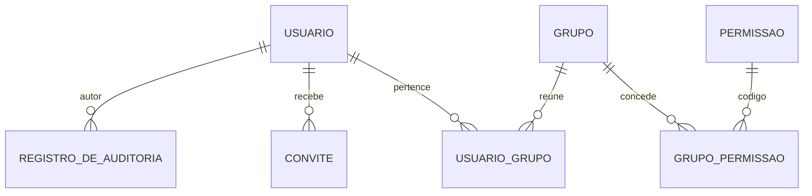
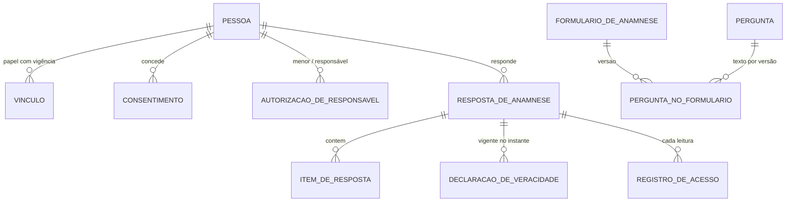
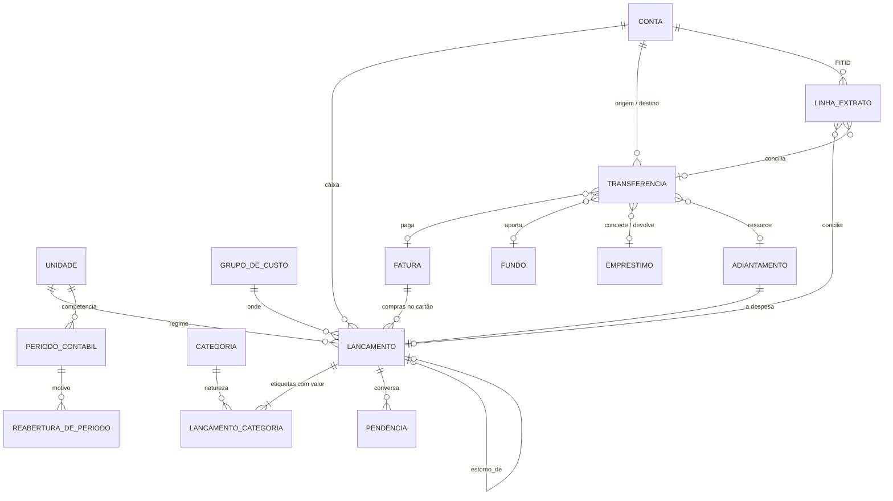
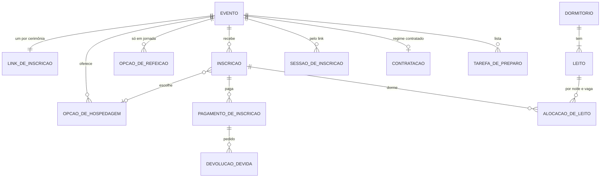
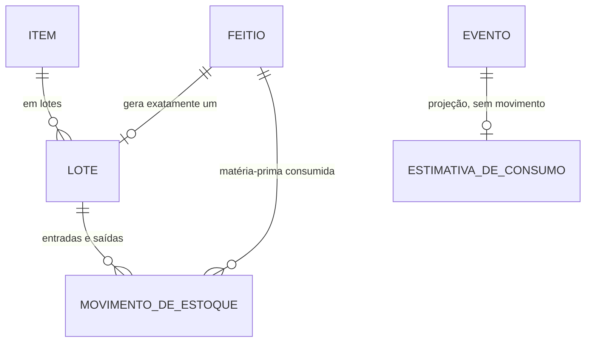

# Sistema de Gestão — Céu do Despertar (CDD)

## Documento 7 — Backend: arquitetura, banco de dados e plano de construção

**Versão 1.0** · setembro/2026 · Status: proposta

> Pressupõe os Documentos 1 (Arquitetura), 2 (Modelo de Domínio v2.2), 3 (Identidade e Acesso v2.2), 4 (Mapa de Telas v2.2) e 6 (Plano do Backend).
> O Documento 6 diz **o que** construir e **em que ordem**, e registra as decisões da coordenação. Este documento diz **como**: a forma do servidor, o desenho do banco e o que cada etapa entrega em tabela, endpoint e teste. Onde os dois se tocam, o Documento 6 decide e este detalha.

**Artefatos que acompanham este documento**

| Arquivo | O que é |
|---|---|
| [`sql/cdd-07-esquema.sql`](sql/cdd-07-esquema.sql) | O esquema de referência completo — 6 schemas, 58 tabelas, RLS, gatilhos de guarda, views de leitura e o catálogo de permissões. **É a fonte da verdade das colunas**; as tabelas deste documento resumem, o arquivo decide. |
| [`sql/cdd-07-verificacao.sql`](sql/cdd-07-verificacao.sql) | 143 verificações executáveis que provam o que §15 promete: isolamento entre instituições, imutabilidade, período fechado, o caso Aline, a devolução como estorno, leitos, saldo de estoque. Roda como o papel da aplicação, não como superusuário. |

```bash
createdb cdd_ref
psql -d cdd_ref -v ON_ERROR_STOP=1 -f docs/sql/cdd-07-esquema.sql -f docs/sql/cdd-07-verificacao.sql
# … 143 linhas "OK" e: Verificação concluída
```

Os dois arquivos foram executados contra PostgreSQL 16 — 16.13 na primeira versão, com 71 verificações; 16.15 na atual, com as guardas de transferência, período e feitio, o bloqueio de `TRUNCATE`, o resolvedor do link e o resolvedor de identidade com dono próprio, a varredura de RLS e o bloqueio de `TRUNCATE` como funções idempotentes (`shared.aplicar_isolamento_por_instituicao()`, `shared.proibir_truncate()`), o ator da trilha/anexo (`autor_tipo`, `enviado_por_tipo`), a US2 (`usuario_pessoa_unica`) e o convite revogável (`convite_vigente_unico`, com o reenvio depois de revogar ou usar), com 143 verificações. O esquema não é a migration de produção — as migrations nascem do MikroORM (§22) —, mas toda migration deve deixá-lo coerente, e a verificação vira teste de CI em B0.

---

# Parte I — Arquitetura

## 1. Forma geral

```
                         ┌────────────────────────────────────────────┐
  Equipe (6 logins) ───▶ │  apps/web · SPA React                      │
                         │  AppShell autenticado                      │──┐ OIDC + PKCE
  Participante ────────▶ │  /i/:token · página pública, sem login     │  │
  (link no WhatsApp)     └───────────────┬────────────────────────────┘  │
                                         │ HTTPS · JSON                  ▼
                         ┌───────────────▼────────────────┐     ┌──────────────┐
                         │  apps/api · NestJS             │◀───▶│  Keycloak    │
                         │  monólito modular              │JWKS │  quem é      │
                         │                                │     └──────────────┘
                         │  identidade  pessoas  eventos  │
                         │  financeiro  estoque           │     ┌──────────────┐
                         │  ── shared: kernel, outbox,    │────▶│  S3 (R2/     │
                         │     auth, tenant, storage      │     │  MinIO)      │
                         └───────────────┬────────────────┘     └──────────────┘
                                         │ um pool, papel cdd_app, RLS
                         ┌───────────────▼────────────────┐     ┌──────────────┐
                         │  PostgreSQL 16                 │────▶│  backup      │
                         │  um schema por módulo          │     │  diário      │
                         └────────────────────────────────┘     └──────────────┘
```

Um processo, um banco, um bucket, um provedor de identidade. Nada de fila externa, cache distribuído ou serviço separado: o volume do CDD — seis logins, 500 a 600 lançamentos por ano, uma cerimônia por semana nos meses cheios — não paga o custo operacional de nenhum deles, e quem vai manter o sistema é uma pessoa em tempo parcial (Doc 1 §5.2).

## 2. Stack

| Camada | Escolha | Por quê, aqui |
|---|---|---|
| Linguagem | TypeScript estrito, Node 22 LTS | O mesmo `packages/contracts` serve front e back; tipos de domínio não se duplicam |
| Framework HTTP | NestJS 11 | Módulos, injeção e guards casam com a fronteira por módulo e com `@RequerPermissao`; o domínio não depende dele |
| ORM | MikroORM 6 (Data Mapper + Unit of Work) | Agregado sem anotação de ORM na camada de domínio; UoW é o que permite gravar agregado + outbox + auditoria numa transação |
| Leitura | SQL direto (Kysely) sobre views e tabelas | Read model é consulta, não agregado; passar por ORM para ler é custo sem ganho |
| Banco | PostgreSQL 16 | RLS, `EXCLUDE` com `btree_gist`, `daterange`, `jsonb`, gatilhos de restrição adiáveis — o esquema usa todos |
| Validação | Zod, nos comandos, compartilhado com o front | A mesma regra de forma nos dois lados; a regra de negócio fica no domínio |
| Identidade | Keycloak 26 (OIDC) | Só autenticação. Autorização é domínio (Doc 3 §10.1) |
| Arquivos | S3 compatível — Cloudflare R2 em produção, MinIO local | URL assinada curta; o arquivo nunca passa pelo processo da API na leitura |
| PDF | HTML + Chromium headless (Playwright) | A prestação de contas usa os mesmos componentes visuais do relatório |
| Observabilidade | Pino (JSON) + OpenTelemetry + Sentry | Um `correlacao_id` liga log, trace e linha de auditoria |
| Testes | Vitest, Testcontainers, Playwright | §26 |
| Execução | Docker; Fly.io ou Railway (ou VPS) | Uma imagem, um Postgres gerenciado, deploy por push |

## 3. Módulos e fronteiras

| Módulo | Schema | É dono de | Expõe aos outros (porta pública) |
|---|---|---|---|
| **identidade** | `identidade` | `Usuario`, `Grupo`, catálogo de permissões, convite, trilha de auditoria | `ContextoDoUsuario` (id, pessoa, permissões); `RegistrarAuditoria` |
| **pessoas** | `pessoas` | `Pessoa`, `Vinculo`, `AutorizacaoDeResponsavel`, `Consentimento`, `FormularioDeAnamnese`, `RespostaDeAnamnese`, `DeclaracaoDeVeracidade`, registro de acesso | `VinculoAtivoNaData` (para A1); `SituacaoDaAnamnese` (para IN5); `ResumoDaPessoa` |
| **financeiro** | `financeiro` | `Unidade`, `GrupoDeCusto`, `Categoria`, `Conta`, `Fundo`, `Lancamento` (+ etiquetas, pendências), `Transferencia`, `Fatura`, `Emprestimo`, `Adiantamento`, `PeriodoContabil`, extrato, prestação de contas | `ConsultaDeCustosDoEvento` (Doc 2 §5.1.6); `SituacaoDoPeriodo` |
| **eventos** | `eventos` | `Evento`, opções de hospedagem e refeição, link de inscrição, `Inscricao`, pagamento, `DevolucaoDevida`, `Contratacao`, `Dormitorio`/`Leito`, mapa de leitos, preparo | `ResumoDoEvento` |
| **estoque** | `estoque` | `Item`, `Lote`, `MovimentoDeEstoque`, `Feitio`, `EstimativaDeConsumo` | `SaldoDisponivel` |
| **shared** | `shared` | kernel (`Result`, `AggregateRoot`, `DomainEvent`), outbox, anexos, idempotência, contexto de instituição | — |

**Três regras de fronteira, verificadas por `dependency-cruiser` na CI:**

1. Um módulo só importa de outro o arquivo `public-api.ts` dele — nunca `domain/`, nunca `infrastructure/`.
2. Nenhuma FK cruza schema (verificado também no banco — §15). Referência entre módulos é por id, e a consistência é garantida por comando síncrono via porta pública **ou** por evento assíncrono via outbox — nunca por JOIN entre schemas em código de escrita.
3. Read models podem ler de mais de um schema **só** na camada `interface/queries` de quem monta a tela, e só por views que o módulo dono publica. O painel de um evento lê a view de custos do Financeiro; não lê `financeiro.lancamento`.

## 4. Dentro do módulo

```
apps/api/src/modules/financeiro/
├── domain/                        sem import de Nest, MikroORM, Zod ou HTTP
│   ├── lancamento/
│   │   ├── lancamento.ts          raiz do agregado: registrar, confirmar, estornar, abrirPendencia…
│   │   ├── etiqueta.ts            value object: categoria + natureza + valor
│   │   ├── pendencia.ts           entidade interna (L10, L11)
│   │   ├── eventos.ts             LancamentoRegistrado, LancamentoConfirmado…
│   │   └── lancamento.repo.ts     interface — a implementação mora em infrastructure
│   ├── periodo/  transferencia/  fatura/  …
│   └── servicos/                  serviços de domínio: CalculadoraDoFechamento, MotorDeSugestao
├── application/
│   ├── comandos/                  um handler por comando: ConfirmarLancamento, FecharPeriodo…
│   └── reacoes/                   handlers de eventos de outros módulos (PagamentoConfirmado → lançamento)
├── infrastructure/
│   ├── persistencia/              entidades MikroORM, mappers domínio ↔ linha, repositórios
│   ├── importacao/                parser OFX/CSV
│   └── acl/                       adaptadores das portas públicas de outros módulos
├── interface/
│   ├── http/                      controllers finos: validam, chamam o handler, traduzem Result
│   └── consultas/                 read models em SQL (um por tela e por bloco)
└── public-api.ts                  o que os outros módulos podem importar
```

A regra que vale a pena repetir: **o domínio não sabe que existe banco.** As invariantes do Doc 2 são testadas em `domain/` sem I/O. O banco repete algumas delas (§15) como segunda trava, não como primeira.

## 5. O caminho de uma escrita

`POST /api/v1/financeiro/lancamentos/{id}/confirmar`, pela Tesouraria, na Verificação de lote:

| # | Onde | O que acontece |
|:--:|---|---|
| 1 | `AuthGuard` (shared) | Valida o JWT contra o JWKS do Keycloak; lê `sub` |
| 2 | `ContextoGuard` (shared) | Resolve `sub` → `Usuario` → instituição, pessoa e permissões efetivas (união dos grupos). Usuário `SUSPENSO` ou `REVOGADO` para aqui com 401 |
| 3 | `@RequerPermissao('financeiro.lancamento.confirmar')` | Sem a permissão: **404**, não 403, quando o recurso não é visível para o grupo (T16b); 403 quando é visível mas a ação não é permitida |
| 4 | Pipe Zod | Valida o corpo contra o schema do comando, vindo de `packages/contracts` |
| 5 | `UnitOfWork.transacao()` | Abre a transação em `READ COMMITTED` — o banco recusa fechar ou gravar numa competência em outro nível (§18.5) — e executa `SET LOCAL app.instituicao_id = …` **antes de qualquer consulta** |
| 6 | Handler | Carrega o agregado pelo repositório (`SELECT … FOR UPDATE` implícito na versão), chama `lancamento.confirmar(por, ajustes)` |
| 7 | Agregado | Aplica L7, L8, L10…; devolve `Result<void, DomainError>` e acumula `LancamentoConfirmado` |
| 8 | Handler | Se `Result` é erro, a transação é desfeita e o erro sobe com seu código (§12) |
| 9 | UoW `flush` | Grava o agregado (com `versao + 1`, falha se outra escrita chegou antes), as linhas de `shared.outbox` com os eventos acumulados, e a linha de `identidade.registro_de_auditoria` |
| 10 | `COMMIT` | Os gatilhos adiáveis rodam aqui (soma das etiquetas). Se falharem, nada foi gravado |
| 11 | Controller | Devolve 200 com o read model atualizado do item — o front não precisa recarregar a fila |

```ts
// application/comandos/confirmar-lancamento.handler.ts
@RequerPermissao('financeiro.lancamento.confirmar')
async executar(cmd: ConfirmarLancamento, ctx: Contexto): Promise<Result<void, DomainError>> {
  return this.uow.transacao(ctx, async () => {
    const lancamento = await this.lancamentos.porId(cmd.lancamentoId);
    if (!lancamento) return erro('LANCAMENTO_NAO_ENCONTRADO');

    const r = lancamento.confirmar({ por: ctx.usuarioId, ajustes: cmd.ajustes });
    if (r.isErr()) return r;

    await this.auditoria.registrar(ctx, 'LANCAMENTO_CONFIRMADO', lancamento);
    return ok();                    // o flush grava agregado + outbox + trilha juntos
  });
}
```

**Por que a auditoria é síncrona e não um assinante do evento.** Uma trilha que pode perder linha quando o despachante falha não é trilha. Ela entra na mesma transação do ato; se a transação desfaz, a linha some junto, e é isso que se quer.

## 6. O caminho de uma leitura

Leitura não passa por agregado. Cada tela tem uma consulta — e, pela diretriz de tela única com autorização por bloco (Doc 6 §2.2), cada **bloco** da tela é uma consulta separada, executada só se o usuário tem a permissão daquele bloco.

```ts
// interface/consultas/painel-do-evento.consulta.ts
async montar(eventoId: EventoId, ctx: Contexto): Promise<PainelDoEvento> {
  return {
    evento:      await this.cabecalho(eventoId),                                      // sempre
    inscricoes:  ctx.pode('eventos.inscricao.ler')          ? await this.inscricoes(eventoId) : undefined,
    arrecadacao: ctx.pode('eventos.arrecadacao.ler')        ? await this.arrecadacao(eventoId) : undefined,
    custos:      ctx.pode('financeiro.resultado_evento.ler') ? await this.custos(eventoId) : undefined,
  };
}
```

O bloco sem permissão **não é consultado e não aparece na resposta** — a chave está ausente, não nula. O teste confere a ausência da chave, nunca a invisibilidade na tela (Doc 6 §10). É o mesmo princípio de Doc 3 §10.2 levado a nível de bloco: dado que o usuário não pode ver não sai do banco.

**Leitura de dado de saúde é escrita.** A consulta que devolve uma `RespostaDeAnamnese` grava `pessoas.registro_de_acesso` na mesma transação (RA3). Por isso ela é a única consulta que roda dentro de `uow.transacao()` e não na conexão de leitura: se o registro falhar, a leitura falha.

## 7. Identidade, autenticação e o link público

### 7.1 Equipe

- O SPA autentica no Keycloak com **Authorization Code + PKCE**. Nada de senha passa pela API.
- A API valida o token (assinatura, `iss`, `aud`, expiração) e usa só o `sub`. **Grupos do Keycloak não são lidos** — o realm não tem papel de negócio nenhum (Doc 3 §10.1). Quem pode o quê está em `identidade.usuario_grupo` + `identidade.grupo_permissao`.
- O `sub` chega sem instituição, e `identidade.usuario` tem RLS FORCE: sem contexto, nem o dono dos objetos leria a linha para descobri-la. No passo 2 de §5 (`ContextoGuard`), a API chama `identidade.resolver_sujeito(sub)` — função `SECURITY DEFINER` de dono próprio, `cdd_resolvedor_identidade` (**não** `BYPASSRLS`, política só dele — mesmo desenho do link público, §7.3, §8), que devolve só `instituicao_id` e `usuario_id`. A partir daí o contexto é montado (`SET LOCAL app.instituicao_id`) e o resto — pessoa, grupos, permissões efetivas — vem de uma consulta normal de `cdd_app`, já sob a RLS de sempre.
- Permissões efetivas ficam em cache em memória por usuário, por 60 s, e o cache é invalidado no próprio processo quando `GrupoAlterado` ou `UsuarioSuspenso` é publicado. Com um processo só, isso é exato; se um dia houver dois, o TTL curto é o limite do atraso.
- Token de acesso de 5 min, refresh de 8 h com rotação. Suspender um usuário revoga as sessões no Keycloak **e** falha no passo 2 de §5 — as duas coisas, porque a segunda não depende da primeira ter funcionado.

### 7.2 Convite

`sistema.usuario.gerenciar` cria o `Usuario` em `CONVITE_PENDENTE` e um convite com token aleatório; o banco guarda só o SHA-256 dele. Ao aceitar, a pessoa cria a credencial no Keycloak (tela do tema do CDD), o `sub` é gravado e a situação vira `ATIVO`. Convite vale 72 h e é de uso único.

### 7.3 O link público de inscrição

A rota `/i/:token` é a única porta do sistema aberta sem login (Doc 6 §2.6). Ela precisa de desenho próprio porque inverte a ordem de §5: **a instituição não vem do usuário, vem do link.**

1. `GET /api/v1/publico/inscricao/{token}` chama `eventos.resolver_link(token)` — função `SECURITY DEFINER` que devolve **só** `instituicao_id` e `evento_id`. O dono dela é o papel `cdd_resolvedor_link` (§8): com RLS forçada, nem o dono dos objetos leria a tabela sem contexto. A partir daí o contexto é montado como em qualquer requisição e a RLS vale igual. A tabela de links continua fechada para quem não tem contexto (verificado).
2. A pessoa declara o CPF. A API cria uma `sessao_de_inscricao` (cookie `httpOnly`, `SameSite=Strict`, expira em no máximo 2 h; o banco guarda só o hash do segredo).
3. Se o CPF é conhecido, a pessoa **confirma um fator** antes de ver qualquer dado dela (ver o achado abaixo). Até cinco tentativas por sessão; depois, a sessão morre e a recepção é o caminho.
4. Cadastro, anamnese, declaração de veracidade e inscrição são comandos normais do domínio, executados com o `pessoaId` da sessão conferida — nunca com um id vindo do corpo da requisição.
5. Limite de taxa por token e por IP (30 aberturas/min por token; 10 identificações/min por IP), no processo, sem Redis. `link_de_inscricao.aberturas` alimenta o contador que a tela `E-06` mostra.

> **Achado de segurança — o CPF sozinho não pode abrir a anamnese de ninguém.**
>
> A tela pública construída reconhece a pessoa só pelo CPF e, em seguida, mostra as respostas herdadas da anamnese dela — medicação, condição de saúde, histórico. O link é o mesmo para todo mundo e circula em grupo de WhatsApp; CPF não é segredo (está em nota fiscal, cadastro de loja, cópia de documento). **Qualquer pessoa com o link e o CPF de outra lê dado de saúde dela.** Pela LGPD é dado sensível, e o vazamento seria da casa.
>
> **Recomendação:** depois do CPF conhecido, pedir a **data de nascimento** — que o próprio cadastro pelo link já coleta — e só então mostrar qualquer resposta anterior. Não é um fator forte, e o documento não finge que é: é proporcional ao risco, não custa nada à pessoa e fecha o caso trivial (alguém digitando o CPF de outra). O fator forte é um código de uso único pelo WhatsApp ou e-mail; fica como evolução, porque exige integração paga e a casa pode preferir não ter.
>
> Até a conferência, a resposta da API para CPF conhecido diz apenas *"encontramos seu cadastro"* — nem nome, nem situação da anamnese. **Muda a tela `/i/:token`** (um campo a mais no passo de identificação) e é **decisão da coordenação** (§27, #1).

## 8. Multi-instituição

O CDD é uma instituição. O desenho é multi-instituição desde o início porque o Doc 1 §4.2 pede — e porque a mesma garantia que separa duas casas separa, de graça, o que um bug poderia misturar.

**Três travas, em camadas:**

| Trava | Onde | O que impede |
|---|---|---|
| **RLS com FORCE** em toda tabela com `instituicao_id` | banco | Ler ou gravar linha de outra instituição. Aplicada por varredura no fim do esquema — tabela nova não escapa, e o teste T23 confere |
| **FK composta** `(instituicao_id, x_id)` dentro do schema | banco | Apontar para linha de outra instituição sabendo o id. FK ignora RLS; a composta não |
| **Filtro global do MikroORM** | aplicação | Segunda camada na consulta, e o que torna o erro legível quando a RLS barra |

**Como o contexto chega ao banco.** `SET LOCAL app.instituicao_id` no início de cada transação, pelo `UnitOfWork`. `SET LOCAL` morre no fim da transação, então a conexão volta limpa ao pool — não há como uma requisição herdar a instituição da anterior. Consulta fora de transação não tem contexto e **devolve vazio** (`shared.instituicao_atual()` é *fail-closed*): esquecer o contexto produz tela vazia, nunca vazamento.

**Papéis do banco.**

| Papel | Uso | `BYPASSRLS` |
|---|---|:--:|
| `cdd_owner` | dono dos objetos; roda migrations | — (FORCE vale para ele também) |
| `cdd_app` | a aplicação em execução | **não** |
| `cdd_backup` | `pg_dump` | sim, só leitura |
| `cdd_resolvedor_link` | dono só de `eventos.resolver_link`; lê quatro colunas de `link_de_inscricao` por uma política só dele | **não** |
| `cdd_resolvedor_identidade` | dono só de `identidade.resolver_sujeito`; lê três colunas de `identidade.usuario` por uma política só dele | **não** |

Há três exceções desenhadas. O despachante do outbox: `shared.outbox` não tem RLS porque ele lê eventos de todas as instituições; antes de entregar cada um, abre transação com o `instituicao_id` do evento. E os dois resolvedores que chegam sem instituição: o do link público, que lê o token de qualquer instituição sem `BYPASSRLS` — por uma política `FOR SELECT TO cdd_resolvedor_link` — e devolve só a instituição e o evento; e o do sujeito autenticado (§7.1), que lê o `sub` de qualquer instituição sem `BYPASSRLS` — por uma política `FOR SELECT TO cdd_resolvedor_identidade` — e devolve só a instituição e o usuário. Em produção, quem roda a migration precisa poder assumir os dois papéis para passar as funções a eles: `GRANT cdd_resolvedor_link TO cdd_owner WITH INHERIT FALSE` e `GRANT cdd_resolvedor_identidade TO cdd_owner WITH INHERIT FALSE`. Sem o `INHERIT FALSE`, o dono herdaria a política de um dos resolvedores e leria sem contexto as linhas de todas as instituições.

## 9. Eventos de domínio e integração entre módulos

**Outbox transacional, despacho no mesmo processo.** O agregado acumula eventos; o UoW grava-os em `shared.outbox` na mesma transação. Um laço no processo (a cada 1 s, e imediatamente após cada commit que gravou evento) lê o lote pendente com `FOR UPDATE SKIP LOCKED`, entrega a cada assinante e marca `publicado_em`. Falha incrementa `tentativas` e grava o próximo instante de tentativa em `proxima_tentativa_em` (backoff exponencial); após 10, o evento vai para o painel de saúde e o Sentry. A consulta do laço — `publicado_em IS NULL AND tentativas < 10 AND coalesce(proxima_tentativa_em, '-infinity') <= now() ORDER BY id` — é servida pelo índice parcial `outbox_pendentes (id) WHERE publicado_em IS NULL AND tentativas < 10`: o backoff entra como filtro de execução, não como predicado do índice, porque depende do relógio e não pode ser fixado na hora de criar o índice.

**Todo assinante é idempotente.** Antes de agir, grava `(consumidor, evento_id)` em `shared.evento_processado` na mesma transação do efeito; se a linha já existe, não faz nada. Entrega "pelo menos uma vez" + consumidor idempotente = efeito exatamente uma vez.

**Não há assinante de notificação** (Doc 1 §5.4). Evento alimenta integração, projeção e fila de trabalho — nunca e-mail ou push.

| Evento | Publicado por | Consumido por | Efeito |
|---|---|---|---|
| `PagamentoDeContribuicaoRegistrado` | eventos | financeiro | Cria `Lancamento` `CONFIRMADO`, origem `INTEGRACAO_EVENTOS`, etiqueta de contribuição, e preenche `pagamento_de_inscricao.lancamento_id` (Doc 2 §5.1.1). O controle é a conciliação, não a conferência |
| `ContratacaoRecebida` | eventos | financeiro | Receita `CACHE_RECEBIDO` na unidade comercial; conta para o teto (§5.1.2) |
| `DevolucaoEfetivada` | eventos | financeiro | **Estorno** da receita original — a contribuição (Doc 6 §2.5.1) ou o cachê da contratação cancelada (CN4) —, nunca despesa |
| `InscricaoCancelada` | eventos | eventos | Libera leitos (ML3) |
| `ConsumoDeCerimoniaRegistrado` | estoque | eventos | Atualiza o resumo do evento |
| `FeitioConcluido` | estoque | financeiro (leitura) | Congela o custo por litro; aparece no relatório |
| `LancamentoConfirmado` / `Estornado` | financeiro | estoque | Recalcula custo parcial de feitio em andamento |
| `FormularioPublicado` | pessoas | pessoas | Recalcula pendências de anamnese das inscrições abertas |
| `GrupoAlterado`, `UsuarioSuspenso` | identidade | identidade | Invalida o cache de permissões |

**Portas síncronas** são usadas quando a resposta decide o comando — e só então:

- `VinculoAtivoNaData(pessoaId, papeis, data)` — A1: quem autoriza adiantamento precisa ser padrinho ou madrinha na data da despesa. Consulta `pessoas.vinculo`; o Financeiro nunca lê a tabela.
- `SituacaoDaAnamnese(pessoaId, eventoId)` — IN5: confirmar inscrição exige resposta em dia **e** declaração para aquele evento.
- `ConsultaDeCustosDoEvento(eventoId)` — resultado da cerimônia e custo do feitio.
- `SituacaoDoPeriodo(unidadeId, competencia)` — a Devolução decide em que competência o estorno entra.

## 10. Arquivos

- Chave no bucket: `{instituicao}/{modulo}/{uuid}` — nunca o nome original, que vai para `shared.anexo.nome_original`.
- **Upload direto ao bucket** com URL pré-assinada de `PUT` (5 min, tamanho e tipo fixados na assinatura); a API registra o anexo depois de conferir o SHA-256.
- **Leitura só por URL assinada de 5 min**, gerada depois da verificação de permissão do recurso dono do anexo. Não há URL pública nunca.
- Tipos aceitos: imagem, PDF, OFX/CSV. Limite de 10 MB. Anexo marcado `sensivel` (documento de autorização de responsável) só é servido a quem tem a permissão do bloco correspondente, e a leitura entra no registro de acesso.
- Anexo órfão (registrado e nunca referenciado em 24 h) é removido por rotina diária.

## 11. Relatórios e prestação de contas

- DRE, fluxo de caixa, resultado por cerimônia e por grupo de custo são **views SQL** (§18.6). Com ~600 lançamentos por ano, nenhuma materialização se paga; se um dia se pagar, a view vira `MATERIALIZED` sem mudar quem a consome.
- A prestação de contas é um PDF gerado por Chromium headless a partir de uma página HTML interna, com os mesmos componentes do relatório na tela. O arquivo vai ao bucket; `financeiro.prestacao_de_contas` guarda período, nível, autor, **hash SHA-256** do PDF e é só-inserção. A assembleia pode conferir que o documento que recebeu é o que o sistema gerou.
- Nível `RESUMO` suprime identidade de pessoa física (Doc 1 §6); `DETALHADO` exige `financeiro.prestacao_contas.detalhada`.
- O fechamento grava o hash do conjunto de lançamentos da competência (P2) — ordenados por id, serializados de forma canônica — e a reabertura guarda o hash anterior. Mudou o mês depois de prestado, a divergência aparece.

## 12. API: convenções e catálogo de erros

| Tema | Convenção |
|---|---|
| Estilo | REST + JSON, prefixo `/api/v1/{modulo}/…`. Comando que não é CRUD é verbo em subrecurso: `POST /lancamentos/{id}/confirmar` |
| Ids | UUIDv7 gerado pela aplicação — ordenável, sem sequência que revele volume |
| Dinheiro | Inteiro em **centavos**, sempre — o mesmo `Dinheiro` de `packages/contracts/kernel.ts` |
| Datas | `YYYY-MM-DD` para data local (fuso `America/Sao_Paulo`), ISO 8601 com fuso para instante, `YYYY-MM` para competência |
| Concorrência | Toda escrita em agregado existente envia `If-Match: {versao}`; divergiu, **409 `VERSAO_DESATUALIZADA`** e o front recarrega o item. Seis pessoas raramente colidem; quando colidem, é na Verificação de lote, e perder a conferência de alguém em silêncio é o pior resultado |
| Idempotência | Todo `POST` que cria aceita `Idempotency-Key`; a resposta fica em `shared.chave_de_idempotencia` por 24 h. Evita o lançamento em dobro do duplo toque — e prepara o terreno para o PWA offline |
| Paginação | Cursor opaco (`?depois=…`), nunca `offset` |
| Leitura por bloco | Chave ausente = sem permissão; `null` = sem dado. Nunca os dois significando a mesma coisa |

**Erro de domínio tem código estável e nenhuma frase.** O front tem a frase (Doc 4 §13).

```json
{ "erro": "PERIODO_FECHADO", "detalhes": { "unidade": "CDD", "competencia": "2026-07" } }
```

Os códigos vivem em `packages/contracts/erros.ts` e vêm de três fontes, todas traduzidas para o mesmo formato:

| Fonte | Exemplo | Como vira código |
|---|---|---|
| Agregado (`Result.err`) | `SEM_VINCULO_PARA_AUTORIZAR_ADIANTAMENTO` (A1) | Direto |
| Gatilho de guarda do banco | `PERIODO_FECHADO`, `LANCAMENTO_IMUTAVEL`, `TRANSFERENCIA_IMUTAVEL`, `FEITIO_IMUTAVEL`, `REGISTRO_IMUTAVEL`, `ETIQUETAS_NAO_FECHAM`, `SALDO_INSUFICIENTE`, `ISOLAMENTO_INVALIDO` | Prefixo da mensagem antes de `:` (os gatilhos usam os mesmos códigos). `ISOLAMENTO_INVALIDO` (`financeiro.exigir_read_committed`) não é regra de negócio — é a borda transacional tendo aberto a transação no nível errado; erro de programação, sempre 500 |
| Restrição nomeada | `l7_confirmado_completo`, `i1_fitid_unico`, `ml1_vaga_livre_no_evento` | Tabela `nome da restrição → código` — é por isso que as restrições que o domínio mapeia **têm nome** no esquema |

Erro de banco que chega à API **sem** mapeamento é bug: vira 500, vai ao Sentry, e o teste de contrato (§26) falha. Se o domínio está certo, a trava do banco nunca dispara em uso normal — quando dispara, alguém escreveu código que contorna o agregado.

## 13. Operação

| Tema | Decisão |
|---|---|
| Ambientes | `local` (Docker Compose: Postgres, Keycloak, MinIO), `homologacao` (dados sintéticos, nunca cópia de produção — tem anamnese), `producao` |
| Deploy | Imagem única; migration roda como passo separado **antes** de a nova versão receber tráfego; migrations em duas fases (expandir → migrar → contrair) para não exigir parada |
| Configuração | Variáveis de ambiente validadas por Zod na partida; segredo nunca em arquivo versionado |
| Saúde | `/saude/viva` (processo) e `/saude/pronta` (banco + Keycloak + bucket + outbox sem atraso > 5 min) |
| Logs | Pino JSON; **nunca** corpo de requisição nem resposta de anamnese; CPF mascarado |
| Backup | `pg_dump` diário cifrado para bucket de outra conta, retenção de 35 dias + 12 mensais; PITR do provedor quando disponível. RPO/RTO de 24 h (Doc 1 §5) |
| Restauração | **Testada todo mês**, por rotina que restaura o último backup num banco descartável e roda `cdd-07-verificacao.sql` e a contagem de linhas. Backup que nunca foi restaurado é hipótese |
| Custos | Um Postgres gerenciado pequeno, um processo de 512 MB, R2 no plano gratuito, Keycloak no mesmo host. Ordem de grandeza: dezenas de reais por mês |

---

# Parte II — Banco de dados

## 14. Convenções

| Convenção | Regra | Razão |
|---|---|---|
| Schema | Um por módulo; nenhuma FK cruza schema | Doc 1 §4.7 — a fronteira do módulo vale no banco |
| Instituição | `instituicao_id uuid NOT NULL` em toda tabela de domínio, com RLS | §8 |
| FK dentro do schema | Composta com `instituicao_id` | FK ignora RLS; a composta não deixa apontar para outra casa |
| Chave | `id uuid` gerado pela aplicação; `UNIQUE (instituicao_id, id)` como alvo das FKs | UUIDv7 ordena por tempo e não vaza volume |
| Dinheiro | `bigint` em centavos, `CHECK (> 0)` onde o domínio exige positivo | L1: o sinal vem da natureza, nunca do número |
| Quantidade física | `numeric(12,3)` | Litros e quilos precisam de fração exata |
| Competência | `date` no dia 1, `CHECK (extract(day …) = 1)` | Ordena, compara e indexa como data |
| Enumeração | `text` + `CHECK (… IN (…))` | Acrescentar valor é migration trivial; `ENUM` do Postgres não remove nem renomeia |
| Concorrência | `versao integer` na raiz de cada agregado que muda depois de criado; os só-inserção dispensam. No formulário de anamnese, a versão de negócio do Doc 2 é a coluna `numero` | Trava otimista do MikroORM; `If-Match` na API |
| Imutável | Gatilho `shared.somente_insercao()` **e** `REVOKE UPDATE, DELETE` do papel da aplicação; `TRUNCATE` barrado por gatilho de instrução, inclusive para o dono | Duas travas independentes: privilégio e comportamento. `TRUNCATE` não dispara gatilho de linha, e o dono é quem roda migration |
| Nome | `snake_case`, português, sem abreviação; restrições que o domínio mapeia têm nome próprio | O nome da restrição vira código de erro (§12) |
| Exclusão | Fato registrado não se apaga. `DELETE` físico só em dois casos: o descarte de lançamento e de transferência ainda `A_CONFERIR`, antes da conferência (as guardas barram o `DELETE` em qualquer outro estado — §15, §18.4), e o conteúdo da anamnese e as sessões do link na anonimização (§23). Cadastro se desliga por `ativo`/`ativa`; pessoa se anonimiza (§23) | Histórico financeiro e trilha dependem das linhas |

## 15. O que o banco garante

O domínio aplica as regras. O banco repete as que, se quebradas, **corrompem histórico** — para que um bug, um script de suporte ou uma migration descuidada não consiga fazer o que o agregado proíbe. Cada linha abaixo é um caso de `cdd-07-verificacao.sql`:

| Garantia | Mecanismo | Regra |
|---|---|---|
| Instituição não vê nem grava na outra | RLS FORCE + política única, aplicada por varredura | Doc 1 §4.2, T23 |
| Sem contexto, nada | `instituicao_atual()` devolve NULL | *fail-closed* |
| Não se aponta para linha de outra casa | FK composta | — |
| Nenhuma FK cruza schema | verificação sobre `pg_constraint` | Doc 1 §4.7 |
| Lançamento e transferência confirmados não mudam nem somem | gatilhos `guarda_lancamento` e `guarda_transferencia` | L2, e a mesma regra na transferência (§18.4) |
| Etiquetas de confirmado não mudam depois da transação que o gravou — nem com `set_config`, nem com um `INSERT` que não acontece, nem movendo a etiqueta para outro lançamento | gatilho `guarda_etiqueta` + coluna `gravado_na_transacao`, escrita só pela guarda | L2 |
| Etiquetas fecham no valor, com sinal | gatilho de restrição **adiável** (roda no `COMMIT`) | Decisão 1 |
| Etiqueta tem a natureza da categoria | FK `(categoria_id, natureza)` | L3 |
| Estorno tem a natureza do original, e só um por lançamento | FK `(estorno_de_id, natureza)` + `UNIQUE` | §2.5.1, L9 |
| Confirmado sem lacuna; a transferência confirmada diz quem conferiu | `l7_confirmado_completo`, `t_confirmada_tem_conferente` | L7 |
| Caixa não antecede competência | `l6_caixa_depois_da_competencia` | L6 |
| Nada nasce em competência fechada — lançamento nem transferência, nem na corrida com o fechamento | gatilhos com `periodo_esta_fechado` + trava consultiva por período, que só vale em `READ COMMITTED` — e o banco recusa os dois atos em outro nível | L5, T4 |
| O período não troca de unidade nem de competência; fechado, não muda nem some, e só reabre com motivo registrado na mesma transação — a hora da reabertura é carimbada pelo banco —, e o registro fica para sempre | gatilhos `guarda_periodo` e `reabertura_carimbo` + `CHECK` + só-inserção | P2, P3 |
| Uma pendência aberta por vez, nunca para si mesmo | índice parcial + `CHECK` | L10 |
| Fatura só em cartão | FK `(conta_id, 'CARTAO_CREDITO')` | F1 |
| Cada finalidade de transferência carrega sua referência | `CHECK`s nomeados | FD3, F3, E1, A4 |
| Adiantamento sai de conta pessoal | FK `(conta_id, 'PESSOAL_DE_TERCEIRO')` | A2 |
| FITID não se repete na conta; linha concilia com um só | `UNIQUE` + `CHECK` + índices parciais | I1, I2 |
| Um CPF por casa | índice único parcial | link público |
| Papel não se sobrepõe a si mesmo no tempo | `EXCLUDE USING gist` sobre `daterange` | V |
| Uma versão de formulário publicada; uma resposta vigente por pessoa | índices únicos parciais | FA, RA |
| Item de resposta: herdado **ou** com motivo | `CHECK` | anamnese incremental |
| Uma declaração por pessoa por cerimônia | `UNIQUE` | Doc 6 §2.6 |
| Leitura de anamnese registrada não se apaga | só-inserção | RA3 |
| Trilha de auditoria não se edita nem se apaga | só-inserção | Doc 3 §10.4 |
| Trilha e anexo têm ator coerente: usuário sempre que `autor_tipo`/`enviado_por_tipo` é USUARIO, nunca fora disso | `CHECK`s `autor_coerente`, `enviado_coerente` | despachante (SISTEMA) e link público (LINK_PUBLICO) auditam e anexam sem `identidade.usuario` |
| A aplicação não inventa permissão | catálogo sem privilégio de escrita | T29 |
| Cerimônia de contribuição tem três níveis, em ordem | `CHECK`s nomeados | Decisão 6 |
| Colchonete é gratuito e não ocupa leito | `CHECK` | Decisão 6 |
| Zero não é isenção; isenção tem motivo | `CHECK`s | E-06 |
| Contato de emergência e restrições alimentares sempre — *"nenhuma"* é resposta, branco não | `NOT NULL` + `CHECK` | IN4, decisão 9 |
| Uma inscrição viva por pessoa por evento | índice único parcial | IN |
| Beliche tem um lugar; a cama de casal, dois; a vaga cabe no leito | `CHECK` por tipo + `vaga` limitada pela capacidade, trazida do leito por FK composta | Leitos |
| Mesma vaga, mesma noite, mesmo evento: uma pessoa. Uma pessoa, uma cama por noite | `UNIQUE` + PK | ML1 |
| Quem pede a devolução não é quem paga | `CHECK` | DV3 |
| A devolução estorna uma receita só: a contribuição paga ou o cachê da contratação cancelada do mesmo evento | `CHECK` + FK | CN4 |
| O link público resolve o token sem contexto, e só isso, por um papel sem `BYPASSRLS` | função `SECURITY DEFINER` de dono próprio + política só dele | link público |
| Saldo de lote nunca negativo, mesmo com saídas simultâneas | gatilho com `FOR UPDATE` no lote | Estoque |
| Perda e ajuste têm justificativa | `CHECK` | Estoque |
| Estimativa não mexe em saldo | tabela sem ligação com movimento | EC1 |
| Feitio concluído tem custo por litro congelado | `CHECK` na conclusão + gatilho `guarda_feitio` depois dela | S-04 |
| Nem o dono esvazia o histórico com `TRUNCATE`, nem por `CASCADE` a partir de outra tabela | gatilho `BEFORE TRUNCATE` nas tabelas guardadas | — |

**O que o banco deliberadamente não garante** — porque exige consultar outro módulo, depende de data corrente ou é regra de fluxo — está em §21.

## 16. `shared` e `identidade`



| Tabela | Papel | Pontos de desenho |
|---|---|---|
| `shared.instituicao` | A casa | Sem RLS, como o catálogo de permissões, o outbox e `shared.evento_processado` — as quatro únicas tabelas sem RLS |
| `shared.anexo` | Metadado de arquivo | `sha256`, `sensivel`; a chave do bucket é única global. Ator de quem enviou por `enviado_por_tipo` (`USUARIO`\|`SISTEMA`\|`LINK_PUBLICO`) + `enviado_por` nulo fora de `USUARIO` (`enviado_coerente`) — o despachante e o link público também sobem anexo sem login |
| `shared.outbox` | Eventos a despachar | Sem RLS (§8); `proxima_tentativa_em` para o backoff; índice parcial em pendentes sob o teto de tentativas (§9) |
| `shared.evento_processado` | Idempotência do consumidor | PK `(consumidor, evento_id)` |
| `shared.chave_de_idempotencia` | Idempotência do HTTP | PK `(instituicao, chave)`, expira em 24 h |
| `identidade.permissao` | Catálogo global, espelho do código | Formato `modulo.recurso.acao` por `CHECK`; **64 permissões** — as do Doc 3 §4 menos `pessoas.anamnese.responder_por_terceiro`, que perdeu o caso de uso (Doc 6 §2.6) |
| `identidade.usuario` | Login | `subject_id` nulo até aceitar o convite, resolvido sem instituição por `identidade.resolver_sujeito` (§7.1, §8); `pessoa_id` é a ponte para o eixo de vínculo, única por instituição quando presente (US2, `usuario_pessoa_unica`) |
| `identidade.grupo` | Conjunto de permissões | `codigo_sistema` nos seis grupos de sistema (Doc 3 §12), nulo nos criados pela casa; `protegido` |
| `identidade.grupo_permissao`, `usuario_grupo` | Associações | `usuario_grupo` guarda quem atribuiu e quando |
| `identidade.convite` | Convite de uso único | Só o hash do token; `revogado_em` fecha o convite sem uso, nunca junto com `usado_em`; no máximo um convite vigente (nem usado, nem revogado) por usuário |
| `identidade.registro_de_auditoria` | Trilha (Doc 3 §10.4) | Só-inserção. Ator por `autor_tipo` (`USUARIO`\|`SISTEMA`\|`LINK_PUBLICO`) + `autor_usuario_id` nulo fora de `USUARIO` (`autor_coerente`) — o despachante audita como SISTEMA, o link público como LINK_PUBLICO, nenhum dos dois com usuário. `autor_grupos` é **fotografia** dos grupos no instante do ato. O alvo é guardado por referência (`agregado_tipo`, `agregado_id`, `pessoa_alvo_id`) e o texto humano (*"lançamento de 12/08, Padaria São Jorge"*) é montado na leitura — anonimizar uma pessoa não pode exigir reescrever a trilha |

## 17. `pessoas`



**Pessoa, com os dois eixos separados (decisão 7).** *O quanto a pessoa é da casa* — `MEMBRO`, `FREQUENTADOR`, `VISITANTE` — é a coluna `relacao_com_a_casa`. *O que ela faz* — `MADRINHA`, `GUARDIAO`, `MUSICO`, `FORNECEDOR`… — é `pessoas.vinculo`, com vigência em `daterange` e `EXCLUDE` para não sobrepor o mesmo papel. É `vinculo` que A1 consulta: *"era madrinha em 10/09?"* é uma pergunta de intervalo, e o índice GiST responde.

**Nada de saúde na pessoa (decisão 8).** `pessoas.pessoa` não tem uma coluna de anamnese. O read model de pessoa que precisa dizer *"anamnese em dia"* consulta a porta `SituacaoDaAnamnese`, que devolve situação e validade — nunca conteúdo.

**CPF como chave do link.** `documento` só dígitos, único por casa quando presente. Pessoa jurídica usa CNPJ na mesma coluna.

**Anamnese com pergunta de identidade estável.** A dificuldade que o Doc 6 aponta em B4 — *"a identidade estável de `PerguntaId` entre versões"* — está resolvida na forma das tabelas:

| Tabela | Guarda |
|---|---|
| `formulario_de_anamnese` | A versão: `numero` é a versão de negócio do Doc 2 §3.4.1, `status` diz se é rascunho, publicada ou supersedida; `versao` é só a trava otimista (§14) |
| `pergunta` | Só a identidade (`id`, `codigo`). Nunca muda |
| `pergunta_no_formulario` | O texto, tipo, opções, obrigatoriedade, sensibilidade e alerta **daquela versão**. `exige_nova_resposta` marca mudança de sentido — é o que produz o motivo `SUBSTITUIU` |
| `resposta_de_anamnese` | Uma submissão, contra uma versão. `modo` distingue `INCREMENTAL`, `REVALIDACAO_COMPLETA` e `POR_ESCOLHA` (Doc 6 §2.6 — refeita por escolha não é refeita por vencimento). Uma `VIGENTE` por pessoa; a anterior fica `SUPERSEDIDA`, com ponteiro para a nova |
| `item_de_resposta` | Uma linha por pergunta. Ou foi respondida agora (`motivo_pendencia` diz por quê), ou foi **herdada** (`herdado_de` aponta a resposta de onde veio). `respondido_em` é quando a pessoa disse aquilo — não quando foi copiado. É o que deixa o parecer saber que *"não uso medicação"* foi dito em março |

O delta que a tela pública mostra é uma consulta: perguntas da versão publicada que não têm item vigente, mais as marcadas `exige_nova_resposta`, mais todas se venceu, mais todas se a pessoa escolheu refazer.

**Declaração de veracidade.** Uma por pessoa por cerimônia, com o **texto exato** que a pessoa afirmou e a resposta vigente naquele instante. `origem_ip_hash` prova o canal sem guardar o IP.

**Registro de acesso.** Toda leitura de resposta, com leitor, pessoa, resposta e contexto. Só-inserção. A Governança lê este registro; `sistema.auditoria.ler` lê a trilha geral — são públicos diferentes (Doc 3 §7.5).

## 18. `financeiro`



### 18.1 Cadastros

`unidade` (com `regime` e, na comercial, `teto_anual` — o MEI da Munay), `grupo_de_custo` (decisão 2: convive com a unidade), `categoria` (natureza, tipo, regimes permitidos, linha do relatório), `conta` (tipo, titularidade, titular quando pessoal, identificador bancário único para casar o OFX) e `fundo` (conta vinculada, meta, categorias permitidas por código — FD1). Todos com `codigo_sistema` onde o código do sistema precisa se referir a um registro específico, nunca ao nome.

### 18.2 Lançamento e etiquetas — decisão 1

O contrato atual tem `categoriaIds[]` e um único `valor`, e não representa o caso que motivou manter várias categorias. A etiqueta passa a carregar **natureza e valor próprios**:

| | natureza | valor |
|---|---|---:|
| **Lançamento** · *Encontro de contas com a Aline* | DESPESA | **20,00** |
| etiqueta · Flores | DESPESA | 70,00 |
| etiqueta · Ervas | DESPESA | 50,00 |
| etiqueta · Contribuição de cerimônia | RECEITA | 100,00 |
| **Soma com sinal** (despesa +, receita −, do ponto de vista do lançamento) | | **20,00** ✓ |

Três consequências de modelo, todas no esquema:

1. **L3 muda de lugar.** A natureza *do lançamento* passa a ser a do valor líquido — o dinheiro que efetivamente saiu ou entrou. É **a etiqueta** que tem sempre a natureza da categoria, garantida por FK `(categoria_id, natureza)`.
2. **A DRE lê etiquetas, nunca lançamentos.** O caso Aline aparece como 120 de despesa (flores + ervas) e 100 de receita de contribuição — que é o que aconteceu. Ler `lancamento.valor` diria 20 de despesa e perderia os três fatos.
3. **O saldo da conta lê lançamentos.** Da conta saíram 20. As duas leituras são verdadeiras sobre coisas diferentes, e é por isso que existem duas views.

A soma é verificada por gatilho **adiável**: lançamento e etiquetas são gravados por comandos separados da mesma unidade de trabalho, e só no `COMMIT` o conjunto está completo. Lançamento `A_CONFERIR` pode não ter etiqueta (registro rápido, L7); confirmado precisa de pelo menos uma.

**Imutabilidade das etiquetas.** Uma integração cria o lançamento já `CONFIRMADO`, e a conferência pode ajustar etiquetas no mesmo ato em que confirma. A regra do banco é portanto *"etiquetas só mudam enquanto `A_CONFERIR`, ou dentro da transação que gravou o lançamento"* — a guarda do lançamento grava em `gravado_na_transacao` o id da transação que o inseriu ou confirmou, e a das etiquetas compara com a transação corrente. A coluna só é escrita pela guarda, e confirmado não muda mais; na transação seguinte, o id já é outro. Estornar não reescreve a coluna: um estorno nunca reabre as etiquetas do original. (Uma marca por `set_config`, que era o desenho anterior, qualquer script da aplicação forjaria.)

**Colunas que mudaram em relação ao contrato do front**, a refletir em `packages/contracts` em B1:

| Contrato hoje | Esquema | Por quê |
|---|---|---|
| `categoriaIds: CategoriaId[]` | `etiquetas: { categoriaId, natureza, valor }[]` | Decisão 1 |
| `tipo: 'ENTRADA' \| 'SAIDA' \| 'TRANSFERENCIA'` | só `natureza`; transferência é outro agregado | Decisão 3 |
| `grupo: string \| null` | `grupoDeCustoId` | Decisão 2, com cadastro |
| `contraparte: string \| null` | `pessoaId` **ou** `contraparteTexto` | Quem ainda não está cadastrado não impede o registro rápido |
| `OrigemLancamento` com 5 valores | 8 valores: união do front e do Doc 2 | Decisão 11 |
| — | `confirmadoPor`, `confirmadoEm`, `versao` | Trilha e concorrência |

### 18.3 Estorno — a convenção que sustenta §2.5.1

O estorno é um lançamento novo com `estorno_de_id`, **a mesma natureza e as mesmas etiquetas do original**, e efeito com sinal invertido. O original passa a `ESTORNADO` e continua contando; os dois se anulam.

É essa convenção que faz a devolução de contribuição (Doc 6 §2.5.1) derrubar a receita em vez de inflar a despesa — e ela vale para qualquer estorno, não só devolução. A verificação reproduz o caso: receita de 210, estornada; a DRE de setembro mostra contribuição líquida de 100 (os 100 da Aline), e a despesa continua sendo só o que a casa gastou — flores, ervas e a padaria —, **sem** os 210.

Estorno em competência fechada: a guarda do banco admite, num lançamento de período fechado, uma única escrita — marcá-lo `ESTORNADO`. O estorno em si nasce na competência corrente (L9, com o motivo registrado). Se a coordenação rejeitar §2.5.1 e exigir reabertura, a regra fica mais estrita no domínio sem mudar o banco.

### 18.4 Transferência, fatura, empréstimo, adiantamento, fundo

`transferencia` é o agregado das sete finalidades do Doc 2 §1.4. Cada finalidade exige a referência que a justifica, por `CHECK` nomeado: aporte tem fundo (FD3), pagamento tem fatura (F3), concessão e devolução têm empréstimo (E1), ressarcimento tem adiantamento (A4), repasse tem duas unidades diferentes. **Conta nula de um dos lados** significa dinheiro que entra ou sai do sistema — só admitido para empréstimo, porque a contraparte não tem conta cadastrada.

**Uma adição ao Doc 2: o ciclo da transferência.** O Doc 2 §1.4 desenha `Transferencia` sem estado. O esquema dá a ela o ciclo do lançamento — `A_CONFERIR` → `CONFIRMADO` → `ESTORNADO`, com `confirmado_por` obrigatório fora de `A_CONFERIR` e `estorno_de_id` —, porque a transferência importada do extrato ou registrada às pressas também passa pela conferência. Com o ciclo vem a regra de L2: confirmada, a transferência não muda nem some, e a correção é por estorno; `A_CONFERIR` ainda se edita e se descarta. A guarda `guarda_transferencia` aplica as duas coisas (§15).

A fatura agrupa as compras no cartão (`lancamento.fatura_id`) e é paga por transferência — nunca por uma segunda despesa, o que resolve os ~R$ 3,5 mil de dupla contagem que a migração achou (Doc 1 §7.2). O adiantamento guarda **quem era a pessoa** que autorizou (`autorizado_por_pessoa`), não só o usuário: A1 é sobre vínculo, e o vínculo é da pessoa.

### 18.5 Período, extrato, prestação

`periodo_contabil` é por unidade e competência, com hash no fechamento (P2); `reabertura_de_periodo` é só-inserção, com motivo de pelo menos dez caracteres e o hash anterior (P3). O período nunca troca de unidade nem de competência. Fechada, a competência não muda nem some: o gatilho `guarda_periodo` só a deixa reabrir quando a reabertura do hash corrente foi gravada na mesma transação — o comando grava as duas coisas juntas, e uma reabertura antiga não serve para reabrir de novo. A hora da reabertura é carimbada pelo banco (`now()` da transação): o `em` da `Reabertura` do Doc 2 é esse valor, e o que a aplicação mandar é ignorado. P1 (zero `A_CONFERIR` na competência) e P4 (anterior fechada) são verificados pelo comando de fechamento — dependem de consulta a várias linhas no instante do ato e não cabem num `CHECK`. Por isso o comando começa com `financeiro.travar_periodo_para_fechar(...)`, a trava exclusiva da competência: quem grava lançamento ou transferência nela toma a mesma trava, compartilhada, e ninguém grava entre a conferência de P1, o hash e o fechamento. A guarda do período também toma a trava exclusiva no `INSERT` ou `UPDATE` que fecha: mesmo que o comando esqueça a trava, nada nasce na competência depois do fechamento (L5). P1 e o hash, porém, são conferidos antes desse `UPDATE` e só ficam protegidos se o comando travar antes de conferi-los. E a trava só serve em `READ COMMITTED` — em `REPEATABLE READ`, quem esperou leria o período como estava antes —, por isso o banco recusa fechar ou gravar na competência em outro nível de isolamento.

`importacao_de_extrato` guarda o arquivo (anexo), período e contagens; `linha_extrato` tem `UNIQUE (conta, FITID)` (I1) — reimportar é seguro por construção — e concilia com **um** lançamento **ou** **uma** transferência (I2), nunca os dois.

### 18.6 Views de leitura

| View | Lê | Serve |
|---|---|---|
| `v_efeito_por_categoria` | etiquetas de lançamentos confirmados ou estornados, com o estorno negativo | base de todas as outras |
| `v_dre` | efeito por categoria, agrupado por unidade, competência e linha do relatório | Relatórios, Prestação de contas |
| `v_saldo_da_conta` | lançamentos pelo líquido + transferências dos dois lados | Contas e fundo, Painel |

Todas com `security_invoker = true`: a RLS de quem consulta vale dentro da view. Resultado por cerimônia e por grupo de custo são a mesma `v_efeito_por_categoria` filtrada por `evento_id` e `grupo_de_custo_id`, publicadas pelo Financeiro como porta de leitura para o painel do evento.

## 19. `eventos`



**Evento.** Os cinco estados do Doc 2 (decisão 5), `consagra` explícito (define anamnese e estimativa de daime) e **três colunas de valor sugerido** — `valor_social ≤ valor_sustentavel ≤ valor_prospero`, obrigatórias exatamente quando o regime é de contribuição (decisão 6). Não existe `permite_valor_livre`: no regime de contribuição ele é sempre verdadeiro, nos dois sentidos, e uma coluna que só pode ter um valor é uma coluna que alguém um dia vai pôr no outro.

**Hospedagem à parte.** `opcao_de_hospedagem` por evento, com valor por noite e se ocupa leito. `COLCHONETE` existe com valor zero e sem leito, por `CHECK`, enquanto a coordenação não decidir o ponto em aberto do Doc 6 §2.5 — se a decisão for *"não registrar"*, é uma linha de `CHECK` a mudar. Refeição é tabela própria, e só tem linha em ocasião especial.

**Inscrição.** Os campos de IN4 são `NOT NULL` (decisão 9); nas restrições alimentares, *"nenhuma"* é resposta explícita, e em branco não vale. A contribuição tem três colunas e uma regra: `nivel_escolhido` é o que a pessoa marcou (sugestão), `valor_combinado` é o que vale, **nulo significa "a combinar"**, e `isento` é explícito — zero não é isenção (`in_zero_nao_e_isencao`), e isenção tem motivo. `canal` distingue recepção de link; pelo link, `registrada_por` é nulo. `declaracao_id` aponta a declaração de veracidade daquela cerimônia.

**Pagamento e devolução.** O pagamento guarda conta e forma e recebe `lancamento_id` quando a integração cria a receita. A devolução nasce de um pagamento de inscrição ou, pelo CN4, do cachê de uma contratação cancelada do mesmo evento — é essa receita que será estornada, e `dv_origem_unica` exige exatamente uma das duas. É pedida pelo Acolhimento e paga pela Tesouraria — `dv3_quem_pede_nao_paga` impede que a mesma pessoa faça os dois atos.

**Leitos.** `dormitorio` e `leito` são cadastro fixo; o mapa (`alocacao_de_leito`) é por evento, **uma linha por pessoa por noite**, com `vaga` numerando os lugares até a capacidade do leito — que a alocação traz do próprio leito por FK composta, então não se declara maior do que é, e o leito alocado não muda de capacidade. É o que representa a casa como ela é: Dormitório 1 com uma cama de casal (vagas 1 e 2), Dormitório 2 com três beliches (seis leitos de um lugar), sem divisão por gênero. `ml1_vaga_livre_no_evento` impede duas pessoas na mesma vaga na mesma noite do mesmo evento; a PK impede uma pessoa em duas camas. Conflito entre **eventos simultâneos** não é invariante (Doc 2 §2.6) — é o índice `alocacao_por_leito_noite` que a tela usa para avisar.

**Link e sessão.** `link_de_inscricao` (um por evento, token com pelo menos 128 bits) e `sessao_de_inscricao` (§7.3) — CPF declarado, pessoa conferida, tentativas, expiração máxima de 2 h por `CHECK`.

**Preparo.** A lista de preparo exige login (Doc 6 §2.5, decisão 12): quem marca uma tarefa é um usuário, gravado em `feita_por` junto com `feita_em` — nunca um link público ou um webhook.

## 20. `estoque`



**Saldo é soma de movimento.** O lote nasce com seu movimento de entrada na mesma transação; `quantidade_inicial` é registro histórico. `movimento_de_estoque` é só-inserção — correção é movimento de ajuste, com justificativa, como estorno no dinheiro. Quantidade sempre positiva; a direção vem do tipo.

**Saldo nunca negativo, mesmo em concorrência.** Duas pessoas registrando o consumo do mesmo lote ao mesmo tempo é o caso que o domínio sozinho perde: cada uma lê saldo suficiente, as duas gravam. O gatilho trava a linha do lote (`FOR UPDATE`) antes de somar, o que serializa os movimentos daquele lote e só daquele.

**Tipos de movimento** — a união das duas listas (decisão 11), com os nomes ajustados para a direção ficar no próprio nome: `ENTRADA_FEITIO`, `ENTRADA_AQUISICAO`, `ENTRADA_DOACAO`, `ENTRADA_RECEBIMENTO`, `SAIDA_TRABALHO`, `SAIDA_FEITIO` (matéria-prima que entrou na panela), `SAIDA_VENDA`, `SAIDA_PERDA`, `TRANSFERENCIA_SAIDA`, `AJUSTE_ENTRADA`, `AJUSTE_SAIDA`.

**Duas adições ao Doc 2**, que a tela de Feitio exigiu: a categoria de item `MATERIA_PRIMA` (jagube e folha não são `INSUMO_CERIMONIA`) e a origem de lote `COLHEITA_PROPRIA` (*"colheita própria · sítio do Chico"* não é aquisição nem doação).

**Feitio.** Um por evento de feitio; gera exatamente um lote (`lote.feitio_id` único). O custo é a soma da matéria-prima consumida (`movimento.custo` das saídas `SAIDA_FEITIO`) e dos lançamentos do evento (porta `ConsultaDeCustosDoEvento`). Na conclusão, os três números — matéria-prima, lançamentos, custo por litro — são **congelados** na linha: estornar um lançamento depois muda o custo do próximo feitio, não reescreve o deste.

**Estimativa (decisão 10, EC1).** Tabela própria, sem nenhuma ligação com movimento ou saldo; `litros_estimados` é coluna gerada. Não existe caminho no esquema para uma estimativa alterar saldo.

## 21. Banco × domínio: onde cada regra mora

| Mora no banco (e no domínio) | Mora só no domínio | Por quê só no domínio |
|---|---|---|
| L1, L2, L3, L5, L6, L7, L9 (unicidade), L10 (forma) | L4 — categoria compatível com o regime da unidade | Compara arrays de duas tabelas; cabe em gatilho, mas a mensagem de erro precisa do contexto do formulário |
| T4, F1, F3, FD3, E1, A2, A4, I1, I2 | L8 — integração não editável por comando manual | É sobre **quem** chama, não sobre o dado |
| P2 (o hash do fechamento não muda), P3 | L11 — só o destinatário responde | Depende do usuário da requisição |
| V, FA, RA (unicidade), RA3 | P1, P4 — fechamento sem pendente, anterior fechada | Consulta a várias linhas no instante do ato |
| ML1, DV3, CN4 (a forma), IN4, decisão 6 | A1 — vínculo de padrinho/madrinha na data | Cruza módulo (pessoas) |
| Saldo de estoque ≥ 0 | FD2 — saldo de fundo ≥ 0 | Saldo de fundo é derivado de transferências e lançamentos de duas tabelas; o comando de saída verifica sob `FOR UPDATE` na linha do fundo |
| Uma inscrição viva, uma declaração por cerimônia | IN5 — confirmar exige anamnese em dia e declaração | Cruza módulo, depende de data corrente |
| | ML2, ML4 — leito exige hospedagem; noite dentro do evento | Regras de fluxo, com mensagem própria na tela |
| | EV1–EV11, CN1–CN4, EC4, AR1–AR4 | Regras de transição de estado e de cálculo |

A regra geral: **o banco guarda o que, se quebrado, falsifica o histórico**. Transição de estado, permissão e cálculo são do domínio.

## 22. Migrações, seed e evolução

- **MikroORM Migrations**, geradas e **revisadas à mão** — RLS, gatilhos, `EXCLUDE` e FKs compostas não saem do gerador; ficam em migrations escritas em SQL.
- **Duas funções que toda migration chama, no fim, depois de criar suas tabelas** — ambas idempotentes, então uma migration de etapa posterior pode chamá-las de novo sobre o esquema inteiro sem duplicar nem falhar:
  - `shared.aplicar_isolamento_por_instituicao()` — a política de RLS não é escrita tabela a tabela; a função varre `information_schema` atrás de `instituicao_id` e aplica `ENABLE`+`FORCE`+a política a quem ainda não tem. O teste T23 falha se alguma tabela ficar de fora.
  - `shared.proibir_truncate(regclass[])` — recebe a lista de tabelas que a etapa quer guardar contra `TRUNCATE` (histórico, trilha, saldo) e cria o gatilho `sem_truncate` só em quem ainda não o tem.
- **Duas fases para mudança destrutiva:** expandir (coluna nova, preenchida em paralelo) → migrar leitura e escrita → contrair (remover a antiga) numa versão seguinte.
- **Seed de sistema** (versionado, idempotente, roda em toda migração): catálogo de permissões, os seis grupos com suas permissões (Doc 3 §12), unidades e categorias do plano de contas aprovado.
- **Seed de homologação**: dados sintéticos gerados a partir dos mocks do front — os mesmos personagens das telas (Clarice, Helena, Eduardo, Aline) —, o que faz a demonstração do protótipo e a de homologação contarem a mesma história.
- **Migração da planilha** (Doc 6, transversal): módulo `migracao` com CLI que carrega os 1.760 lançamentos com `origem = 'MIGRACAO'`, cria as competências históricas **fechadas** com hash, e emite o relatório de conciliação. Como a guarda do banco impede lançamento em competência fechada, a carga é feita com os períodos abertos e o fechamento é o último passo — se o relatório não bater, nada é fechado.

## 23. Dados pessoais e LGPD no banco

| Tema | Como está no esquema |
|---|---|
| Dado sensível | Só em `pessoas.resposta_de_anamnese` / `item_de_resposta` e em anexos `sensivel`. Nenhuma outra tabela tem dado de saúde |
| Leitura de sensível | Sempre registrada (RA3), na mesma transação da leitura |
| Base legal | `consentimento` com finalidade, versão do texto lido, canal, data; revogável |
| Anonimização | `pessoas.pessoa.anonimizar()`: nome vira *"Pessoa anonimizada"*, documento, contato, nascimento e foto viram nulos (`CHECK` exige documento nulo quando anonimizada), o conteúdo das respostas de anamnese é apagado — as linhas de `item_de_resposta` saem e o alerta derivado (`dispara_alerta`) vai a falso —, o hash de IP da declaração de veracidade vira nulo, as sessões do link público da pessoa (`eventos.sessao_de_inscricao`, que guardam o CPF declarado) são apagadas antes de o documento ser anulado — pelo `pessoa_id` e pelo CPF, porque a sessão pode ter o CPF antes de reconhecer a pessoa —, e a exclusão fica registrada na trilha. O cabeçalho da resposta fica, só com versão, datas e canal, porque o registro de acesso (só-inserção, RA3) e a declaração de veracidade apontam para ele. Na inscrição, contato de emergência e restrições alimentares são sobrescritos com *"anonimizado"*, porque as colunas são obrigatórias. **O id permanece**: lançamentos, inscrições e trilha continuam íntegros e passam a mostrar a pessoa anonimizada |
| Trilha × anonimização | A trilha guarda referência, não nome (§16) — anonimizar não exige reescrever o que é só-inserção |
| Logs | Nunca corpo de requisição de anamnese; CPF mascarado; IP só como hash na declaração |
| Criptografia de coluna | Adiada (Doc 1 §5). O banco gerenciado cifra em repouso; se um dia a coluna precisar de chave própria, `item_de_resposta.valor` é o único alvo e já está isolado |
| Retenção | O conteúdo (`item_de_resposta`) da resposta de anamnese supersedida há mais de 5 anos é elegível a expurgo, pelo mesmo caminho da anonimização. O cabeçalho fica, porque o registro de acesso, a declaração de veracidade e os itens herdados (`herdado_de`) apontam para ele. Prazo a confirmar com a coordenação (§27) |

## 24. Volume, índices e desempenho

Ordem de grandeza em cinco anos: ~3 mil lançamentos, ~1 mil pessoas, ~250 eventos, ~10 mil inscrições, ~5 mil respostas de anamnese, ~50 mil linhas de trilha. **Tudo cabe em memória de um Postgres pequeno.** Os índices do esquema existem para as consultas de tela, não por volume:

| Índice | Consulta |
|---|---|
| `lancamento_fila` (parcial, `A_CONFERIR`) | Verificação de lote |
| `lancamento_competencia` | DRE, fechamento |
| `lancamento_autor` | Meus registros |
| `lancamento_evento` | Resultado por cerimônia, custo de feitio |
| `lancamento_conta_caixa`, `transferencia_origem/destino` | Saldo e extrato da conta |
| `auditoria_por_data`, `auditoria_por_agregado` | Auditoria, histórico do item |
| `acesso_por_pessoa` | Quem leu a anamnese de alguém |
| `alocacao_por_leito_noite` | Aviso de conflito entre eventos |
| `evento_agenda` | Agenda |

O risco de desempenho real não é volume — é **N+1** nos read models montados por bloco. A regra: cada bloco é **uma** consulta SQL, e o teste de integração conta as consultas por requisição.

---

# Parte III — Construção

## 25. Etapas, em tabela e endpoint

As etapas são as do Doc 6 §6, na mesma ordem e com as mesmas estimativas. O que este documento acrescenta é o que cada uma entrega em banco e API, e o critério de aceite.

| Etapa | Banco | API e infraestrutura | Aceite |
|---|---|---|---|
| **B0 · Fundação** · ~3 sem | `shared` e `identidade` inteiros; varredura de RLS; papéis; seed de permissões e grupos | NestJS, UoW com `SET LOCAL`, guards, catálogo de erros, outbox + despachante, storage, Keycloak com tema do CDD, CI com `dependency-cruiser`, T23, T28–T30 e **`cdd-07-verificacao.sql` como teste** | Login real; os seis grupos; um endpoint de escrita qualquer com decorator e trilha; teste de vazamento entre instituições verde |
| **B1 · Financeiro núcleo** · ~6 sem | `unidade`, `grupo_de_custo`, `categoria`, `conta`, `lancamento` + etiquetas + pendência, `transferencia` (simples), `periodo_contabil`, `reabertura`, `fundo`; views; `pessoas.pessoa` **mínima** (nome, tipo, documento) | Registrar, confirmar, estornar, pendência (abrir, responder), fechar, reabrir; read models de fila, meus registros, lançamentos, contas, DRE, fluxo de caixa | **O fechamento do sistema bate com o da planilha por dois meses consecutivos** |
| **B2 · Financeiro, o resto** · ~3 sem | `fatura`, `emprestimo`, `adiantamento`, `prestacao_de_contas`; `pessoas.vinculo` | Porta `VinculoAtivoNaData` (A1); PDF com hash | Percurso 4 do Doc 4 §11: um administrador sem vínculo tenta autorizar adiantamento e o domínio recusa |
| **B3 · Importação e conciliação** · ~3 sem | `importacao_de_extrato`, `linha_extrato` | Parser OFX/CSV, motor de sugestão, fila de conciliação, faturamento contra o teto | Reimportar o mesmo extrato não cria nenhuma linha; o lançamento esquecido aparece |
| **B4 · Pessoas e anamnese** · ~4 sem | `pessoas` inteiro | Formulário versionado com `simularImpacto()` (FA5), resposta incremental, declaração, registro de acesso, consentimento, autorização de responsável, anonimização | Publicar versão nova gera pendência só para quem a pergunta afeta; toda leitura de anamnese aparece no registro |
| **B5 · Eventos** · ~5 sem | `eventos` inteiro | Link público com sessão e fator de conferência (§7.3), inscrição pelos dois canais, pagamento → receita, devolução → estorno, contratação, leitos, preparo | Percursos 2 e 3 do Doc 4 §11; uma inscrição completa pelo link, do CPF à confirmação, sem login |
| **B6 · Estoque** · ~3 sem | `estoque` inteiro | Movimento, consumo por lote, feitio com custo congelado, estimativa e calibragem (EC4) | Duas saídas simultâneas do mesmo lote não deixam saldo negativo; custo por litro de um feitio concluído não muda depois de um estorno |
| **Migração** · ~2 sem, em paralelo a B1–B2 | — | CLI `migracao`, relatório de conciliação | As onze decisões humanas do Doc 1 §7.2 tomadas; relatório sem divergência |

> **B1 depende de uma `pessoa` mínima**, e B4 a completa. A tabela é criada inteira em B1 — com as colunas nulas que B4 vai preencher —, para não haver migration de reforma no meio do Financeiro em uso.

## 26. Testes

| Camada | Ferramenta | O que cobre | Quando entra |
|---|---|---|---|
| Domínio | Vitest, sem I/O | Toda invariante do Doc 2 como teste, antes do código de infraestrutura | Com cada agregado |
| Autorização | Vitest + fixtures de grupo | Os 30 casos do Doc 3 §11 — **escritos em B0, falhando**, como critério de aceite das etapas seguintes | B0 |
| Guardas de banco | `cdd-07-verificacao.sql` em Postgres real (Testcontainers) | As 143 verificações de §15; cresce a cada tabela nova | B0 |
| Integração | Testcontainers | Handler → banco → outbox → consumidor; idempotência; `If-Match`; contagem de consultas por read model (N+1) | Com cada comando |
| Concorrência | Testcontainers, duas conexões | Saídas simultâneas do mesmo lote; duas confirmações do mesmo lançamento; duas inscrições da mesma pessoa pelo link; fechamento e lançamento na mesma competência, com o comando travando antes de P1 e do hash | B1, B5, B6 |
| Contrato | Vitest | Todo código de erro que a API pode devolver existe em `contracts/erros.ts`; toda restrição nomeada tem mapeamento | B0 |
| Bloco ausente | Vitest sobre o read model | Para cada bloco com permissão, a resposta **não contém a chave** sem a permissão | Com cada read model |
| Ponta a ponta | Playwright | Os cinco percursos do Doc 4 §11, mais a inscrição pelo link | Ao trocar cada mock |

Os roteiros Playwright que verificaram as telas construídas (25 a 56 verificações por tela) viram a base da suíte ponta a ponta: as mesmas asserções, contra o backend real em vez do mock.

## 27. Decisões

### 27.1 Novas, levantadas por este documento

| # | Decisão | Recomendação | Bloqueia |
|:--:|---|---|---|
| 1 | **Fator de conferência no link público** (§7.3) | Data de nascimento depois do CPF conhecido; código por WhatsApp como evolução | B5 — e a tela `/i/:token` |
| 2 | L3 revisto: natureza do lançamento é a do líquido; a etiqueta é que segue a categoria (§18.2) | Aceitar — é consequência direta da decisão 1 | B1 |
| 3 | Estorno com a natureza do original e efeito negativo (§18.3) | Aceitar — é o que sustenta §2.5.1 | B1 |
| 4 | `MATERIA_PRIMA` e `COLHEITA_PROPRIA` no Estoque (§20) | Aceitar | B6 |
| 5 | Retenção do conteúdo de anamnese supersedida — o cabeçalho fica (§23) | 5 anos após supersedida | B4 |
| 6 | Hospedagem do provedor: Fly.io, Railway ou VPS | Fly.io com Postgres gerenciado — backup e PITR do provedor, sem administrar servidor | B0 |
| 7 | Transferência com o ciclo de conferência e estorno do lançamento, e imutável depois de confirmada (§18.4) | Aceitar — é a mesma trilha do lançamento | B1 |
| 8 | Anonimização apaga o conteúdo da anamnese e mantém o cabeçalho da resposta, porque o registro de acesso aponta para ele (§23) | Aceitar — é o que RA3 e a LGPD pedem juntos | B4 |

### 27.2 Herdadas do Documento 6, ainda abertas

| # | Decisão | Onde bate no banco |
|:--:|---|---|
| Doc 6 §9.1 #3 | Regime da Chácara e dos Dormitórios | `unidade.regime` e `categoria.regimes_permitidos` do seed |
| Doc 6 §9.1 #4 | A unidade ativa filtra tudo ou só pré-preenche? | Só API e front — o esquema serve às duas |
| Doc 6 §9.2 #15 | Colchonete: registrar sem cobrar, ou não registrar | `colchonete_gratis_e_sem_leito` — uma linha de `CHECK` |
| Doc 6 §9.2 #14 | Devolução como estorno | §18.3 já implementa; rejeitar exige só regra de domínio |
| Doc 6 §9.2 #6–#9, #11, #12 | Prazo de ressarcimento, validade da anamnese, equipe sem anamnese, cadastro de dormitório (Q3), consumo médio, custo por litro (Q4) | Parâmetros e read models; nenhuma exige tabela nova |

## 28. Riscos

| Risco | Por que é real aqui | Mitigação |
|---|---|---|
| **Vazamento de anamnese pelo link** | O link circula em grupo; CPF não é segredo | §7.3: fator de conferência, sessão curta, tentativas limitadas, nenhum dado antes da conferência |
| **Código contornando o agregado** | É o atalho natural para "só corrigir esse dado" | Guardas de banco (§15): o atalho falha com o mesmo código de erro que o domínio daria |
| **RLS esquecida em tabela nova** | Uma tabela basta | Varredura na migration + T23 na CI |
| **Contexto de instituição vazando entre requisições** | Pool de conexões | `SET LOCAL` dentro de transação; *fail-closed* sem contexto |
| **Soma de etiquetas quebrando fluxo legítimo** | Integração cria confirmado; conferência ajusta ao confirmar | Gatilho adiável + coluna `gravado_na_transacao`, escrita só pela guarda; os dois casos estão na verificação |
| **Despachante parado sem ninguém ver** | Processo único, sem fila externa | `/saude/pronta` falha com outbox atrasado > 5 min; Sentry após 10 tentativas |
| **Backup que não restaura** | Ninguém testa até precisar | Restauração mensal automática com a verificação |
| **Mantenedor único** | Tempo parcial, uma pessoa | Esquema de referência executável, este documento, e nenhuma peça de infraestrutura além de Postgres, Keycloak e um bucket |

## 29. Resumo

O servidor é **um monólito modular em NestJS sobre um PostgreSQL**, com cinco módulos de domínio que se falam por porta pública e por eventos em outbox, sem fila, sem cache e sem serviço separado — porque o CDD tem seis logins, e quem mantém o sistema é uma pessoa.

O banco tem **58 tabelas em seis schemas**, com três travas de isolamento (RLS forçada, FK composta, filtro do ORM) e um conjunto pequeno de guardas que existem para uma coisa só: **impedir que o histórico seja falsificado**, mesmo por quem contorna o domínio. As decisões da coordenação estão todas no esquema — as etiquetas com valor do caso Aline, a devolução como estorno, os três níveis de contribuição, o colchonete gratuito, os dois dormitórios como são, a declaração de veracidade por cerimônia. E está tudo **verificado**: 143 casos que rodam contra Postgres real, como o papel da aplicação.

O desenho encontrou uma coisa que precisa de decisão antes de B5: **o link público, como está, deixa ler a anamnese de alguém com o CPF dela.** A correção é pequena — um campo a mais na tela e uma sessão conferida no servidor —, mas é da coordenação.

A ordem de construção é a do Documento 6, com o critério de aceite de cada etapa escrito em tabela, endpoint e teste. O marco continua o mesmo: **o fechamento que bate com a planilha**, no fim de B1.
