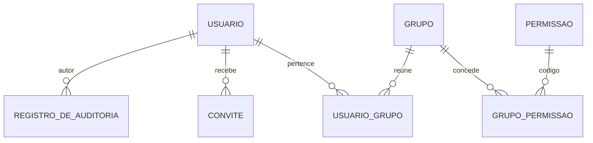
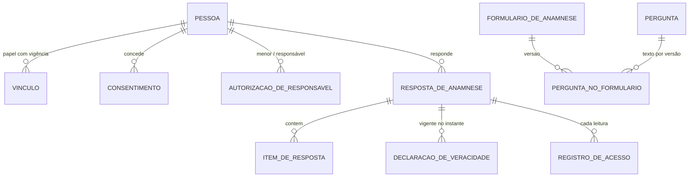
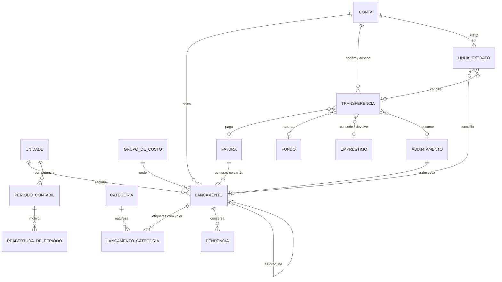
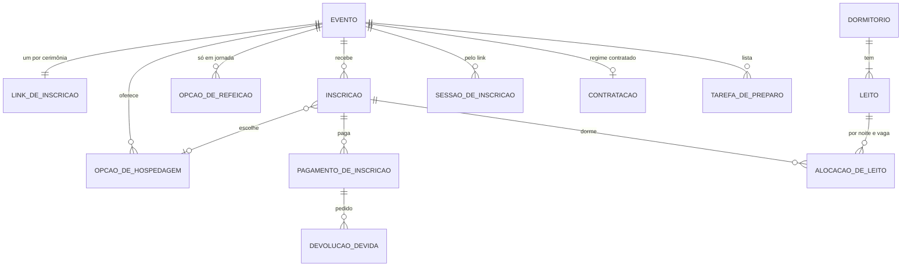
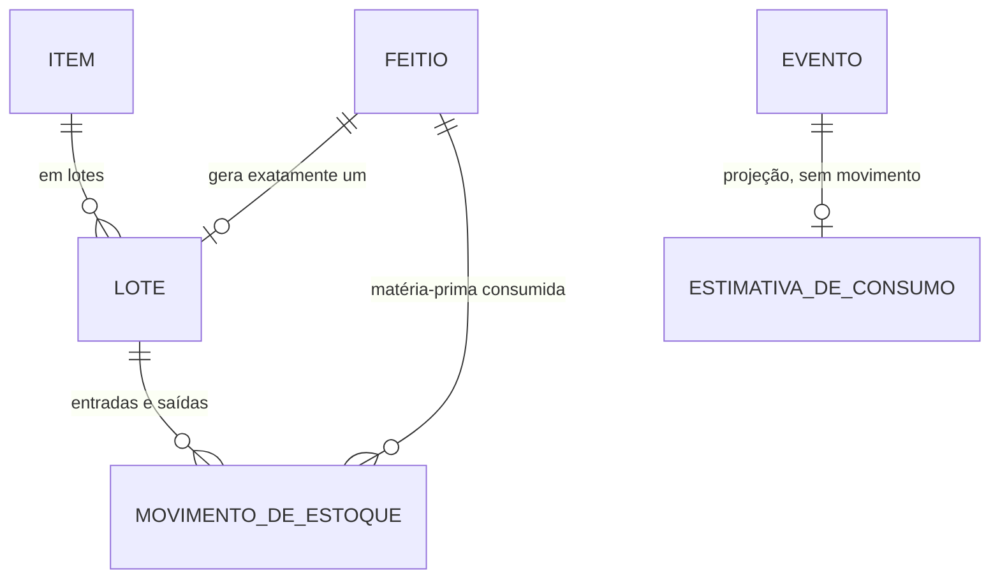

# Sistema de Gestão — Céu do Despertar (CDD)

## Documento 7 — Backend: arquitetura, banco de dados e plano de construção

**Versão 1.2** · outubro/2026 · Status: proposta (B0 entregue)

Alterações em relação à v1.1: encerramento do B0. As seções 2, 5, 6, 7, 8, 9, 12, 13, 22 e 25 passam a descrever o que o código do B0 faz — versões reais, borda transacional, ativação do convite, contexto da instituição, despachante e vigia do outbox, catálogo de erros, CLI da identidade e migrações `b0-000` a `b0-011`. Onde o desenho original continua valendo como alvo das etapas seguintes, o texto diz isso.

Alterações em relação à v1.0: corte "lógica de negócio sai do banco" (issue #11). Toda regra de negócio fica no domínio; no banco ficam estrutura, isolamento, segurança e as guardas mínimas de histórico. As migrations passam a ser a fonte do banco, e o esquema de referência vira documentação congelada. O que fica e o que sai, objeto a objeto, está no anexo.

> Pressupõe os Documentos 1 (Arquitetura), 2 (Modelo de Domínio v2.2), 3 (Identidade e Acesso v2.2), 4 (Mapa de Telas v2.2) e 6 (Plano do Backend).
> O Documento 6 diz **o que** construir e **em que ordem**, e registra as decisões da coordenação. Este documento diz **como**: a forma do servidor, o desenho do banco e o que cada etapa entrega em tabela, endpoint e teste. Onde os dois se tocam, o Documento 6 decide e este detalha.

**Artefatos que acompanham este documento**

| Arquivo | O que é |
|---|---|
| [`sql/cdd-07-esquema.sql`](sql/cdd-07-esquema.sql) | **Documentação do desenho, congelada em set/2026** (issue #11). O esquema de referência como foi desenhado — 6 schemas, 58 tabelas, RLS, gatilhos de guarda, views e o catálogo de permissões —, com mais lógica no banco do que a produção terá: o que fica no banco está no §15 e no anexo. Não é a fonte das migrations (§22). |
| [`sql/cdd-07-verificacao.sql`](sql/cdd-07-verificacao.sql) | **Documentação executável do desenho congelado.** 155 verificações do esquema de referência, rodadas à mão. Não é o teste de CI: a CI roda a verificação de garantias contra o banco migrado (§22, §26). |

```bash
createdb cdd_ref
psql -d cdd_ref -v ON_ERROR_STOP=1 -f docs/sql/cdd-07-esquema.sql -f docs/sql/cdd-07-verificacao.sql
# … 155 linhas "OK" e: Verificação concluída
```

Os dois arquivos foram executados contra PostgreSQL 16 — 16.13 na primeira versão, com 71 verificações; 16.15 na atual, com as guardas de transferência, período e feitio, o bloqueio de `TRUNCATE`, o resolvedor do link e o resolvedor de identidade com dono próprio, a varredura de RLS e o bloqueio de `TRUNCATE` como funções idempotentes, o ator da trilha/anexo, a US2 e o convite revogável, com 155 verificações. As migrations são a fonte do banco (§22), e a CI verifica as garantias contra o banco migrado (§26).

---

# Parte I — Arquitetura

## 1. Forma geral

```
                         ┌────────────────────────────────────────────┐
  Equipe (6 logins) ───▶ │  apps/web · SPA React                      │
                         │  AppShell autenticado                      │──┐ OIDC + PKCE
  Participante ────────▶ │  /i/:token · página pública, sem login     │  │
  (link no WhatsApp)     └───────────────┬────────────────────────────┘  │
                                         │ HTTPS · JSON                  ▼
                         ┌───────────────▼────────────────┐     ┌──────────────┐
                         │  apps/api · NestJS             │◀───▶│  Keycloak    │
                         │  monólito modular              │JWKS │  quem é      │
                         │                                │     └──────────────┘
                         │  identidade  pessoas  eventos  │
                         │  financeiro  estoque           │     ┌──────────────┐
                         │  ── shared: kernel, outbox,    │────▶│  S3 (R2/     │
                         │     auth, tenant, storage      │     │  SeaweedFS)  │
                         └───────────────┬────────────────┘     └──────────────┘
                                         │ um pool, papel cdd_app, RLS
                         ┌───────────────▼────────────────┐     ┌──────────────┐
                         │  PostgreSQL 16                 │────▶│  backup      │
                         │  um schema por módulo          │     │  diário      │
                         └────────────────────────────────┘     └──────────────┘
```

Um processo, um banco, um bucket, um provedor de identidade. Nada de fila externa, cache distribuído ou serviço separado: o volume do CDD — seis logins, 500 a 600 lançamentos por ano, uma cerimônia por semana nos meses cheios — não paga o custo operacional de nenhum deles, e quem vai manter o sistema é uma pessoa em tempo parcial (Doc 1 §5.2).

## 2. Stack

| Camada | Escolha | Por quê, aqui |
|---|---|---|
| Linguagem | TypeScript estrito (`strict` em `tsconfig.base.json`, TypeScript `^5.7`); Node 24 (`.nvmrc`, usado pela CI), com piso `>=22.17` em `engines` | O mesmo `packages/contracts` serve front e back; tipos de domínio não se duplicam |
| Framework HTTP | NestJS `^12.1` (`@nestjs/common`, `core`, `platform-express`) | Módulos, injeção e guards casam com a fronteira por módulo e com `@RequerPermissao`; o domínio não depende dele |
| ORM | MikroORM `^7.2` (`@mikro-orm/postgresql` e `migrations`; Data Mapper + Unit of Work) | Agregado sem anotação de ORM na camada de domínio; UoW é o que permite gravar agregado + outbox + auditoria numa transação |
| Leitura | SQL direto (Kysely `^0.29`, tipos gerados do banco migrado por `kysely-codegen`) sobre as tabelas | Read model é consulta, não agregado; passar por ORM para ler é custo sem ganho |
| Banco | PostgreSQL 16 (imagem `postgres:16.15` no compose) | RLS, `EXCLUDE` com `btree_gist`, `daterange`, `jsonb` |
| Validação | Zod `^4.6`, nos comandos, compartilhado com o front | A mesma regra de forma nos dois lados; a regra de negócio fica no domínio |
| Identidade | Keycloak 26 (`quay.io/keycloak/keycloak:26.4.7`, OIDC); e-mail local pelo Mailpit | Só autenticação. Autorização é domínio (Doc 3 §10.1) |
| Arquivos | S3 compatível. Alvo: Cloudflare R2 em produção. Local: SeaweedFS (`chrislusf/seaweedfs:3.97`), no lugar do MinIO, que deixou de ter imagem pública (comentário em `compose.yaml`) | URL assinada curta; o arquivo nunca passa pelo processo da API na leitura. No B0 a API ainda não tem cliente de storage: `shared.anexo` entra na B1 |
| PDF | HTML + Chromium headless (Playwright) | A prestação de contas usa os mesmos componentes visuais do relatório. Entra na B2 |
| Observabilidade | Pino `^10` (JSON, via `nestjs-pino`), com `correlacaoId` por requisição | Um `correlacaoId` liga log e linha de auditoria. OpenTelemetry e Sentry **não existem** no B0; o alerta de evento esgotado é um log `error` (§13) |
| Testes | Vitest `^4.1`; Testcontainers (`@testcontainers/postgresql`) na integração; aceite real com Keycloak e Mailpit (§13) | §26. Playwright fica para a suíte ponta a ponta das telas |
| Execução | Só `local` (Docker Compose) e CI no B0 | Provedor e topologia de deploy são decisão pendente da coordenação (§13) |

## 3. Módulos e fronteiras

| Módulo | Schema | É dono de | Expõe aos outros (porta pública) |
|---|---|---|---|
| **identidade** | `identidade` | `Usuario`, `Grupo`, catálogo de permissões, convite, trilha de auditoria | `ContextoDoUsuario` (id, pessoa, permissões); `RegistrarAuditoria` |
| **pessoas** | `pessoas` | `Pessoa`, `Vinculo`, `AutorizacaoDeResponsavel`, `Consentimento`, `FormularioDeAnamnese`, `RespostaDeAnamnese`, `DeclaracaoDeVeracidade`, registro de acesso | `VinculoAtivoNaData` (para A1); `SituacaoDaAnamnese` (para IN5); `ResumoDaPessoa` |
| **financeiro** | `financeiro` | `Unidade`, `GrupoDeCusto`, `Categoria`, `Conta`, `Fundo`, `Lancamento` (+ etiquetas, pendências), `Transferencia`, `Fatura`, `Emprestimo`, `Adiantamento`, `PeriodoContabil`, extrato, prestação de contas | `ConsultaDeCustosDoEvento` (Doc 2 §5.1.6); `SituacaoDoPeriodo` |
| **eventos** | `eventos` | `Evento`, opções de hospedagem e refeição, link de inscrição, `Inscricao`, pagamento, `DevolucaoDevida`, `Contratacao`, `Dormitorio`/`Leito`, mapa de leitos, preparo | `ResumoDoEvento` |
| **estoque** | `estoque` | `Item`, `Lote`, `MovimentoDeEstoque`, `Feitio`, `EstimativaDeConsumo` | `SaldoDisponivel` |
| **shared** | `shared` | kernel (`Result`, `AggregateRoot`, `DomainEvent`), outbox, anexos, idempotência, contexto de instituição | — |

**Três regras de fronteira, verificadas por `dependency-cruiser` na CI:**

1. Um módulo só importa de outro o arquivo `public-api.ts` dele — nunca `domain/`, nunca `infrastructure/`.
2. Nenhuma FK cruza schema (verificado também no banco — §15). Referência entre módulos é por id, e a consistência é garantida por comando síncrono via porta pública **ou** por evento assíncrono via outbox — nunca por JOIN entre schemas em código de escrita.
3. Read models podem ler de mais de um schema **só** na camada `interface/queries` de quem monta a tela, e só pela porta de leitura que o módulo dono publica. O painel de um evento lê o read model de custos que o Financeiro publica; não lê `financeiro.lancamento`.

## 4. Dentro do módulo

```
apps/api/src/modules/financeiro/
├── domain/                        sem import de Nest, MikroORM, Zod ou HTTP
│   ├── lancamento/
│   │   ├── lancamento.ts          raiz do agregado: registrar, confirmar, estornar, abrirPendencia…
│   │   ├── etiqueta.ts            value object: categoria + natureza + valor
│   │   ├── pendencia.ts           entidade interna (L10, L11)
│   │   ├── eventos.ts             LancamentoRegistrado, LancamentoConfirmado…
│   │   └── lancamento.repo.ts     interface — a implementação mora em infrastructure
│   ├── periodo/  transferencia/  fatura/  …
│   └── servicos/                  serviços de domínio: CalculadoraDoFechamento, MotorDeSugestao
├── application/
│   ├── comandos/                  um handler por comando: ConfirmarLancamento, FecharPeriodo…
│   └── reacoes/                   handlers de eventos de outros módulos (PagamentoConfirmado → lançamento)
├── infrastructure/
│   ├── persistencia/              entidades MikroORM, mappers domínio ↔ linha, repositórios
│   ├── importacao/                parser OFX/CSV
│   └── acl/                       adaptadores das portas públicas de outros módulos
├── interface/
│   ├── http/                      controllers finos: validam e chamam o handler, que devolve Result; a borda traduz (ok vira o corpo, erro de domínio vira o código do catálogo depois do rollback)
│   └── consultas/                 read models em SQL (um por tela e por bloco)
└── public-api.ts                  o que os outros módulos podem importar
```

A regra que vale a pena repetir: **o domínio não sabe que existe banco.** As invariantes do Doc 2 são testadas em `domain/` sem I/O. O banco repete algumas delas (§15) como segunda trava, não como primeira.

## 5. O caminho de uma escrita

`POST /api/v1/financeiro/lancamentos/{id}/confirmar`, pela Tesouraria, na Verificação de lote (rota da B1; os nomes de infraestrutura são os do B0):

| # | Onde | O que acontece |
|:--:|---|---|
| 1 | `GuardaDeAcesso` (`APP_GUARD`, shared) | Valida o JWT contra o JWKS do Keycloak; lê `sub` |
| 2 | `GuardaDeAcesso`, pelo resolvedor da identidade | Resolve `sub` → `Usuario` → instituição, pessoa e permissões efetivas (união dos grupos). Usuário `SUSPENSO` ou `REVOGADO` para aqui com 401 (§7.1) |
| 3 | `@RequerPermissao('financeiro.lancamento.confirmar')` | Sem a permissão: **404**, não 403, quando o recurso não é visível para o grupo (T16b); 403 quando é visível mas a ação não é permitida |
| 4 | Pipe Zod | Valida o corpo contra o schema do comando, vindo de `packages/contracts` |
| 5 | `BordaTransacionalInterceptor` → `UnidadeDeTrabalho.transacao(modo)` | Abre a transação da requisição no modo da rota — `escrita` e `leitura-que-grava` em `READ COMMITTED`, `leitura` em `REPEATABLE READ` somente leitura — e executa `set_config('app.instituicao_id', …, true)` (o equivalente a `SET LOCAL`) **antes de qualquer consulta**. O repositório toma a trava consultiva de período pela aplicação (§18.5) |
| 6 | Handler | Carrega o agregado pelo repositório (`SELECT … FOR UPDATE` implícito na versão), chama `lancamento.confirmar(por, ajustes)` |
| 7 | Agregado | Aplica L7, L8, L10…; devolve `Result<void, DomainError>` e acumula `LancamentoConfirmado` |
| 8 | Handler | Se `Result` é erro, a transação é desfeita e o erro sobe com seu código (§12) |
| 9 | Repositório, na transação aberta | Grava a linha de `identidade.registro_de_auditoria` de cada evento auditável, o agregado (com `versao + 1`, falha se outra escrita chegou antes) e as linhas de `shared.outbox` com os mesmos eventos |
| 10 | `COMMIT` | Não há gatilho adiável: a soma das etiquetas e a competência aberta já foram conferidas pelo agregado e pelo comando antes do flush. Se o `COMMIT` falhar, nada foi gravado |
| 11 | Controller | Devolve 200 com o read model atualizado do item — o front não precisa recarregar a fila |

**Ordem na aplicação e onde a instituição entra.** `AppModule` registra, nesta ordem: a guarda de acesso (`APP_GUARD`, passos 1–3) → `BordaTransacionalInterceptor` (passo 5) → `IdempotenciaInterceptor`. O `LoggerErrorInterceptor` do log, instalado por `useGlobalInterceptors`, fica por **dentro** dos dois (ordem efetiva: borda, idempotência, logger) e só vê o que o handler lança. O que a borda e a idempotência lançam — `Result` de erro virado exceção, falha no `COMMIT`, conflito de chave — não passa por ele; o filtro global de erros (§12) fecha a resposta de qualquer um deles e registra em `error`, com a `correlacaoId`, todo erro que vira 500. A instituição entra na borda pelo `ProvedorDeContextoDeInstituicao`, que lê o contexto de acesso que a guarda pôs na requisição (`instituicaoId` e `usuarioId`); a borda o publica em `ContextoDaRequisicao` e a unidade de trabalho grava `app.instituicao_id` antes da primeira consulta. Rota `@Publico` ou `@ApenasIdentificado` não tem contexto de acesso: a transação abre sem instituição e a RLS nega o acesso (fail-closed). A idempotência roda **dentro** da borda — reaproveita a transação e a instituição dela — e só vale em `POST` com `Idempotency-Key`. A rota que roda sem instituição no contexto — `@Publico` ou `@ApenasIdentificado`, como a ativação do primeiro acesso, que descobre a instituição dentro do próprio caso de uso — leva `@SemIdempotencia`: o interceptor ignora o `Idempotency-Key` que o front envia sozinho em todo `POST` e executa o handler, sem gravar chave, e a idempotência dessa rota vem do domínio. A aplicação recusa partir com `@SemIdempotencia` em rota que tenha permissão ou instituição no contexto (`@RequerPermissao`, `@RequerAlgumaPermissao`, `@ApenasUsuarioAtivo`) ou sem marca de acesso.

**Modo de transação da rota.** Rota sem `@ModoDeTransacao` abre transação `leitura`. Por isso `POST`, `PUT`, `PATCH` e `DELETE` precisam declarar `escrita` ou `leitura-que-grava`, no método ou na classe: a aplicação recusa partir sem isso, em vez de falhar com 500 só quando chegar uma `Idempotency-Key`. A rota que não usa o banco da aplicação — `/saude/viva` e `/saude/pronta`, que têm pool próprio — se marca com `@SemTransacaoNaBorda` e a borda a deixa passar sem abrir transação. Em `POST`, `PUT`, `PATCH`, `DELETE` ou `ALL`, a aplicação só aceita `@SemTransacaoNaBorda` junto de `@SemIdempotencia` (`VerificadorDeModoDeTransacaoDasRotas`, na partida); sem a segunda marca, recusa partir. É o caso de `POST /eu/ativacao`, que chega sem instituição e abre as próprias transações curtas dentro do caso de uso (§7.2).

**Ganchos depois do commit.** O contexto da transação oferece `aoConfirmar(gancho)`. Os ganchos rodam só depois do `COMMIT` da transação de fora, nunca em rollback nem em `Result` de erro; um gancho que lança vira log `error` e não desfaz nada, porque o commit já aconteceu. É por eles que saem os efeitos externos ao banco: o sinal que acorda o despachante quando o outbox recebeu linha (§9), o envio do convite pelo Keycloak e a liberação direta do acesso na reativação (§7.2). O outbox em si **não** é gancho: as linhas de `shared.outbox` entram na mesma transação do agregado e da trilha (passo 9).

Ilustrativo — o comando é da B1; a assinatura da unidade de trabalho é a do B0 (`transacao(modo, fn)`), e o contexto da instituição vem da borda, não de parâmetro:

```ts
// application/comandos/confirmar-lancamento.handler.ts
@RequerPermissao('financeiro.lancamento.confirmar')
async executar(cmd: ConfirmarLancamento, ctx: Contexto): Promise<Result<void, DomainError>> {
  return this.uow.transacao('escrita', async () => {
    const lancamento = await this.lancamentos.porId(cmd.lancamentoId);
    if (!lancamento) return erro('LANCAMENTO_NAO_ENCONTRADO');

    const r = lancamento.confirmar({ por: ctx.usuarioId, ajustes: cmd.ajustes });
    if (r.isErr()) return r;

    await this.auditoria.registrar(ctx, 'LANCAMENTO_CONFIRMADO', lancamento);
    return ok();                    // o flush grava agregado + outbox + trilha juntos
  });
}
```

**Result de erro desfaz a transação (passo 8).** A porta `UnidadeDeTrabalho` reconhece o `Result` de erro devolvido por `fn` pelo discriminante `tipo === 'erro'` do kernel: desfaz a transação sem `flush`, não dispara os ganchos `aoConfirmar` (nem o sinal do outbox) e devolve o mesmo `Result` ao chamador, sem convertê-lo em exceção. Exceção lançada continua desfazendo como antes.

Transação aninhada reaproveita a de fora e **a de fora decide**: o `Result` de erro devolvido por uma chamada interna chega ao chamador sem desfazer nada. Se a de fora o repassa como seu retorno, tudo é desfeito, inclusive as escritas da interna; se o ignora e devolve sucesso, tudo é confirmado. Não há savepoint. Na borda HTTP, o `BordaTransacionalInterceptor` converte o `Result` de erro devolvido pelo handler em `ErroDeDominioException` depois do rollback, e o filtro global responde pelo código de domínio (§12). No `Result` ok, a mesma borda entrega o `valor` como corpo da resposta, sem o envelope `{tipo, valor}`.

**Por que a auditoria é síncrona e não um assinante do evento.** Uma trilha que pode perder linha quando o despachante falha não é trilha. Ela entra na mesma transação do ato; se a transação desfaz, a linha some junto, e é isso que se quer.

**Como a trilha da identidade entra na transação.** O repositório da identidade retira os eventos do agregado e, dentro da transação do `salvar`, chama o gravador de trilha **antes** de tocar o agregado: a fotografia dos grupos do autor (`autor_grupos`) é lida do banco nesse instante, e o mesmo agregado pode estar trocando os grupos do próprio autor logo em seguida. Depois vêm o agregado e o outbox, com os mesmos eventos. Cada tipo de evento da identidade tem um mapeamento **explícito** para a operação, o alvo e os `detalhes` (ids e valores de domínio, nunca nome, e-mail ou CPF), ou consta numa lista de não auditados, que hoje é vazia; evento fora das duas listas é erro de programação, e um teste percorre as operações do domínio para provar que nenhuma escapa. Falha depois da gravação — exceção, `Result` de erro, conflito de versão — desfaz a trilha junto com o ato.

## 6. O caminho de uma leitura

Leitura não passa por agregado. Cada tela tem uma consulta — e, pela diretriz de tela única com autorização por bloco (Doc 6 §2.2), cada **bloco** da tela é uma consulta separada, executada só se o usuário tem a permissão daquele bloco.

```ts
// interface/consultas/painel-do-evento.consulta.ts
async montar(eventoId: EventoId, ctx: Contexto): Promise<PainelDoEvento> {
  return {
    evento:      await this.cabecalho(eventoId),                                      // sempre
    inscricoes:  ctx.pode('eventos.inscricao.ler')          ? await this.inscricoes(eventoId) : undefined,
    arrecadacao: ctx.pode('eventos.arrecadacao.ler')        ? await this.arrecadacao(eventoId) : undefined,
    custos:      ctx.pode('financeiro.resultado_evento.ler') ? await this.custos(eventoId) : undefined,
  };
}
```

O bloco sem permissão **não é consultado e não aparece na resposta** — a chave está ausente, não nula. O teste confere a ausência da chave, nunca a invisibilidade na tela (Doc 6 §10). É o mesmo princípio de Doc 3 §10.2 levado a nível de bloco: dado que o usuário não pode ver não sai do banco.

**Como a leitura roda no B0.** Os leitores são portas da camada `application` (`LeitorDeUsuarios`, `LeitorDeGrupos`, `LeitorDoEu`…) implementadas em `infrastructure` com Kysely (`*.kysely.ts`). Cada leitor pede `unidadeDeTrabalho.transacao('leitura', ({ kysely }) => …)` e consulta pelo Kysely do próprio contexto da transação — nunca por uma conexão avulsa:

- **Na requisição HTTP**, a borda já abriu a transação da rota (rota sem `@ModoDeTransacao` abre `leitura`; as listagens declaram `leitura` explicitamente, com uma exceção: `GET /identidade/auditoria` declara `leitura-que-grava`, e o `LeitorDeAuditoria` recebe a transação como parâmetro em vez de abrir uma). O pedido do leitor é aninhado e **reaproveita** essa transação, com a instituição que a borda gravou ao abri-la. Uma transação aninhada pode pedir `leitura` dentro de `escrita`, mas não o contrário: pedir modo gravável dentro de uma `leitura` aberta lança `ErroDeModoDeTransacaoIncompativel`.
- **A transação de leitura** é `REPEATABLE READ` e `READ ONLY`: todas as consultas de uma resposta veem o mesmo instantâneo, e uma escrita acidental falha no banco.
- **O isolamento vem da RLS**, não de `WHERE instituicao_id` no leitor: sem instituição no contexto, a consulta devolve vazio (§8).
- **Fora da borda** — a guarda de acesso, que roda antes dela, o caso de uso da ativação e o CLI —, quem lê fixa a instituição com `emContextoDaInstituicao(instituicaoId, fn)` antes de abrir a transação. No consumidor do outbox a transação já vem aberta pelo despachante, que grava a instituição do evento nela (§8, §9).

**Leitura de dado de saúde é escrita.** A consulta que devolve uma `RespostaDeAnamnese` grava `pessoas.registro_de_acesso` na mesma transação (RA3). Por isso ela roda em transação gravável (`leitura-que-grava`), não na de leitura: se o registro falhar, a leitura falha. `GET /eu` já usa esse modo no B0 para atualizar `ultimo_acesso_em` (§7.1).

## 7. Identidade, autenticação e o link público

### 7.1 Equipe

- O SPA autentica no Keycloak com **Authorization Code + PKCE**. Nada de senha passa pela API.
- A API valida o token (assinatura, `iss`, `aud`, expiração) e usa só o `sub`. **Grupos do Keycloak não são lidos** — o realm não tem papel de negócio nenhum (Doc 3 §10.1). Quem pode o quê está em `identidade.usuario_grupo` + `identidade.grupo_permissao`.
- O `sub` chega sem instituição, e `identidade.usuario` tem RLS FORCE: sem contexto, nem o dono dos objetos leria a linha para descobri-la. No passo 2 de §5 (`GuardaDeAcesso`), a API chama `identidade.resolver_sujeito(sub)` — função `SECURITY DEFINER` de dono próprio, `cdd_resolvedor_identidade` (**não** `BYPASSRLS`, política só dele — mesmo desenho do link público, §7.3, §8), que devolve só `instituicao_id` e `usuario_id`. A partir daí o contexto é montado (`emContextoDaInstituicao` e `set_config` ao abrir a transação, §8) e o resto — pessoa, grupos, permissões efetivas — vem de uma consulta normal de `cdd_app`, já sob a RLS de sempre.
- Resolvida a instituição, a guarda lê a situação do usuário e as permissões efetivas (grupos **ativos** do usuário × `grupo_permissao`, reduzidos por `PermissoesEfetivas`) numa transação de leitura aberta já com `app.instituicao_id`. `CONVITE_PENDENTE`, `SUSPENSO` e `REVOGADO` recusam com o código próprio (401); sujeito sem usuário recusa com `USUARIO_DESCONHECIDO`. A guarda roda antes da borda transacional, então o adaptador monta o contexto da requisição por conta própria.
- O resultado (contexto ou recusa) fica em cache em memória por `sub`, por 60 s. O cache é invalidado no próprio processo, depois do commit, pelos consumidores de outbox da identidade: `GRUPO_ALTERADO`, `USUARIO_ATIVADO`, `USUARIO_SUSPENSO` e `USUARIO_REATIVADO` esquecem o usuário do evento; `GRUPO_EDITADO` esquece todos os usuários da instituição do evento. Uma leitura iniciada antes de uma invalidação não grava o resultado velho no cache. O consumidor do outbox roda numa só réplica: com mais de uma, as demais servem o cache velho até 60 s, e esse TTL é o limite do atraso. Sujeito desconhecido não entra no cache.
- `GET /eu` é a única rota sem permissão específica (`@ApenasUsuarioAtivo`, Doc 3 §10–§11) e relê do banco o nome, a situação, os grupos e as permissões, sem usar o cache. Se a situação não for `ATIVO`, ele esquece o cache daquele `sub` e responde 401, com o desafio `WWW-Authenticate: Bearer` como toda resposta 401, e o código da situação (`USUARIO_CONVITE_PENDENTE`, `USUARIO_SUSPENSO` ou `USUARIO_REVOGADO`), mesmo dentro dos 60 s de TTL; a guarda ainda decide com o contexto em cache, então a recusa chega ao `/eu` por essa releitura e às demais rotas pela invalidação feita nela. A rota roda em transação `leitura-que-grava` e atualiza `ultimo_acesso_em` com um `UPDATE` condicional — só quando o valor gravado é nulo ou anterior a uma hora —, sem alterar `versao`: um comando concorrente sobre o mesmo usuário não toma conflito por causa do acesso. A falha dessa escrita vira log de aviso, sem dado pessoal, e não afeta a resposta.
- Token de acesso de 5 min, refresh de 8 h com rotação. Suspender um usuário revoga as sessões no Keycloak **e** falha no passo 2 de §5 — as duas coisas, porque a segunda não depende da primeira ter funcionado.
- **Suspensão e reativação no provedor (B0).** Desativar (`POST /identidade/usuarios/:id/desativar`) leva o usuário a `SUSPENSO` e reativar o devolve a `ATIVO`; os dois emitem evento na mesma transação. O `SincronizadorDoAcessoNoProvedor` reage a `USUARIO_SUSPENSO` e `USUARIO_REATIVADO` pelo outbox e é **convergente**: não aplica o evento, relê a situação atual no banco e põe o Keycloak de acordo — `ATIVO` reabilita a conta (`enabled: true`); qualquer outra situação desabilita e encerra as sessões (`PUT /users/{sub}` com `enabled: false` e `POST /users/{sub}/logout`). Assim, eventos que chegam fora de ordem ou repetidos terminam no mesmo estado. Conta que o Keycloak não conhece conta como convergida (log de aviso). A reativação também agenda uma **liberação direta** no `aoConfirmar` (`LiberacaoDiretaDoAcesso`), que relê a situação antes de reabilitar, para não esperar o ciclo do despachante; se ela falhar, vira log e o consumidor converge depois. O aceite real confere que o usuário suspenso não obtém token (T26, §13).
- **Adaptador do Keycloak.** A API fala com a Admin API do realm por uma conta de serviço própria, com token obtido por `client_credentials` (`KEYCLOAK_ADMIN_CLIENT_ID` e `CDD_KC_ADMIN_SEGREDO`) e guardado em cache até perto de expirar. Cada chamada tem 3 s de limite e cada operação, 15 s de orçamento (`configuracao-do-keycloak.ts`). Falha de rede ou resposta fora do formato vira `PROVEDOR_DE_IDENTIDADE_INDISPONIVEL` (503) no caso de uso que precisa da resposta: na ativação, a borda responde 503; no bootstrap por vínculo, que roda pelo CLI, o comando sai com código 1.

### 7.2 Convite

`sistema.usuario.gerenciar` cria o `Usuario` em `CONVITE_PENDENTE` e um convite com token aleatório; o banco guarda só o SHA-256 dele. Ao aceitar, a pessoa cria a credencial no Keycloak (tela do tema do CDD), o `sub` é gravado e a situação vira `ATIVO`. Convite vale 72 h e é de uso único.

A ativação chega sem instituição no contexto, e `identidade.convite` tem RLS FORCE. A API descobre a casa do convite por `identidade.resolver_convite(hash)`, no mesmo desenho de `resolver_sujeito` (§7.1, §8): devolve só `instituicao_id` e `usuario_id` e não olha validade. Vencido, usado ou revogado é regra do caso de uso, conferida depois, já com o contexto da instituição.

**Convite vencido e não revogado continua vigente para o índice.** `convite_vigente_unico` (§15) só sai do caminho de um usuário quando `usado_em` ou `revogado_em` deixam de ser nulos — a expiração por si só não grava nada. O reenvio de convite, então, precisa **revogar o anterior na mesma transação** antes de criar o novo; sem isso, o `INSERT` do novo convite esbarra no índice único mesmo com o velho havendo expirado horas atrás.

**Envio pelo Keycloak.** Convidar (`POST /identidade/usuarios`) e reenviar (`POST /identidade/usuarios/:id/convite/reenviar`) gravam o convite e só no `aoConfirmar` (§5) chamam o `EnviadorDeConvite`: ele cria o usuário no realm — ou adota o que já existe com o mesmo e-mail, se ele não pertencer a outro usuário do CDD — e dispara o `execute-actions-email` do Keycloak, com validade igual ao que resta do convite e `redirect_uri` para `<APP_URL_BASE>/entrar?convite=<token>`. A pessoa define a senha no tema do CDD, volta ao SPA e o SPA chama a ativação. Falha no envio vira log `error` com o id do usuário e o tipo da falha, sem e-mail nem token; o commit já aconteceu.

**Reenvio com limite.** Reenviar antes de 60 s desde o convite vigente é recusado pelo domínio com **429 `CONVITE_REENVIADO_RECENTEMENTE`**, com a espera em `detalhes.retryAfterSegundos` (entre 1 e 60). O filtro global copia esse valor para o cabeçalho `Retry-After` **só quando o status é 429** e o valor é um inteiro ≥ 1 (`retry-after.ts`); nenhuma outra resposta leva `Retry-After`.

**Ativação: `POST /eu/ativacao`.** A rota é `@ApenasIdentificado` (token válido, sem usuário resolvido), `@SemIdempotencia` e `@SemTransacaoNaBorda`, e recebe `{ convite }`. Ela não tem transação na borda porque a instituição só é descoberta pelo convite, e porque uma das etapas é uma chamada HTTP ao Keycloak, que não pode segurar conexão nem transação aberta. O caso de uso `AtivarConvite` faz, nesta ordem:

1. Resolve o hash do token por `identidade.resolver_convite`. Token desconhecido devolve `CONVITE_INVALIDO` sem chamar o Keycloak.
2. Entra em `emContextoDaInstituicao` e abre uma **leitura curta**, que avalia a ativação no agregado (vencido, usado, revogado, situação do usuário). O mesmo `sub` já ativo responde 200 aqui — é daí que vem a idempotência da rota.
3. **Fora de transação**, confere no Keycloak que o e-mail do `sub` é o do convite. Divergente: `CONVITE_DE_OUTRO_SUJEITO` (403); Keycloak indisponível: `PROVEDOR_DE_IDENTIDADE_INDISPONIVEL` (503).
4. Abre uma **escrita curta** que relê o usuário e **reavalia** a ativação antes de gravar `subject_id`, a trilha e o outbox — o estado pode ter mudado durante a chamada ao Keycloak. Um `sub` já ligado a outro usuário vira `SUJEITO_JA_VINCULADO` (409). Duas ativações concorrentes terminam em 200 ou 409, nunca 500 (corpo do #76).

**Normalização do e-mail.** `normalizarEmail` (`application/convite/normalizar-email.ts`) apara as pontas, aplica a normalização Unicode **NFC** (composição canônica: o mesmo caractere acentuado digitado de formas diferentes vira a mesma sequência) e passa a minúsculas. Ela é usada em três pontos, todos de comparação ou gravação contra o Keycloak: na ativação (passo 3, nos dois lados), no bootstrap (normaliza o `--admin-email` antes de gravar e compara com o e-mail do `sub` no modo vínculo) e no `EnviadorDeConvite`, ao procurar no realm o usuário de mesmo e-mail para adotar. O convite comum pela API não passa por ela: o schema do contrato (`comandos/identidade.ts`) apara e passa a minúsculas, sem NFC.

### 7.3 O link público de inscrição

A rota `/i/:token` é a única porta do sistema aberta sem login (Doc 6 §2.6). Ela precisa de desenho próprio porque inverte a ordem de §5: **a instituição não vem do usuário, vem do link.**

1. `GET /api/v1/publico/inscricao/{token}` chama `eventos.resolver_link(token)` — função `SECURITY DEFINER` que devolve **só** `instituicao_id` e `evento_id`. O dono dela é o papel `cdd_resolvedor_link` (§8): com RLS forçada, nem o dono dos objetos leria a tabela sem contexto. A partir daí o contexto é montado como em qualquer requisição e a RLS vale igual. A tabela de links continua fechada para quem não tem contexto (verificado).
2. A pessoa declara o CPF. A API cria uma `sessao_de_inscricao` (cookie `httpOnly`, `SameSite=Strict`, expira em no máximo 2 h; o banco guarda só o hash do segredo).
3. Se o CPF é conhecido, a pessoa **confirma um fator** antes de ver qualquer dado dela (ver o achado abaixo). Até cinco tentativas por sessão; depois, a sessão morre e a recepção é o caminho.
4. Cadastro, anamnese, declaração de veracidade e inscrição são comandos normais do domínio, executados com o `pessoaId` da sessão conferida — nunca com um id vindo do corpo da requisição.
5. Limite de taxa por token e por IP (30 aberturas/min por token; 10 identificações/min por IP), no processo, sem Redis. `link_de_inscricao.aberturas` alimenta o contador que a tela `E-06` mostra.

> **Achado de segurança — o CPF sozinho não pode abrir a anamnese de ninguém.**
>
> A tela pública construída reconhece a pessoa só pelo CPF e, em seguida, mostra as respostas herdadas da anamnese dela — medicação, condição de saúde, histórico. O link é o mesmo para todo mundo e circula em grupo de WhatsApp; CPF não é segredo (está em nota fiscal, cadastro de loja, cópia de documento). **Qualquer pessoa com o link e o CPF de outra lê dado de saúde dela.** Pela LGPD é dado sensível, e o vazamento seria da casa.
>
> **Recomendação:** depois do CPF conhecido, pedir a **data de nascimento** — que o próprio cadastro pelo link já coleta — e só então mostrar qualquer resposta anterior. Não é um fator forte, e o documento não finge que é: é proporcional ao risco, não custa nada à pessoa e fecha o caso trivial (alguém digitando o CPF de outra). O fator forte é um código de uso único pelo WhatsApp ou e-mail; fica como evolução, porque exige integração paga e a casa pode preferir não ter.
>
> Até a conferência, a resposta da API para CPF conhecido diz apenas *"encontramos seu cadastro"* — nem nome, nem situação da anamnese. **Muda a tela `/i/:token`** (um campo a mais no passo de identificação) e é **decisão da coordenação** (§27, #1).

### 7.4 Primeiro administrador e seed de demonstração

Banco novo não tem instituição nem usuário, e sem administrador ninguém convida ninguém. Os dois caminhos de entrada são subcomandos do CLI da identidade (`apps/api/src/identidade-cli/`), não rotas HTTP; a operação está em §13 e no README.

- **Bootstrap** (`pnpm db:identidade:bootstrap`): numa só transação de escrita, sob `emContextoDaInstituicao` com o id da instituição nova, toma uma trava global, recusa se já houver o marcador `identidade.bootstrap_executado` ou qualquer instituição (`BOOTSTRAP_JA_EXECUTADO`), cria a instituição, semeia os seis grupos, cria o administrador pelo agregado `Usuario` e grava o marcador (§8, §22). No modo convite, o envio pelo Keycloak acontece depois do commit; no modo vínculo (`--sujeito`), o e-mail do `sub` é conferido no Keycloak **antes** da transação, e o administrador já nasce `ATIVO`.
- **Seed de demonstração** (`pnpm db:identidade:seed-demo`): cria pelo domínio a instituição de demonstração, liga o `dev@cdd.local` do realm local a um administrador ativo e cria usuários fictícios (`*@demo.cdd.invalid`, `sub` `demo:<slug>`). Só roda com `CDD_AMBIENTE=local` ou `ci` e banco e Keycloak em loopback (§13); não escreve o marcador do bootstrap.

O CLI fixa `CDD_PROCESSO=cli` antes de carregar qualquer módulo (`identidade-cli/cli.ts`), e com isso o despachante e a vigia do outbox não sobem no processo do CLI (§9): os eventos gravados ficam no outbox e a API os entrega quando subir.

## 8. Multi-instituição

O CDD é uma instituição. O desenho é multi-instituição desde o início porque o Doc 1 §4.2 pede — e porque a mesma garantia que separa duas casas separa, de graça, o que um bug poderia misturar.

**Três travas, em camadas:**

| Trava | Onde | O que impede |
|---|---|---|
| **RLS com FORCE** em toda tabela com `instituicao_id` | banco | Ler ou gravar linha de outra instituição. Aplicada por varredura no fim do esquema — tabela nova não escapa, e o teste T23 confere |
| **FK composta** `(instituicao_id, x_id)` dentro do schema | banco | Apontar para linha de outra instituição sabendo o id. FK ignora RLS; a composta não |
| **Filtro global do MikroORM** | aplicação | Segunda camada na consulta, e o que torna o erro legível quando a RLS barra. **Não existe no B0**: a segunda camada hoje é a persistência da identidade, que toma a instituição do contexto da requisição (`instituicaoDoContexto()`) e falha sem ela |

**Como o contexto chega ao banco.** A instituição vive no `ContextoDaRequisicao` (um `AsyncLocalStorage`), e a `UnidadeDeTrabalho` a grava com `select set_config('app.instituicao_id', $1, true)` — o terceiro argumento faz o valor valer só na transação, como `SET LOCAL` — logo depois de abrir a transação e antes de qualquer consulta. O valor morre no fim da transação, então a conexão volta limpa ao pool — não há como uma requisição herdar a instituição da anterior. Consulta fora de transação não tem contexto e **devolve vazio** (`shared.instituicao_atual()` é *fail-closed*): esquecer o contexto produz tela vazia, nunca vazamento.

- **Só a transação de fora grava.** O `set_config` roda apenas quando a `UnidadeDeTrabalho` abre a transação externa (fora o despachante, que grava a instituição do evento no meio da própria transação, §9); uma transação aninhada reaproveita a aberta e não toca a variável. Trocar a instituição no meio de uma transação, portanto, não tem efeito no banco.
- **`emContextoDaInstituicao(instituicaoId, fn)`** (`shared/infrastructure/contexto-da-instituicao.ts`) põe a instituição no `ContextoDaRequisicao` para quem não passa pela borda: a guarda de acesso depois de resolver o `sub`, a ativação depois de resolver o convite, o bootstrap com a instituição recém-gerada, o seed de demonstração e os leitores usados pelos consumidores. Como a regra acima, ela só chega ao banco se for chamada **antes** de a transação abrir.
- **Na borda HTTP**, a instituição vem do contexto de acesso que a guarda pôs na requisição (§5); rota sem usuário resolvido abre a transação sem instituição.

**Papéis do banco.**

| Papel | Uso | `BYPASSRLS` |
|---|---|:--:|
| `cdd_owner` | dono dos objetos; roda migrations | — (FORCE vale para ele também) |
| `cdd_app` | a aplicação em execução | **não** |
| `cdd_backup` | `pg_dump` | sim, só leitura |
| `cdd_resolvedor_link` | dono só de `eventos.resolver_link`; lê quatro colunas de `link_de_inscricao` por uma política só dele | **não** |
| `cdd_resolvedor_identidade` | dono só de `identidade.resolver_sujeito` e `identidade.resolver_convite`; lê três colunas de `identidade.usuario` e três de `identidade.convite`, cada tabela por uma política só dele | **não** |

Há três exceções desenhadas. O despachante do outbox: `shared.outbox` não tem RLS (a varredura o exclui pelo nome) porque ele lê eventos de todas as instituições; abre a transação sem instituição, escolhe o próximo evento e, antes de entregá-lo, grava nela o `instituicao_id` do evento com o mesmo `set_config` (§9). E os resolvedores que chegam sem instituição: o do link público, que lê o token de qualquer instituição sem `BYPASSRLS` — por uma política `FOR SELECT TO cdd_resolvedor_link` — e devolve só a instituição e o evento; e o do sujeito autenticado (§7.1), que lê o `sub` de qualquer instituição sem `BYPASSRLS` — por uma política `FOR SELECT TO cdd_resolvedor_identidade` — e devolve só a instituição e o usuário; e o do convite (§7.2), que pelo mesmo papel e por uma política `FOR SELECT TO cdd_resolvedor_identidade` em `identidade.convite` acha o convite pelo SHA-256 do token e devolve só a instituição e o usuário. Em produção, quem roda a migration precisa poder assumir os dois papéis para passar as funções a eles: `GRANT cdd_resolvedor_link TO cdd_owner WITH INHERIT FALSE` e `GRANT cdd_resolvedor_identidade TO cdd_owner WITH INHERIT FALSE`. Sem o `INHERIT FALSE`, o dono herdaria a política de um dos resolvedores e leria sem contexto as linhas de todas as instituições.

**Uma tabela de propósito sem `instituicao_id`: o marcador do bootstrap.** `identidade.bootstrap_executado` (`b0-011`) tem linha única (`id boolean PRIMARY KEY DEFAULT true CHECK (id)`), `criado_em` e `admin_usuario_id`, e `cdd_app` só pode ler e inserir nela. Ela registra que o primeiro administrador já foi criado **no banco**, não numa instituição. Se tivesse `instituicao_id`, a varredura lhe aplicaria RLS FORCE, e a guarda do bootstrap — que roda sob o contexto da instituição recém-gerada — leria 0 linhas e nunca enxergaria o marcador gravado antes. Sem a coluna, a varredura não a alcança, e a recusa da segunda execução funciona em qualquer contexto.

## 9. Eventos de domínio e integração entre módulos

**Outbox transacional, despacho no mesmo processo.** O agregado acumula eventos; o UoW grava-os em `shared.outbox` na mesma transação. Um laço no processo, o `Despachante` (a cada 1 s, `INTERVALO_DE_POLLING_EM_MS = 1000`, e imediatamente após cada commit que gravou evento, pelo sinal do `aoConfirmar`), processa **um evento por transação** — até 100 por ciclo —: escolhe o próximo com `FOR UPDATE SKIP LOCKED` e `LIMIT 1`, grava na transação a instituição do evento (§8), entrega a cada consumidor num savepoint próprio e marca `publicado_em`. Falha de um consumidor desfaz só o savepoint dele, incrementa `tentativas`, grava `ultimo_erro` (só a classe do erro, o SQLSTATE e o nome da restrição, quando há — nunca a mensagem nem o `detail` do driver, que podem trazer dado pessoal) e agenda `proxima_tentativa_em` com backoff exponencial — 1 s × 2^(n−1), com teto de 5 min (`backoff.ts`). O teto é `TETO_DE_TENTATIVAS = 10` (`teto-de-tentativas.ts`): ao chegar a 10, o despachante loga `error` com o `evento_id` e o evento está **esgotado** — sai da consulta do laço e passa a contar para a vigia (abaixo e §13). Consumidor que não responde em 30 s (padrão de `TIMEOUT_DO_CONSUMIDOR_EM_MS`) aborta a transação inteira do evento, e a falha é registrada numa transação separada. A consulta do laço — `publicado_em IS NULL AND tentativas < 10 AND coalesce(proxima_tentativa_em, '-infinity') <= now() ORDER BY id` — é servida pelo índice parcial `outbox_pendentes (id) WHERE publicado_em IS NULL AND tentativas < 10`: o backoff entra como filtro de execução, não como predicado do índice, porque depende do relógio e não pode ser fixado na hora de criar o índice. O teto (10) vai **literal** nessa consulta — como parâmetro de uma rotina preparada, o planner passa a usar plano genérico e deixa de enxergar que o índice parcial cobre o predicado, caindo para full scan.

`id` é ordem global de inserção, não ordem por agregado: com o filtro de backoff, o evento n+1 de um agregado pode ficar livre para sair enquanto o n ainda espera (o estorno antes da confirmação, por exemplo). Manter a ordem por agregado é dever do **despachante** (B0), não do índice: antes de entregar um evento, ele confere que não há evento anterior do mesmo agregado ainda pendente — `NOT EXISTS (SELECT 1 FROM shared.outbox anterior WHERE anterior.agregado_tipo = e.agregado_tipo AND anterior.agregado_id = e.agregado_id AND anterior.id < e.id AND anterior.publicado_em IS NULL)`. Um evento que estourou o teto de tentativas trava o agregado inteiro atrás dele — é para isso que ele dispara o alerta: destravar exige uma decisão humana, não uma nova tentativa automática (§13, linha "Evento esgotado").

**Quem roda na aplicação.** `EventosModule` faz parte do `AppModule`: o despachante (a cada 1 s e após cada commit que gravou evento), a vigia de eventos esgotados e a descoberta dos consumidores `@ReageA` — no B0, o invalidador do cache de acesso e o sincronizador do acesso no Keycloak (§7.1) — sobem com a API.

**Vigia de eventos esgotados.** A `VigiaDeEventosEsgotados` conta, a cada 60 s (`INTERVALO_DA_VIGIA_EM_MS = 60_000`), os eventos com `publicado_em IS NULL AND tentativas >= 10` — consulta servida pelo índice parcial `outbox_esgotados` (`b0-006`). Ela **só loga quando a contagem muda** em relação à última verificação do processo: mudou para um valor maior que zero (para cima ou para baixo), `error` `outbox: eventos esgotados` com `quantidade` e `maisAntigoEm`; voltou a zero, `info` `outbox: nenhum evento esgotado`. Contagem igual não gera linha, então um esgotado parado aparece uma vez por processo, não a cada minuto. Falha na própria contagem vira `warn`.

**Seguidores travados.** Como o despachante só entrega um evento quando não há anterior pendente do mesmo agregado (o `NOT EXISTS` do parágrafo sobre a ordem por agregado), um evento esgotado trava **todos os eventos seguintes do mesmo agregado**, inclusive os que ainda não falharam. A prontidão não os conta como atraso (§13): é a vigia que avisa, e destravar é decisão humana.

**Modo do processo.** `ModoDoProcesso` (`modo-do-processo.ts`) é `'api'` ou `'cli'`, lido de `CDD_PROCESSO` (ausente = `'api'`; outro valor impede a partida). Em `'cli'`, o despachante e a vigia não ligam temporizador nem ouvem o sinal de commit. O CLI da identidade (§7.4) fixa `CDD_PROCESSO=cli` na primeira linha; os eventos que ele grava ficam no outbox e são entregues pela API quando ela subir. O expurgo das chaves de idempotência (`IdempotenciaModule`) roda na partida e a cada hora. Os repositórios da identidade e o semeador de grupos de sistema entram no `IdentidadeModule` junto com o outbox, de que dependem.

**Todo assinante é idempotente.** Antes de agir, grava `(consumidor, evento_id)` em `shared.evento_processado` na mesma transação do efeito; se a linha já existe, não faz nada. Entrega "pelo menos uma vez" + consumidor idempotente = efeito exatamente uma vez.

**Não há assinante de notificação** (Doc 1 §5.4). Evento alimenta integração, projeção e fila de trabalho — nunca e-mail ou push.

| Evento | Publicado por | Consumido por | Efeito |
|---|---|---|---|
| `PagamentoDeContribuicaoRegistrado` | eventos | financeiro | Cria `Lancamento` `CONFIRMADO`, origem `INTEGRACAO_EVENTOS`, etiqueta de contribuição, e preenche `pagamento_de_inscricao.lancamento_id` (Doc 2 §5.1.1). O controle é a conciliação, não a conferência |
| `ContratacaoRecebida` | eventos | financeiro | Receita `CACHE_RECEBIDO` na unidade comercial; conta para o teto (§5.1.2) |
| `DevolucaoEfetivada` | eventos | financeiro | **Estorno** da receita original — a contribuição (Doc 6 §2.5.1) ou o cachê da contratação cancelada (CN4) —, nunca despesa |
| `InscricaoCancelada` | eventos | eventos | Libera leitos (ML3) |
| `ConsumoDeCerimoniaRegistrado` | estoque | eventos | Atualiza o resumo do evento |
| `FeitioConcluido` | estoque | financeiro (leitura) | Congela o custo por litro; aparece no relatório |
| `LancamentoConfirmado` / `Estornado` | financeiro | estoque | Recalcula custo parcial de feitio em andamento |
| `FormularioPublicado` | pessoas | pessoas | Recalcula pendências de anamnese das inscrições abertas |
| `GRUPO_ALTERADO`, `GRUPO_EDITADO`, `USUARIO_ATIVADO`, `USUARIO_SUSPENSO`, `USUARIO_REATIVADO` | identidade | identidade (`InvalidadorDoCacheDeAcesso`) | Invalida o cache de contexto de acesso (§7.1). **Existe no B0** |
| `USUARIO_SUSPENSO`, `USUARIO_REATIVADO` | identidade | identidade (`SincronizadorDoAcessoNoProvedor`) | Converge a conta no Keycloak com a situação atual (§7.1). **Existe no B0** |

**Portas síncronas** são usadas quando a resposta decide o comando — e só então:

- `VinculoAtivoNaData(pessoaId, papeis, data)` — A1: quem autoriza adiantamento precisa ser padrinho ou madrinha na data da despesa. Consulta `pessoas.vinculo`; o Financeiro nunca lê a tabela.
- `SituacaoDaAnamnese(pessoaId, eventoId)` — IN5: confirmar inscrição exige resposta em dia **e** declaração para aquele evento.
- `ConsultaDeCustosDoEvento(eventoId)` — resultado da cerimônia e custo do feitio.
- `SituacaoDoPeriodo(unidadeId, competencia)` — a Devolução decide em que competência o estorno entra.

## 10. Arquivos

- Chave no bucket: `{instituicao}/{modulo}/{uuid}` — nunca o nome original, que vai para `shared.anexo.nome_original`.
- **Upload direto ao bucket** com URL pré-assinada de `PUT` (5 min, tamanho e tipo fixados na assinatura); a API registra o anexo depois de conferir o SHA-256.
- **Leitura só por URL assinada de 5 min**, gerada depois da verificação de permissão do recurso dono do anexo. Não há URL pública nunca.
- Tipos aceitos: imagem, PDF, OFX/CSV. Limite de 10 MB. Anexo marcado `sensivel` (documento de autorização de responsável) só é servido a quem tem a permissão do bloco correspondente, e a leitura entra no registro de acesso.
- Anexo órfão (registrado e nunca referenciado em 24 h) é removido por rotina diária.

## 11. Relatórios e prestação de contas

- DRE, fluxo de caixa, resultado por cerimônia e por grupo de custo são **read models do backend** — consultas Kysely sobre as tabelas (§18.6 documenta o SQL histórico como referência de cálculo). Com ~600 lançamentos por ano, nenhuma materialização se paga.
- A prestação de contas é um PDF gerado por Chromium headless a partir de uma página HTML interna, com os mesmos componentes do relatório na tela. O arquivo vai ao bucket; `financeiro.prestacao_de_contas` guarda período, nível, autor, **hash SHA-256** do PDF e é só-inserção. A assembleia pode conferir que o documento que recebeu é o que o sistema gerou.
- Nível `RESUMO` suprime identidade de pessoa física (Doc 1 §6); `DETALHADO` exige `financeiro.prestacao_contas.detalhada`.
- O fechamento grava o hash do conjunto de lançamentos da competência (P2) — ordenados por id, serializados de forma canônica — e a reabertura guarda o hash anterior. Mudou o mês depois de prestado, a divergência aparece. O hash é calculado pelo domínio.

## 12. API: convenções e catálogo de erros

| Tema | Convenção |
|---|---|
| Estilo | REST + JSON, prefixo `/api/v1/{modulo}/…`. Comando que não é CRUD é verbo em subrecurso: `POST /lancamentos/{id}/confirmar` |
| Ids | UUIDv7 gerado pela aplicação — ordenável, sem sequência que revele volume |
| Dinheiro | Inteiro em **centavos**, sempre — o mesmo `Dinheiro` de `packages/contracts/kernel.ts` |
| Datas | `YYYY-MM-DD` para data local (fuso `America/Sao_Paulo`), ISO 8601 com fuso para instante, `YYYY-MM` para competência |
| Concorrência | Toda escrita em agregado existente envia `If-Match: {versao}`; divergiu, **409 `VERSAO_DESATUALIZADA`** e o front recarrega o item. Seis pessoas raramente colidem; quando colidem, é na Verificação de lote, e perder a conferência de alguém em silêncio é o pior resultado |
| Idempotência | Todo `POST` que cria aceita `Idempotency-Key`; a resposta fica em `shared.chave_de_idempotencia` por no máximo 24 h além do intervalo do expurgo: um job da API apaga, na subida da aplicação e depois de hora em hora, instituição a instituição, as chaves vencidas. Rota que devolve dado pessoal leva `@RespostaSemCorpoNoReplay`: só o status e o `Location` são guardados e o replay volta sem corpo. Rota sem instituição no contexto (`@Publico` ou `@ApenasIdentificado`) pode levar `@SemIdempotencia`: a borda ignora a chave e a idempotência vem do domínio (§5). Evita o lançamento em dobro do duplo toque — e prepara o terreno para o PWA offline |
| Paginação | Cursor opaco (`?depois=…`), nunca `offset` |
| Leitura por bloco | Chave ausente = sem permissão; `null` = sem dado. Nunca os dois significando a mesma coisa |

**Erro de domínio tem código estável e nenhuma frase.** O front tem a frase (Doc 4 §13).

```json
{ "erro": "PERIODO_FECHADO", "detalhes": { "unidade": "CDD", "competencia": "2026-07" } }
```

Os códigos vivem em `CODIGOS_DE_ERRO`, em `packages/contracts/src/erros.ts` — **49 códigos** ao fim do B0 —, e o status de cada um em `STATUS_POR_CODIGO` (`apps/api/src/shared/infrastructure/http/status-por-codigo.ts`), um `Record` tipado pelo catálogo: código sem status não compila. Eles vêm de três fontes, todas traduzidas para o mesmo formato:

| Fonte | Exemplo | Como vira código |
|---|---|---|
| Agregado ou comando (`Result.err`) | No B0: `ULTIMO_ADMINISTRADOR`, `CONVITE_EXPIRADO`, `GRUPO_PROTEGIDO`. Desenho: `SEM_VINCULO_PARA_AUTORIZAR_ADIANTAMENTO` (A1, entra na B2), `PERIODO_FECHADO`, `ETIQUETAS_NAO_FECHAM` | Direto |
| Guardas mínimas de banco (§15) | `LANCAMENTO_IMUTAVEL`, `TRANSFERENCIA_IMUTAVEL`, `FEITIO_IMUTAVEL`, `REGISTRO_IMUTAVEL` | Prefixo da mensagem antes de `:` (`guardas-minimas-do-banco.ts`). O domínio recusa antes; se um desses chega à API, alguém escreveu código que contorna o agregado — é erro de programação: 500, registrado em `error` pelo filtro global com a `correlacaoId` (o Sentry não existe no B0) |
| Restrição nomeada | No B0 (`restricao-para-codigo.ts`): `usuario_email_unico` → `EMAIL_JA_CADASTRADO`, `usuario_pessoa_unica` → `PESSOA_JA_TEM_USUARIO`, `grupo_nome_unico` → `GRUPO_JA_EXISTE`, `convite_vigente_unico` → `CONVITE_JA_PENDENTE`, `usuario_grupo_grupo_fk` → `GRUPO_INEXISTENTE`. Desenho: `i1_fitid_unico`, `ml1_vaga_livre_no_evento` | Tabela `nome da restrição → código` — é por isso que as restrições que o domínio mapeia **têm nome** no esquema |

**Códigos do B0 e seus status.** Além dos genéricos (`NAO_AUTENTICADO` 401, `SEM_PERMISSAO` 403, `RECURSO_NAO_ENCONTRADO` 404, `CORPO_INVALIDO` 400, `VERSAO_DESATUALIZADA` 409, `VERSAO_OBRIGATORIA` 428, `CHAVE_DE_IDEMPOTENCIA_REUTILIZADA` 422, `CONFLITO_DE_CONCORRENCIA` 409, `SERVICO_INDISPONIVEL` 503, `ERRO_INTERNO` 500, `CORPO_GRANDE_DEMAIS` 413), a identidade usa:

| Tema | Código → status |
|---|---|
| Situação do usuário na guarda e no `/eu` (§7.1) | `USUARIO_DESCONHECIDO`, `USUARIO_CONVITE_PENDENTE`, `USUARIO_SUSPENSO`, `USUARIO_REVOGADO` → 401 |
| Provedor de identidade fora (JWKS ou Admin API) | `PROVEDOR_DE_IDENTIDADE_INDISPONIVEL` → 503 |
| Gestão de usuários | `EMAIL_JA_CADASTRADO`, `PESSOA_JA_TEM_USUARIO`, `CONVITE_JA_PENDENTE`, `SITUACAO_DO_USUARIO_NAO_PERMITE` → 409; `ULTIMO_ADMINISTRADOR`, `MOTIVO_OBRIGATORIO`, `MOTIVO_LONGO_DEMAIS` → 422; `CONVITE_REENVIADO_RECENTEMENTE` → 429, com `Retry-After` (§7.2) |
| Gestão de grupos | `GRUPO_JA_EXISTE`, `GRUPO_PROTEGIDO`, `GRUPO_COM_USUARIOS_ATIVOS` → 409; `GRUPO_INEXISTENTE`, `PERMISSAO_INEXISTENTE` → 404 |
| Ativação do convite (§7.2) | `CONVITE_INVALIDO` → 400; `CONVITE_EXPIRADO` → 410; `CONVITE_JA_USADO`, `SUJEITO_JA_VINCULADO` → 409; `CONVITE_DE_OUTRO_SUJEITO` → 403 |
| Bootstrap e seed de demonstração (§7.4) — saem pelo CLI como código de saída, não por HTTP | `BOOTSTRAP_JA_EXECUTADO`, `INSTITUICAO_NAO_DEMO_EXISTENTE`, `SUJEITO_DO_DEV_DIVERGENTE`, `DEV_COM_CONVITE_PENDENTE` → 409; `EMAIL_DO_SUJEITO_DIVERGENTE` → 403; `SUJEITO_INEXISTENTE`, `DEV_NAO_ENCONTRADO_NO_PROVEDOR` → 404 |

Os oito códigos do Financeiro e do Estoque já estão no catálogo (`CATEGORIA_OBRIGATORIA`, `ETIQUETAS_NAO_FECHAM`, `PERIODO_FECHADO`, `SALDO_INSUFICIENTE` → 422; as quatro guardas mínimas → 500), à espera das etapas que os produzem.

O status HTTP de cada código vem do catálogo (`STATUS_POR_CODIGO`), nunca da exceção que o carrega. Uma `HttpException` cujo corpo traz um código do catálogo (`{ "erro": "USUARIO_SUSPENSO" }`) é traduzida por esse código, com a `correlacaoId` do filtro; status sem código no corpo cai no mapa genérico (400, 401, 403 e 404), e qualquer outro vira 500.

Erro de banco que chega à API **sem** mapeamento é bug: vira 500, é registrado em `error` com a `correlacaoId`, e o teste de contrato (§26) falha. Se o domínio está certo, a trava do banco nunca dispara em uso normal — quando dispara, alguém escreveu código que contorna o agregado.

## 13. Operação

| Tema | Decisão |
|---|---|
| Ambientes | **No B0 só existem `local` e a CI.** `local` é o Docker Compose da raiz: `postgres`, `storage` (SeaweedFS) e `storage-bucket`, `mailpit` e `keycloak` — a API roda fora do compose (`pnpm --filter @cdd/api dev`). `homologacao` (dados sintéticos, nunca cópia de produção — tem anamnese) e `producao` são o desenho; topologia e provedor são decisão pendente da coordenação, com o requisito da linha "Sessão silenciosa" |
| Deploy | Desenho, ainda sem ambiente: imagem única; migration roda como passo separado **antes** de a nova versão receber tráfego (`pnpm db:migrar`, como `cdd_owner` por `BANCO_URL_MIGRACAO`); migrations em duas fases (expandir → migrar → contrair) para não exigir parada |
| Configuração | Variáveis de ambiente validadas por Zod na partida; segredo nunca em arquivo versionado |
| Saúde | `/saude/viva` (processo) e `/saude/pronta`. No B0 a prontidão confere **banco e outbox** (sem evento pendente há mais de 5 min, `ATRASO_MAXIMO_DO_OUTBOX_EM_SEGUNDOS`). O atraso conta só eventos sob o teto de tentativas que não estão travados atrás de um anterior esgotado do mesmo agregado: evento esgotado — e o que fica preso atrás dele (§9) — é alerta, não prontidão; tirar a task do ar não conserta um consumidor com bug |
| Evento esgotado | **Alerta:** log `error` `outbox: eventos esgotados`, com `quantidade` e `maisAntigoEm`, emitido por processo quando muda a contagem de eventos pendentes com 10 tentativas (verificada a cada minuto); ao zerar, `info` `outbox: nenhum evento esgotado`. **Efeito:** os eventos seguintes do mesmo agregado ficam travados atrás dele (§9). **Destravar:** ler `ultimo_erro`, corrigir o consumidor e implantar; depois zerar `tentativas` e `proxima_tentativa_em` da linha (`UPDATE shared.outbox SET tentativas = 0, proxima_tentativa_em = NULL WHERE evento_id = …`) — consumidores que já tinham processado o evento não repetem o efeito (`shared.evento_processado`). Descartar o evento (`publicado_em = now()` sem entregá-lo) só com decisão explícita registrada, citando o `evento_id` |
| CLI da identidade | Dois subcomandos, ambos depois de `pnpm infra:subir && pnpm db:migrar` e ambos como `cdd_app` (`BANCO_URL`), sob RLS: `pnpm db:identidade:bootstrap --instituicao-nome … --admin-nome … --admin-email … [--sujeito …]` cria a instituição e o primeiro administrador, uma vez por banco; `pnpm db:identidade:seed-demo`, sem flags, prepara o login local do `dev@cdd.local` (§7.4). Flags, modos e recuperação do envio de convite que falhou estão no README |
| Códigos de saída do CLI | `0` sucesso; `1` infraestrutura (banco ou Keycloak indisponível, falha no envio do convite depois do commit, erro inesperado); `2` uso ou validação (flag inválida, dado recusado pelo domínio, ambiente recusado pela guarda do seed); `3` regra de negócio (bootstrap já executado, sujeito inexistente ou já vinculado, e-mail do sujeito divergente, conflitos do seed). A saída nunca traz token, hash, `sub`, URL de convite nem segredo (`identidade-cli/codigos-de-saida.ts`, README) |
| Guarda do seed de demonstração | Antes de abrir banco ou Keycloak, `ambientePermiteSeedDemo` exige `CDD_AMBIENTE` igual a `local` ou `ci` — `homologacao`, `producao`, ausente ou desconhecida recusam — e `KEYCLOAK_URL_BASE` e `BANCO_URL` com host de loopback **literal**: `localhost`, `127.0.0.1` ou `[::1]`. Nome de serviço do compose (`postgres`) não conta, e `CI=true` não prova nada. Recusa sai com código `2`. A guarda barra erro de configuração, não quem controla o `.env`. `CDD_AMBIENTE` só é lida pelo CLI |
| Aceite real | `pnpm test:keycloak` (`apps/api/scripts/aceite-keycloak.sh`) sobe Postgres, Keycloak e Mailpit num projeto compose isolado (`cdd-aceite-<pid>`), compila a API, migra e roda `apps/api/test/keycloak-real/`: login real, convite lido no Mailpit, suspensão e reativação, trilha de auditoria, T26 (usuário suspenso não obtém token), bootstrap e seed de demonstração. O script derruba só o próprio projeto ao sair |
| CI | `.github/workflows/ci.yaml`, em todo PR e em push na `main`, três jobs em paralelo: `qualidade` (typecheck, lint, fronteiras do `dependency-cruiser`, testes unitários, build do web), `integracao` (`test:integracao` com Testcontainers, que inclui a verificação de garantias do banco, e a conferência dos tipos Kysely contra o banco migrado) e `e2e` (o aceite real acima, ~70 s medidos, limite de 10 min; em falha publica o `api.log` como artefato `aceite-log-da-api`, retido por 3 dias). Só o `e2e` usa Keycloak real |
| Logs | Pino JSON; **nunca** corpo de requisição nem resposta de anamnese; CPF mascarado |
| Backup | `pg_dump` diário cifrado para bucket de outra conta, retenção de 35 dias + 12 mensais; PITR do provedor quando disponível. RPO/RTO de 24 h (Doc 1 §5) |
| Restauração | **Testada todo mês**, por rotina que restaura o último backup num banco descartável e roda a verificação de garantias (`apps/api/test/banco/garantias/`) e a contagem de linhas. Backup que nunca foi restaurado é hipótese |
| Sessão silenciosa | SPA e Keycloak sob o mesmo domínio registrável (ex.: `app.<domínio>` e `auth.<domínio>`), sem cabeçalho de frame (`X-Frame-Options`, CSP `frame-ancestors`) que bloqueie o redirect silencioso `prompt=none`. O F5 sem novo login e a recuperação de sessão dependem do cookie de sessão do Keycloak num iframe, que Safari (ITP) e Firefox bloqueiam como terceiro. E2e de F5 quando o deploy existir |
| Custos | Um Postgres gerenciado pequeno, um processo de 512 MB, R2 no plano gratuito, Keycloak no mesmo host. Ordem de grandeza: dezenas de reais por mês |

---

# Parte II — Banco de dados

## 14. Convenções

| Convenção | Regra | Razão |
|---|---|---|
| Schema | Um por módulo; nenhuma FK cruza schema | Doc 1 §4.7 — a fronteira do módulo vale no banco |
| Instituição | `instituicao_id uuid NOT NULL` em toda tabela de domínio, com RLS | §8 |
| FK dentro do schema | Composta com `instituicao_id` | FK ignora RLS; a composta não deixa apontar para outra casa |
| Chave | `id uuid` gerado pela aplicação; `UNIQUE (instituicao_id, id)` como alvo das FKs | UUIDv7 ordena por tempo e não vaza volume |
| Dinheiro | `bigint` em centavos, `CHECK (> 0)` onde o domínio exige positivo | L1: o sinal vem da natureza, nunca do número |
| Quantidade física | `numeric(12,3)` | Litros e quilos precisam de fração exata |
| Competência | `date` no dia 1, `CHECK (extract(day …) = 1)` | Ordena, compara e indexa como data |
| Enumeração | `text` + `CHECK (… IN (…))` | Acrescentar valor é migration trivial; `ENUM` do Postgres não remove nem renomeia |
| Concorrência | `versao integer` na raiz de cada agregado que muda depois de criado; os só-inserção dispensam. No formulário de anamnese, a versão de negócio do Doc 2 é a coluna `numero` | Trava otimista do MikroORM; `If-Match` na API |
| Imutável | Gatilho `shared.somente_insercao()` **e** `REVOKE UPDATE, DELETE` do papel da aplicação; `TRUNCATE` barrado por gatilho de instrução, inclusive para o dono | Duas travas independentes: privilégio e comportamento. `TRUNCATE` não dispara gatilho de linha, e o dono é quem roda migration |
| Nome | `snake_case`, português, sem abreviação; restrições que o domínio mapeia têm nome próprio | O nome da restrição vira código de erro (§12) |
| Exclusão | Fato registrado não se apaga. `DELETE` físico só em dois casos: o descarte de lançamento e de transferência ainda `A_CONFERIR`, antes da conferência (as guardas barram o `DELETE` em qualquer outro estado — §15, §18.4), e o conteúdo da anamnese e as sessões do link na anonimização (§23). Cadastro se desliga por `ativo`/`ativa`; pessoa se anonimiza (§23) | Histórico financeiro e trilha dependem das linhas |

## 15. O que o banco garante

O domínio aplica todas as regras de negócio. O banco garante só estrutura, isolamento, segurança e o mínimo que impede falsificar o histórico — de forma simples, sem transição de estado nem cálculo em gatilho (issue #11). É o que um bug, um script de suporte ou uma migration descuidada não consegue desfazer. Cada linha abaixo vira caso da verificação de garantias (`apps/api/test/banco/garantias/`) na etapa em que a tabela nasce; o `cdd-07-verificacao.sql` verifica o desenho congelado, que tinha mais guardas no banco.

| Garantia | Mecanismo | Regra |
|---|---|---|
| Instituição não vê nem grava na outra | RLS FORCE + política única, aplicada por varredura | Doc 1 §4.2, T23 |
| Sem contexto, nada | `instituicao_atual()` devolve NULL | *fail-closed* |
| Não se aponta para linha de outra casa | FK composta | — |
| Nenhuma FK cruza schema | verificação sobre `pg_constraint` | Doc 1 §4.7 |
| O link público resolve o token sem contexto, e só isso, por um papel sem `BYPASSRLS` | função `SECURITY DEFINER` de dono próprio + política só dele | link público |
| O sujeito autenticado (`sub` do Keycloak) resolve sem instituição, e só isso, por um papel sem `BYPASSRLS` | função `SECURITY DEFINER` de dono próprio + política só dele | resolvedor de identidade |
| A aplicação não inventa permissão | catálogo sem privilégio de escrita | T29 |
| Lançamento e transferência confirmados não mudam nem somem | gatilhos `guarda_lancamento` e `guarda_transferencia` (imutabilidade simples) | L2, e a mesma regra na transferência (§18.4) |
| Etiquetas de lançamento confirmado não mudam depois da transação que o gravou | gatilho `guarda_etiqueta` + coluna `gravado_na_transacao`, escrita só pela guarda | L2 |
| Feitio concluído não muda nem some | gatilho `guarda_feitio` | S-04 |
| O período não troca de unidade nem de competência; fechado, não muda nem some — o único `UPDATE` admitido é reabrir | gatilho de imutabilidade simples do período | P2 |
| Trilha de auditoria, leitura de anamnese, reabertura de período, prestação de contas e movimento de estoque não se editam nem se apagam | `shared.somente_insercao()` + `REVOKE UPDATE, DELETE` | Doc 3 §10.4, RA3, P3 |
| Nem o dono esvazia o histórico com `TRUNCATE`, nem por `CASCADE` a partir de outra tabela | gatilho `BEFORE TRUNCATE` nas tabelas guardadas | — |
| Etiqueta tem a natureza da categoria | FK `l3_natureza_da_categoria` | L3 |
| Estorno tem a natureza do original, e só um por lançamento | FK `estorno_mesma_natureza` + `UNIQUE (estorno_de_id)` | L9 |
| Fatura só em cartão; adiantamento sai de conta pessoal | FKs `f1_fatura_so_em_cartao`, `a2_origem_e_conta_pessoal` | F1, A2 |
| Cada finalidade de transferência carrega sua referência | `CHECK`s `fd3_aporte_tem_fundo`, `f3_pagamento_tem_fatura`, `e1_emprestimo_tem_emprestimo`, `a4_ressarcimento_tem_adiantamento` | FD3, F3, E1, A4 |
| FITID não se repete na conta; a linha concilia com um só | `i1_fitid_unico` + `i2_um_so_par` + índices únicos parciais | I1, I2 |
| A devolução nasce de uma origem só: o pagamento ou a contratação | `CHECK` `dv_origem_unica` + FK | CN4 (a forma) |
| Trilha e anexo têm ator coerente: usuário sempre que o tipo é `USUARIO`, nunca fora disso | `CHECK`s `autor_coerente`, `enviado_coerente` | despachante e link público auditam e anexam sem usuário |
| Convite não é usado e revogado ao mesmo tempo; no máximo um vigente por usuário | `CHECK` `convite_nao_usado_e_revogado` + índice único parcial `convite_vigente_unico` | convite revogável |
| A mesma pessoa não é duas contas na mesma casa; um CPF por casa | índices únicos parciais `usuario_pessoa_unica`, `pessoa_documento_unico` | US2, link público |
| Uma pendência aberta por vez | índice único parcial `pendencia_uma_aberta` | L10 (a unicidade) |
| Uma versão de formulário publicada; uma resposta vigente por pessoa | índices únicos parciais | FA, RA |
| Papel não se sobrepõe a si mesmo no tempo | `EXCLUDE USING gist` sobre `daterange` | V |
| Uma declaração por pessoa por cerimônia; uma inscrição viva por pessoa por evento | `UNIQUE` + índice único parcial | Doc 6 §2.6, IN |
| Mesma vaga, mesma noite, mesmo evento: uma pessoa. Uma pessoa, uma cama por noite | `UNIQUE` + PK | ML1 |
| Estimativa não mexe em saldo | tabela sem ligação com movimento | EC1 |
| Valor fora da lista ou fora da faixa | `NOT NULL`, tipos, `CHECK`s de enumeração e de sanidade (`status IN (…)`, `> 0`) | — |

Unicidade fica no banco mesmo quando codifica regra: sob concorrência, o domínio sozinho não a garante.

**O que o banco deliberadamente não garante** — transição de estado, cálculo, permissão, consulta a outro módulo, data corrente, concorrência de regra — está em §21, com o agregado responsável.

## 16. `shared` e `identidade`



| Tabela | Papel | Pontos de desenho |
|---|---|---|
| `shared.instituicao` | A casa | Sem RLS, como o catálogo de permissões, o outbox e `shared.evento_processado` — as quatro únicas tabelas sem RLS |
| `shared.anexo` | Metadado de arquivo | `sha256`, `sensivel`; a chave do bucket é única global. Ator de quem enviou por `enviado_por_tipo` (`USUARIO`\|`SISTEMA`\|`LINK_PUBLICO`) + `enviado_por` nulo fora de `USUARIO` (`enviado_coerente`) — o despachante e o link público também sobem anexo sem login |
| `shared.outbox` | Eventos a despachar | Sem RLS (§8); `proxima_tentativa_em` para o backoff; índice parcial em pendentes sob o teto de tentativas (§9) |
| `shared.evento_processado` | Idempotência do consumidor | PK `(consumidor, evento_id)` |
| `shared.chave_de_idempotencia` | Idempotência do HTTP | PK `(instituicao, chave)`, expira em 24 h |
| `identidade.permissao` | Catálogo global, espelho do código | Formato `modulo.recurso.acao` por `CHECK`; **64 permissões** — as do Doc 3 §4 menos `pessoas.anamnese.responder_por_terceiro`, que perdeu o caso de uso (Doc 6 §2.6) |
| `identidade.usuario` | Login | `subject_id` nulo até aceitar o convite, resolvido sem instituição por `identidade.resolver_sujeito` (§7.1, §8); `pessoa_id` é a ponte para o eixo de vínculo, única por instituição quando presente (US2, `usuario_pessoa_unica`) |
| `identidade.grupo` | Conjunto de permissões | `codigo_sistema` nos seis grupos de sistema (Doc 3 §12), nulo nos criados pela casa; `protegido` |
| `identidade.grupo_permissao`, `usuario_grupo` | Associações | `usuario_grupo` guarda quem atribuiu e quando |
| `identidade.convite` | Convite de uso único | Só o hash do token; `revogado_em` fecha o convite sem uso, nunca junto com `usado_em`; no máximo um convite vigente (nem usado, nem revogado) por usuário |
| `identidade.registro_de_auditoria` | Trilha (Doc 3 §10.4) | Só-inserção. Ator por `autor_tipo` (`USUARIO`\|`SISTEMA`\|`LINK_PUBLICO`) + `autor_usuario_id` nulo fora de `USUARIO` (`autor_coerente`) — o despachante audita como SISTEMA, o link público como LINK_PUBLICO, nenhum dos dois com usuário. `autor_grupos` é **fotografia** dos grupos (por id) no instante do ato, lida antes de o ato gravar. `operacao` distingue `GRUPO_ALTERADO` (os grupos de um usuário) de `GRUPO_EDITADO` (conceder, revogar, excluir ou renomear um grupo). O e-mail do convite viaja no outbox, que o adaptador do Keycloak consome, mas **não** entra na trilha. O alvo é guardado por referência (`agregado_tipo`, `agregado_id`, `pessoa_alvo_id`) e o texto humano (*"lançamento de 12/08, Padaria São Jorge"*) é montado na leitura — anonimizar uma pessoa não pode exigir reescrever a trilha. `GET /api/v1/identidade/auditoria` (`sistema.auditoria.ler`) lê a trilha paginada por cursor opaco, filtrada por período (`de`, `ate`) e operação; autor, grupo do autor e alvo são resolvidos por junção na leitura, e a própria consulta grava `AUDITORIA_CONSULTADA` (com o filtro como detalhe, sem o cursor) na mesma transação — a rota é de leitura que grava, e cada página pedida é uma consulta registrada |

## 17. `pessoas`



**Pessoa, com os dois eixos separados (decisão 7).** *O quanto a pessoa é da casa* — `MEMBRO`, `FREQUENTADOR`, `VISITANTE` — é a coluna `relacao_com_a_casa`. *O que ela faz* — `MADRINHA`, `GUARDIAO`, `MUSICO`, `FORNECEDOR`… — é `pessoas.vinculo`, com vigência em `daterange` e `EXCLUDE` para não sobrepor o mesmo papel. É `vinculo` que A1 consulta: *"era madrinha em 10/09?"* é uma pergunta de intervalo, e o índice GiST responde.

**Nada de saúde na pessoa (decisão 8).** `pessoas.pessoa` não tem uma coluna de anamnese. O read model de pessoa que precisa dizer *"anamnese em dia"* consulta a porta `SituacaoDaAnamnese`, que devolve situação e validade — nunca conteúdo.

**CPF como chave do link.** `documento` só dígitos, único por casa quando presente. Pessoa jurídica usa CNPJ na mesma coluna.

**Anamnese com pergunta de identidade estável.** A dificuldade que o Doc 6 aponta em B4 — *"a identidade estável de `PerguntaId` entre versões"* — está resolvida na forma das tabelas:

| Tabela | Guarda |
|---|---|
| `formulario_de_anamnese` | A versão: `numero` é a versão de negócio do Doc 2 §3.4.1, `status` diz se é rascunho, publicada ou supersedida; `versao` é só a trava otimista (§14) |
| `pergunta` | Só a identidade (`id`, `codigo`). Nunca muda |
| `pergunta_no_formulario` | O texto, tipo, opções, obrigatoriedade, sensibilidade e alerta **daquela versão**. `exige_nova_resposta` marca mudança de sentido — é o que produz o motivo `SUBSTITUIU` |
| `resposta_de_anamnese` | Uma submissão, contra uma versão. `modo` distingue `INCREMENTAL`, `REVALIDACAO_COMPLETA` e `POR_ESCOLHA` (Doc 6 §2.6 — refeita por escolha não é refeita por vencimento). Uma `VIGENTE` por pessoa; a anterior fica `SUPERSEDIDA`, com ponteiro para a nova |
| `item_de_resposta` | Uma linha por pergunta. Ou foi respondida agora (`motivo_pendencia` diz por quê), ou foi **herdada** (`herdado_de` aponta a resposta de onde veio). `respondido_em` é quando a pessoa disse aquilo — não quando foi copiado. É o que deixa o parecer saber que *"não uso medicação"* foi dito em março |

O delta que a tela pública mostra é uma consulta: perguntas da versão publicada que não têm item vigente, mais as marcadas `exige_nova_resposta`, mais todas se venceu, mais todas se a pessoa escolheu refazer.

**Declaração de veracidade.** Uma por pessoa por cerimônia, com o **texto exato** que a pessoa afirmou e a resposta vigente naquele instante. `origem_ip_hash` prova o canal sem guardar o IP.

**Registro de acesso.** Toda leitura de resposta, com leitor, pessoa, resposta e contexto. Só-inserção. A Governança lê este registro; `sistema.auditoria.ler` lê a trilha geral — são públicos diferentes (Doc 3 §7.5).

## 18. `financeiro`



### 18.1 Cadastros

`unidade` (com `regime` e, na comercial, `teto_anual` — o MEI da Munay), `grupo_de_custo` (decisão 2: convive com a unidade), `categoria` (natureza, tipo, regimes permitidos, linha do relatório), `conta` (tipo, titularidade, titular quando pessoal, identificador bancário único para casar o OFX) e `fundo` (conta vinculada, meta, categorias permitidas por código — FD1). Todos com `codigo_sistema` onde o código do sistema precisa se referir a um registro específico, nunca ao nome.

### 18.2 Lançamento e etiquetas — decisão 1

O contrato atual tem `categoriaIds[]` e um único `valor`, e não representa o caso que motivou manter várias categorias. A etiqueta passa a carregar **natureza e valor próprios**:

| | natureza | valor |
|---|---|---:|
| **Lançamento** · *Encontro de contas com a Aline* | DESPESA | **20,00** |
| etiqueta · Flores | DESPESA | 70,00 |
| etiqueta · Ervas | DESPESA | 50,00 |
| etiqueta · Contribuição de cerimônia | RECEITA | 100,00 |
| **Soma com sinal** (despesa +, receita −, do ponto de vista do lançamento) | | **20,00** ✓ |

Três consequências de modelo:

1. **L3 muda de lugar.** A natureza *do lançamento* passa a ser a do valor líquido — o dinheiro que efetivamente saiu ou entrou. É **a etiqueta** que tem sempre a natureza da categoria, garantida por FK `(categoria_id, natureza)`.
2. **A DRE lê etiquetas, nunca lançamentos.** O caso Aline aparece como 120 de despesa (flores + ervas) e 100 de receita de contribuição — que é o que aconteceu. Ler `lancamento.valor` diria 20 de despesa e perderia os três fatos.
3. **O saldo da conta lê lançamentos.** Da conta saíram 20. As duas leituras são verdadeiras sobre coisas diferentes, e é por isso que existem dois read models (§18.6).

A soma é regra do agregado `Lancamento`: as etiquetas fazem parte dele, e ele recusa confirmar — ou nascer confirmado — com etiquetas que não fecham (`ETIQUETAS_NAO_FECHAM`) ou sem nenhuma (`CATEGORIA_OBRIGATORIA`). Lançamento `A_CONFERIR` pode não ter etiqueta (registro rápido, L7); confirmado precisa de pelo menos uma.

**Imutabilidade das etiquetas.** Uma integração cria o lançamento já `CONFIRMADO`, e a conferência pode ajustar etiquetas no mesmo ato em que confirma. Esta é uma das guardas mínimas que ficam no banco (§15, D4 do issue #11): a regra é *"etiquetas só mudam enquanto `A_CONFERIR`, ou dentro da transação que gravou o lançamento"* — a guarda do lançamento grava em `gravado_na_transacao` o id da transação que o inseriu ou confirmou, e a das etiquetas compara com a transação corrente. A coluna só é escrita pela guarda, e confirmado não muda mais; na transação seguinte, o id já é outro. Estornar não toca no original nem nas etiquetas dele (§18.3). (Uma marca por `set_config`, que era o desenho anterior, qualquer script da aplicação forjaria.)

**Colunas que mudaram em relação ao contrato do front**, a refletir em `packages/contracts` em B1:

| Contrato hoje | Esquema | Por quê |
|---|---|---|
| `categoriaIds: CategoriaId[]` | `etiquetas: { categoriaId, natureza, valor }[]` | Decisão 1 |
| `tipo: 'ENTRADA' \| 'SAIDA' \| 'TRANSFERENCIA'` | só `natureza`; transferência é outro agregado | Decisão 3 |
| `grupo: string \| null` | `grupoDeCustoId` | Decisão 2, com cadastro |
| `contraparte: string \| null` | `pessoaId` **ou** `contraparteTexto` | Quem ainda não está cadastrado não impede o registro rápido |
| `OrigemLancamento` com 5 valores | 8 valores: união do front e do Doc 2 | Decisão 11 |
| — | `confirmadoPor`, `confirmadoEm`, `versao` | Trilha e concorrência |

### 18.3 Estorno — a convenção que sustenta §2.5.1

O estorno é um lançamento novo com `estorno_de_id`, **a mesma natureza e as mesmas etiquetas do original**, e efeito com sinal invertido. O original **não muda**: continua `CONFIRMADO` e contando, e os dois se anulam. "Estornado" é derivado — existe um lançamento com `estorno_de_id` apontando para ele (a coluna é `UNIQUE`: um estorno por lançamento) —, não um status gravado no original (D1 do issue #11).

É essa convenção que faz a devolução de contribuição (Doc 6 §2.5.1) derrubar a receita em vez de inflar a despesa — e ela vale para qualquer estorno, não só devolução. A verificação do desenho (`cdd-07-verificacao.sql`) reproduz o caso, e em B1 ele vira teste do read model da DRE: receita de 210, estornada; a DRE de setembro mostra contribuição líquida de 100 (os 100 da Aline), e a despesa continua sendo só o que a casa gastou — flores, ervas e a padaria —, **sem** os 210.

Estorno em competência fechada: nenhuma escrita no original, nem de status nem de etiqueta, e o mês fechado continua com o mesmo hash. O estorno em si nasce na competência corrente (L9, com o motivo registrado). Se a coordenação rejeitar §2.5.1 e exigir reabertura, a regra fica mais estrita no domínio sem mudar o banco.

### 18.4 Transferência, fatura, empréstimo, adiantamento, fundo

`transferencia` é o agregado das sete finalidades do Doc 2 §1.4. Cada finalidade carrega a referência que a justifica, por `CHECK` nomeado de forma do dado (D3 do issue #11): aporte tem fundo (FD3), pagamento tem fatura (F3), concessão e devolução têm empréstimo (E1), ressarcimento tem adiantamento (A4). Que o repasse seja entre duas unidades diferentes é invariante do agregado. **Conta nula de um dos lados** significa dinheiro que entra ou sai do sistema — só admitido para empréstimo, porque a contraparte não tem conta cadastrada.

**Uma adição ao Doc 2: o ciclo da transferência.** O Doc 2 §1.4 desenha `Transferencia` sem estado. O esquema dá a ela o ciclo do lançamento — `A_CONFERIR` → `CONFIRMADO`, com `estorno_de_id` para o estorno (estornada é derivado, como no lançamento) —, porque a transferência importada do extrato ou registrada às pressas também passa pela conferência. Com o ciclo vem a regra de L2: confirmada, a transferência não muda nem some, e a correção é por estorno; `A_CONFERIR` ainda se edita e se descarta. No banco fica só a imutabilidade simples da confirmada (`guarda_transferencia`, §15); quem conferiu (obrigatório ao confirmar), a competência pela data e o estorno são do agregado.

A fatura agrupa as compras no cartão (`lancamento.fatura_id`) e é paga por transferência — nunca por uma segunda despesa, o que resolve os ~R$ 3,5 mil de dupla contagem que a migração achou (Doc 1 §7.2). O adiantamento guarda **quem era a pessoa** que autorizou (`autorizado_por_pessoa`), não só o usuário: A1 é sobre vínculo, e o vínculo é da pessoa.

### 18.5 Período, extrato, prestação

`periodo_contabil` é por unidade e competência, com hash no fechamento (P2); `reabertura_de_periodo` é só-inserção e guarda o hash anterior (P3). No banco fica a imutabilidade simples do período (D4 do issue #11): unidade e competência nunca mudam, e o fechado não muda nem some — o único `UPDATE` admitido num fechado é reabrir. O resto é do agregado `PeriodoContabil`: a reabertura exige motivo de pelo menos dez caracteres e o registro com o hash corrente gravado na mesma transação (uma reabertura antiga não serve para reabrir de novo); o hash é calculado pelo domínio, na ordem canônica dos lançamentos; P1 (zero `A_CONFERIR` na competência) e P4 (anterior fechada) são verificados pelo comando de fechamento. Para a corrida entre fechar e gravar, o repositório toma uma trava consultiva (`advisory lock`) por período: exclusiva ao fechar, compartilhada em quem grava lançamento ou transferência na competência — ninguém grava entre a conferência de P1, o hash e o fechamento. A trava só serve em `READ COMMITTED` (em `REPEATABLE READ`, quem esperou leria o período como estava antes); a borda transacional abre as escritas nesse nível (§5), e um teste prova isso.

`importacao_de_extrato` guarda o arquivo (anexo), período e contagens; `linha_extrato` tem `UNIQUE (conta, FITID)` (I1) — reimportar é seguro por construção — e concilia com **um** lançamento **ou** **uma** transferência (I2), nunca os dois.

### 18.6 Read models de leitura

Read models do backend, em Kysely sobre as tabelas. O esquema de referência guarda o SQL das views do desenho original, que documenta o cálculo:

| Read model | Lê | Serve |
|---|---|---|
| Efeito por categoria (`v_efeito_por_categoria` no desenho) | etiquetas de lançamentos confirmados, com o estorno negativo | base de todas as outras |
| DRE (`v_dre` no desenho) | efeito por categoria, agrupado por unidade, competência e linha do relatório | Relatórios, Prestação de contas |
| Saldo da conta (`v_saldo_da_conta` no desenho) | lançamentos pelo líquido + transferências dos dois lados | Contas e fundo, Painel |

Resultado por cerimônia e por grupo de custo são o mesmo efeito por categoria filtrado por `evento_id` e `grupo_de_custo_id`, publicado pelo Financeiro como porta de leitura para o painel do evento. A RLS vale igual: o read model roda na transação da requisição, com o contexto da instituição.

## 19. `eventos`



**Evento.** Os cinco estados do Doc 2 (decisão 5), `consagra` explícito (define anamnese e estimativa de daime) e **três colunas de valor sugerido** — `valor_social ≤ valor_sustentavel ≤ valor_prospero`, obrigatórias exatamente quando o regime é de contribuição (decisão 6). Não existe `permite_valor_livre`: no regime de contribuição ele é sempre verdadeiro, nos dois sentidos, e uma coluna que só pode ter um valor é uma coluna que alguém um dia vai pôr no outro.

**Hospedagem à parte.** `opcao_de_hospedagem` por evento, com valor por noite e se ocupa leito. `COLCHONETE` existe com valor zero e sem leito, por invariante do agregado (issue #11), enquanto a coordenação não decidir o ponto em aberto do Doc 6 §2.5 — se a decisão for *"não registrar"*, é uma regra do domínio a mudar. Refeição é tabela própria, e só tem linha em ocasião especial.

**Inscrição.** Os campos de IN4 são `NOT NULL` (decisão 9); nas restrições alimentares, *"nenhuma"* é resposta explícita, e em branco não vale (regra do agregado). A contribuição tem três colunas e uma regra: `nivel_escolhido` é o que a pessoa marcou (sugestão), `valor_combinado` é o que vale, **nulo significa "a combinar"**, e `isento` é explícito — zero não é isenção, e isenção tem motivo — invariantes do agregado `Inscricao` (os `CHECK`s do desenho saíram, issue #11). `canal` distingue recepção de link; pelo link, `registrada_por` é nulo. `declaracao_id` aponta a declaração de veracidade daquela cerimônia.

**Pagamento e devolução.** O pagamento guarda conta e forma e recebe `lancamento_id` quando a integração cria a receita. A devolução nasce de um pagamento de inscrição ou, pelo CN4, do cachê de uma contratação cancelada do mesmo evento — é essa receita que será estornada, e `dv_origem_unica` exige exatamente uma das duas (forma do dado, fica no banco). É pedida pelo Acolhimento e paga pela Tesouraria, e quem pede não paga — invariante do agregado (DV3; o `CHECK` do desenho saiu, issue #11).

**Leitos.** `dormitorio` e `leito` são cadastro fixo; o mapa (`alocacao_de_leito`) é por evento, **uma linha por pessoa por noite**, com `vaga` numerando os lugares até a capacidade do leito. A capacidade por tipo e a vaga dentro dela passam a ser invariantes do agregado (issue #11); a etapa B5 decide se a FK composta que traz a capacidade do leito para a alocação continua. É o que representa a casa como ela é: Dormitório 1 com uma cama de casal (vagas 1 e 2), Dormitório 2 com três beliches (seis leitos de um lugar), sem divisão por gênero. `ml1_vaga_livre_no_evento` impede duas pessoas na mesma vaga na mesma noite do mesmo evento; a PK impede uma pessoa em duas camas. Conflito entre **eventos simultâneos** não é invariante (Doc 2 §2.6) — é o índice `alocacao_por_leito_noite` que a tela usa para avisar.

**Link e sessão.** `link_de_inscricao` (um por evento, token com pelo menos 128 bits) e `sessao_de_inscricao` (§7.3) — CPF declarado, pessoa conferida, tentativas, expiração máxima de 2 h por `CHECK`.

**Preparo.** A lista de preparo exige login (Doc 6 §2.5, decisão 12): quem marca uma tarefa é um usuário, gravado em `feita_por` junto com `feita_em` — nunca um link público ou um webhook.

## 20. `estoque`



**Saldo é soma de movimento.** O lote nasce com seu movimento de entrada na mesma transação; `quantidade_inicial` é registro histórico. `movimento_de_estoque` é só-inserção — correção é movimento de ajuste, com justificativa, como estorno no dinheiro. Quantidade sempre positiva; a direção vem do tipo.

**Saldo nunca negativo, mesmo em concorrência.** Duas pessoas registrando o consumo do mesmo lote ao mesmo tempo é o caso que o domínio sozinho perde: cada uma lê saldo suficiente, as duas gravam. O comando de saída trava a linha do lote (`FOR UPDATE`) no repositório antes de validar o saldo, o que serializa os movimentos daquele lote e só daquele.

**Tipos de movimento** — a união das duas listas (decisão 11), com os nomes ajustados para a direção ficar no próprio nome: `ENTRADA_FEITIO`, `ENTRADA_AQUISICAO`, `ENTRADA_DOACAO`, `ENTRADA_RECEBIMENTO`, `SAIDA_TRABALHO`, `SAIDA_FEITIO` (matéria-prima que entrou na panela), `SAIDA_VENDA`, `SAIDA_PERDA`, `TRANSFERENCIA_SAIDA`, `AJUSTE_ENTRADA`, `AJUSTE_SAIDA`.

**Duas adições ao Doc 2**, que a tela de Feitio exigiu: a categoria de item `MATERIA_PRIMA` (jagube e folha não são `INSUMO_CERIMONIA`) e a origem de lote `COLHEITA_PROPRIA` (*"colheita própria · sítio do Chico"* não é aquisição nem doação).

**Feitio.** Um por evento de feitio; gera exatamente um lote (`lote.feitio_id` único). O custo é a soma da matéria-prima consumida (`movimento.custo` das saídas `SAIDA_FEITIO`) e dos lançamentos do evento (porta `ConsultaDeCustosDoEvento`). Na conclusão, os três números — matéria-prima, lançamentos, custo por litro — são **congelados** na linha: estornar um lançamento depois muda o custo do próximo feitio, não reescreve o deste.

**Estimativa (decisão 10, EC1).** Tabela própria, sem nenhuma ligação com movimento ou saldo. `litros_estimados` é cálculo do domínio. Não existe caminho no esquema para uma estimativa alterar saldo.

## 21. Banco × domínio: onde cada regra mora

A regra geral (issue #11): **toda regra de negócio mora no domínio**. O banco guarda estrutura, isolamento, segurança e, de forma simples, o que se quebrado falsifica o histórico — o §15, linha a linha. O que saiu do banco, objeto a objeto, está no anexo.

| Regra | Mora em | Etapa |
|---|---|---|
| Fechar e reabrir período (P1–P4): reabertura com motivo e com o hash corrente na mesma transação; hash P2 | agregado `PeriodoContabil` | B1 |
| Nada nasce em competência fechada (L5, T4), inclusive na corrida com o fechamento | comandos de lançamento e transferência + trava consultiva tomada pelo repositório (exclusiva ao fechar, compartilhada ao gravar) | B1 |
| Etiquetas fecham no valor, com sinal; confirmado tem categoria (Decisão 1) | agregado `Lancamento` | B1 |
| Confirmado completo (L7), caixa depois da competência (L6), pendência nunca para quem registrou (L10) | agregado `Lancamento` | B1 |
| Estorno: o original não muda; "estornado" é derivado de `estorno_de_id` | agregados `Lancamento` e `Transferencia`, read models | B1 |
| Transferência confirmada diz quem conferiu; repasse entre unidades diferentes; competência pela data | agregado `Transferencia` | B1 |
| Saldo de lote nunca negativo, mesmo com saídas simultâneas; perda e ajuste justificados | agregado `Lote` + repositório com `SELECT … FOR UPDATE` no lote | B6 |
| Custo por litro congelado na conclusão do feitio; litros estimados | agregados `Feitio` e `EstimativaDeConsumo` | B6 |
| Item de resposta herdado ou com motivo | agregado `RespostaDeAnamnese` | B4 |
| Três níveis de contribuição, em ordem; colchonete gratuito e sem leito; capacidade do leito por tipo e vaga dentro dela; zero não é isenção, e isenção tem motivo; restrições respondidas (IN4); recepção com autor; quem pede a devolução não paga (DV3); devolução de contratação do próprio evento (CN4) | agregados do módulo Eventos | B5 |
| Convite de uso único | agregado `Convite` | B0 |
| Categoria compatível com o regime (L4), integração não editável por comando manual (L8), só o destinatário responde (L11), vínculo de padrinho na data (A1), saldo de fundo (FD2), confirmar inscrição exige anamnese em dia e declaração (IN5), ML2, ML4, EV1–EV11, CN1–CN4, EC4, AR1–AR4 | domínio, como já era | cada etapa |
| DRE, saldo da conta, efeito por categoria, saldo por lote | read models do backend (§18.6) | B1, B6 |

As travas de concorrência que saíram do banco — o período e o saldo do lote — ganham teste de integração obrigatório na etapa do módulo (§26).

A regra do último administrador é uma dessas travas: toda alteração que pode tirar `sistema.usuario.gerenciar` ou `sistema.grupo.gerenciar` da instituição toma o advisory lock transacional `identidade.administracao` por instituição, antes de ler o estado, e só então muda e valida. Duas alterações simultâneas se serializam; a segunda enxerga o commit da primeira.

## 22. Migrações, seed e evolução

- **As migrations em SQL do MikroORM são a fonte de verdade.** Escritas à mão, por etapa (a partir do B0), pelo desenho mínimo do corte. RLS, gatilhos, `EXCLUDE` e FKs compostas são codificadas nas migrations, não geradas. O esquema de referência (`cdd-07-esquema.sql`) é documentação congelada em set/2026 do desenho aprovado — não roda em CI.
- **As migrations do B0**, na ordem de `MIGRACOES_DO_CDD` (`apps/api/src/banco/migracoes/lista.ts`), cada uma numa pasta com o SQL de subida, o `desfazer.sql` e a classe que os carrega:

  | Migration | O que cria |
  |---|---|
  | `b0-000-esquemas` | Os schemas `shared` e `identidade` e o `USAGE` para `cdd_app`. Os papéis de cluster vêm da infra (`infra/postgres/papeis.sql`), não de migration |
  | `b0-001-shared` | `shared.instituicao_atual()`, `somente_insercao()`, as duas varreduras (`aplicar_isolamento_por_instituicao`, `proibir_truncate`), `shared.instituicao`, `outbox` (com o índice `outbox_pendentes`), `evento_processado` e `chave_de_idempotencia`. `shared.anexo` fica para a B1 |
  | `b0-002-identidade` | `permissao`, `grupo`, `grupo_permissao`, `usuario`, `usuario_grupo`, `convite` e `registro_de_auditoria`, com os índices únicos (`usuario_email_unico`, `convite_vigente_unico`…), os índices da trilha e `identidade.resolver_sujeito` |
  | `b0-003-catalogo-de-permissoes` | O `INSERT` das 64 permissões, espelho de `packages/contracts/src/identidade/permissoes.ts` |
  | `b0-004-idempotencia` | `corpo_hash` em `chave_de_idempotencia`, para detectar reuso da chave com outro corpo |
  | `b0-005-outbox-por-agregado` | Índice `outbox_por_agregado`, que serve o `NOT EXISTS` da ordem por agregado (§9) |
  | `b0-006-outbox-esgotados` | Índice parcial `outbox_esgotados` (`tentativas >= 10`), que serve a vigia (§9) |
  | `b0-007-idempotencia-expurgo` | Índice `(instituicao_id, criada_em)` para o expurgo das chaves vencidas |
  | `b0-008-auditoria-grupo-editado` | `GRUPO_EDITADO` na enumeração de operações da trilha |
  | `b0-009-usuario-grupo-por-grupo` | Índices `usuario_grupo_por_grupo` e `usuario_por_nome`, e o nome explícito da FK composta que vira `GRUPO_INEXISTENTE` |
  | `b0-010-resolver-convite` | `identidade.resolver_convite(hash)`, com dono `cdd_resolvedor_identidade` (§7.2, §8) |
  | `b0-011-bootstrap` | O marcador `identidade.bootstrap_executado`, sem `instituicao_id` (§8) |

- **Verificação de garantias em CI** (§26): `apps/api/test/banco/garantias/` prova, contra o banco migrado, o que o §15 diz que o banco garante — isolamento, resolvedores, só-inserção, `TRUNCATE`, imutabilidade simples e as restrições de forma. Cresce por etapa, com as tabelas. As regras de negócio têm os seus testes no domínio.
- **Duas funções que toda migration chama, no fim, depois de criar suas tabelas** — ambas idempotentes, então uma migration de etapa posterior pode chamá-las de novo sobre o esquema inteiro sem duplicar nem falhar:
  - `shared.aplicar_isolamento_por_instituicao()` — a política de RLS não é escrita tabela a tabela; a função varre `information_schema` atrás de `instituicao_id` e aplica `ENABLE`+`FORCE`+a política a quem ainda não tem. O teste T23 falha se alguma tabela ficar de fora.
  - `shared.proibir_truncate(regclass[])` — recebe a lista de tabelas que a etapa quer guardar contra `TRUNCATE` (histórico, trilha, saldo) e cria o gatilho `sem_truncate` só em quem ainda não o tem, e religa quem um `ALTER TABLE ... DISABLE TRIGGER` tenha desligado, ou um `ENABLE REPLICA TRIGGER` tenha restringido à réplica (não dispara nas sessões normais), entre uma etapa e outra.
  - As duas conferem só a **existência** de política/gatilho pelo nome — não a expressão. Uma política `isolamento_por_instituicao` recriada com outro `USING` (por exemplo `USING (true)`, por erro de copy-paste numa migration futura) sobrevive à varredura sem ser corrigida nem detectada por ela: conferir que a expressão bate com a esperada é um caso da verificação de garantias, não responsabilidade destas funções.
- **Duas fases para mudança destrutiva:** expandir (coluna nova, preenchida em paralelo) → migrar leitura e escrita → contrair (remover a antiga) numa versão seguinte.
- **Catálogo de permissões:** é uma migration, não um seed. Cada permissão nova ou alterada entra por uma migration nova, que aparece no diff do PR, e o T29 confere o conjunto contra o contrato.
- **Seed por instituição** (`semear`, idempotente, desde o B0): os seis grupos com suas permissões (Doc 3 §12) nascem uma vez por instituição, com `ON CONFLICT DO NOTHING` — editar um grupo protegido depois não é revertido por uma nova execução. Unidades e categorias do plano de contas aprovado entram pelo mesmo caminho no B1.
- **Seed de demonstração** (desde o B0, `pnpm db:identidade:seed-demo`): só identidade — a instituição de demonstração, o `dev@cdd.local` como administrador e usuários fictícios, sem CPF, telefone, endereço nem dado de saúde —, tudo pelo domínio e numa única transação. **Só roda em `local` e `ci`**, com banco e Keycloak em loopback (§7.4, §13).
- **Seed de homologação — adiado para a B1 em diante.** A versão anterior deste documento previa dados sintéticos gerados a partir dos mocks do front, com os mesmos personagens das telas (Clarice, Helena, Eduardo, Aline), para a demonstração do protótipo e a de homologação contarem a mesma história. Isso não foi construído no B0: não há ambiente de homologação, e o único seed existente recusa `CDD_AMBIENTE=homologacao`. Quando homologação existir, o seed dela é uma decisão nova, com guarda própria.
- **Migração da planilha** (Doc 6, transversal): módulo `migracao` com CLI que carrega os 1.760 lançamentos com `origem = 'MIGRACAO'`, cria as competências históricas **fechadas** com hash, e emite o relatório de conciliação. Como o domínio impede lançamento em competência fechada, a carga é feita com os períodos abertos e o fechamento é o último passo — se o relatório não bater, nada é fechado.

## 23. Dados pessoais e LGPD no banco

| Tema | Como está no esquema |
|---|---|
| Dado sensível | Só em `pessoas.resposta_de_anamnese` / `item_de_resposta` e em anexos `sensivel`. Nenhuma outra tabela tem dado de saúde |
| Leitura de sensível | Sempre registrada (RA3), na mesma transação da leitura |
| Base legal | `consentimento` com finalidade, versão do texto lido, canal, data; revogável |
| Anonimização | `pessoas.pessoa.anonimizar()`: nome vira *"Pessoa anonimizada"*, documento, contato, nascimento e foto viram nulos (`CHECK` exige documento nulo quando anonimizada), o conteúdo das respostas de anamnese é apagado — as linhas de `item_de_resposta` saem e o alerta derivado (`dispara_alerta`) vai a falso —, o hash de IP da declaração de veracidade vira nulo, as sessões do link público da pessoa (`eventos.sessao_de_inscricao`, que guardam o CPF declarado) são apagadas antes de o documento ser anulado — pelo `pessoa_id` e pelo CPF, porque a sessão pode ter o CPF antes de reconhecer a pessoa —, e a exclusão fica registrada na trilha. O cabeçalho da resposta fica, só com versão, datas e canal, porque o registro de acesso (só-inserção, RA3) e a declaração de veracidade apontam para ele. Na inscrição, contato de emergência e restrições alimentares são sobrescritos com *"anonimizado"*, porque as colunas são obrigatórias. **O id permanece**: lançamentos, inscrições e trilha continuam íntegros e passam a mostrar a pessoa anonimizada |
| Trilha × anonimização | A trilha guarda referência, não nome (§16) — anonimizar não exige reescrever o que é só-inserção |
| Motivo da suspensão e da reativação | Texto livre na trilha só-inserção (`USUARIO_SUSPENSO` e `USUARIO_REATIVADO`): limite de 500 caracteres no domínio (`MOTIVO_LONGO_DEMAIS`), registro gravado com `sensivel = true`, e as telas de suspensão e de reativação avisam para não escrever dado pessoal |
| Logs | Nunca corpo de requisição de anamnese; CPF mascarado; IP só como hash na declaração |
| Criptografia de coluna | Adiada (Doc 1 §5). O banco gerenciado cifra em repouso; se um dia a coluna precisar de chave própria, `item_de_resposta.valor` é o único alvo e já está isolado |
| Resposta de idempotência | A resposta guardada de um `POST` vive no máximo 24 h além do expurgo periódico (§12). Comando que devolve dado pessoal usa `@RespostaSemCorpoNoReplay`: o corpo nunca vai para `shared.chave_de_idempotencia` e o replay volta sem corpo |
| Retenção | O conteúdo (`item_de_resposta`) da resposta de anamnese supersedida há mais de 5 anos é elegível a expurgo, pelo mesmo caminho da anonimização. O cabeçalho fica, porque o registro de acesso, a declaração de veracidade e os itens herdados (`herdado_de`) apontam para ele. Prazo a confirmar com a coordenação (§27) |

## 24. Volume, índices e desempenho

Ordem de grandeza em cinco anos: ~3 mil lançamentos, ~1 mil pessoas, ~250 eventos, ~10 mil inscrições, ~5 mil respostas de anamnese, ~50 mil linhas de trilha. **Tudo cabe em memória de um Postgres pequeno.** Os índices do esquema existem para as consultas de tela, não por volume:

| Índice | Consulta |
|---|---|
| `lancamento_fila` (parcial, `A_CONFERIR`) | Verificação de lote |
| `lancamento_competencia` | DRE, fechamento |
| `lancamento_autor` | Meus registros |
| `lancamento_evento` | Resultado por cerimônia, custo de feitio |
| `lancamento_conta_caixa`, `transferencia_origem/destino` | Saldo e extrato da conta |
| `auditoria_por_data`, `auditoria_por_agregado` | Auditoria, histórico do item |
| `acesso_por_pessoa` | Quem leu a anamnese de alguém |
| `alocacao_por_leito_noite` | Aviso de conflito entre eventos |
| `evento_agenda` | Agenda |

O risco de desempenho real não é volume — é **N+1** nos read models montados por bloco. A regra: cada bloco é **uma** consulta SQL, e o teste de integração conta as consultas por requisição.

---

# Parte III — Construção

## 25. Etapas, em tabela e endpoint

As etapas são as do Doc 6 §6, na mesma ordem e com as mesmas estimativas. O que este documento acrescenta é o que cada uma entrega em banco e API, e o critério de aceite.

| Etapa | Banco | API e infraestrutura | Aceite |
|---|---|---|---|
| **B0 · Fundação** · ~3 sem · **entregue na API** (último merge: #94) | `shared` e `identidade` inteiros (`b0-000` a `b0-011`, §22); varredura de RLS; papéis; catálogo de permissões (migration) e grupos semeados por instituição | NestJS, UoW com contexto da instituição por `set_config`, guards, catálogo de erros, outbox + despachante, ~~storage~~ (adiado para a B1, com `shared.anexo`), Keycloak com tema do CDD, CI com `dependency-cruiser`, T23, T28–T30 e **a verificação de garantias na CI** | Login real; os seis grupos; um endpoint de escrita qualquer com decorator e trilha; teste de vazamento entre instituições verde |
| **B1 · Financeiro núcleo** · ~6 sem | `unidade`, `grupo_de_custo`, `categoria`, `conta`, `lancamento` + etiquetas + pendência, `transferencia` (simples), `periodo_contabil`, `reabertura`, `fundo`; read models; `pessoas.pessoa` **mínima** (nome, tipo, documento) | Registrar, confirmar, estornar, pendência (abrir, responder), fechar, reabrir; read models de fila, meus registros, lançamentos, contas, DRE, fluxo de caixa | **O fechamento do sistema bate com o da planilha por dois meses consecutivos** |
| **B2 · Financeiro, o resto** · ~3 sem | `fatura`, `emprestimo`, `adiantamento`, `prestacao_de_contas`; `pessoas.vinculo` | Porta `VinculoAtivoNaData` (A1); PDF com hash | Percurso 4 do Doc 4 §11: um administrador sem vínculo tenta autorizar adiantamento e o domínio recusa |
| **B3 · Importação e conciliação** · ~3 sem | `importacao_de_extrato`, `linha_extrato` | Parser OFX/CSV, motor de sugestão, fila de conciliação, faturamento contra o teto | Reimportar o mesmo extrato não cria nenhuma linha; o lançamento esquecido aparece |
| **B4 · Pessoas e anamnese** · ~4 sem | `pessoas` inteiro | Formulário versionado com `simularImpacto()` (FA5), resposta incremental, declaração, registro de acesso, consentimento, autorização de responsável, anonimização | Publicar versão nova gera pendência só para quem a pergunta afeta; toda leitura de anamnese aparece no registro |
| **B5 · Eventos** · ~5 sem | `eventos` inteiro | Link público com sessão e fator de conferência (§7.3), inscrição pelos dois canais, pagamento → receita, devolução → estorno, contratação, leitos, preparo | Percursos 2 e 3 do Doc 4 §11; uma inscrição completa pelo link, do CPF à confirmação, sem login |
| **B6 · Estoque** · ~3 sem | `estoque` inteiro | Movimento, consumo por lote, feitio com custo congelado, estimativa e calibragem (EC4) | Duas saídas simultâneas do mesmo lote não deixam saldo negativo; custo por litro de um feitio concluído não muda depois de um estorno |
| **Migração** · ~2 sem, em paralelo a B1–B2 | — | CLI `migracao`, relatório de conciliação | As onze decisões humanas do Doc 1 §7.2 tomadas; relatório sem divergência |

**Estado do B0 (10/10/2026).** O backend do B0 está mesclado na `main`; o que falta é de front, opcional ou foi adiado para etapas seguintes.

- **Entregue:** unidade de trabalho e borda transacional (§5), guarda de acesso com cache e `GET /eu` (§7.1), idempotência com expurgo, outbox com despachante e vigia (§9), filtro global e catálogo de erros (§12), persistência da identidade com trava otimista e outbox, trilha de auditoria síncrona, gestão de usuários e de grupos, convite, reenvio com limite e ativação pelo Keycloak (§7.2), suspensão e reativação convergentes no provedor, CLI de bootstrap e seed de demonstração (§7.4, §13), tema do Keycloak e login OIDC no SPA. Testes: verificação de garantias e T23 na integração, T29 (catálogo contra o contrato), T30 (marcas de rota), T28a e T28b na API, e o aceite real com Keycloak no job `e2e` da CI (#94).
- **Critérios de aceite da tabela:** login real e escrita auditada com token real são cobertos pelo aceite (`apps/api/test/keycloak-real/`); os seis grupos nascem pelo bootstrap e pelo seed; o isolamento entre instituições é um caso da verificação de garantias (`apps/api/test/banco/garantias/casos/01-isolamento-por-instituicao.sql`).
- **Ainda não entregue:** a rota `/entrar` do SPA, que chama `POST /eu/ativacao`, e o T28a/T28b do web (issue #77, aberta); o cliente de storage (B1); um comando opcional para reenviar o convite inicial do bootstrap (hoje a recuperação é manual, README); qualquer ambiente fora de `local` e CI (§13).

> **B1 depende de uma `pessoa` mínima**, e B4 a completa. A tabela é criada inteira em B1 — com as colunas nulas que B4 vai preencher —, para não haver migration de reforma no meio do Financeiro em uso.

## 26. Testes

| Camada | Ferramenta | O que cobre | Quando entra |
|---|---|---|---|
| Domínio | Vitest, sem I/O | Toda invariante do Doc 2 como teste, antes do código de infraestrutura | Com cada agregado |
| Autorização | Vitest + fixtures de grupo | Os 30 casos do Doc 3 §11 — **escritos em B0, falhando**, como critério de aceite das etapas seguintes | B0 |
| Garantias de banco | `apps/api/test/banco/garantias/` em Postgres real (Testcontainers) | As invariantes de §15, contra o banco migrado; cresce a cada tabela nova | B0 |
| Verificação de referência | `cdd-07-verificacao.sql` (manual, não CI) | As 155 verificações do desenho de set/2026; documentação congelada | — |
| Integração | Testcontainers | Handler → banco → outbox → consumidor; idempotência; `If-Match`; contagem de consultas por read model (N+1) | Com cada comando |
| Concorrência | Testcontainers, duas conexões | Desativações e trocas de grupo simultâneas de administradores (T25, trava `identidade.administracao`); saídas simultâneas do mesmo lote; duas confirmações do mesmo lançamento; duas inscrições da mesma pessoa pelo link; fechamento e lançamento na mesma competência, com o comando travando antes de P1 e do hash; obrigatório na etapa de cada módulo | B0, B1, B5, B6 |
| Contrato | Vitest | Todo código de erro que a API pode devolver existe em `contracts/erros.ts`; toda restrição nomeada tem mapeamento | B0 |
| Bloco ausente | Vitest sobre o read model | Para cada bloco com permissão, a resposta **não contém a chave** sem a permissão | Com cada read model |
| Ponta a ponta | Playwright | Os cinco percursos do Doc 4 §11, mais a inscrição pelo link | Ao trocar cada mock |

Os roteiros Playwright que verificaram as telas construídas (25 a 56 verificações por tela) viram a base da suíte ponta a ponta: as mesmas asserções, contra o backend real em vez do mock.

## 27. Decisões

### 27.1 Novas, levantadas por este documento

| # | Decisão | Recomendação | Bloqueia |
|:--:|---|---|---|
| 1 | **Fator de conferência no link público** (§7.3) | Data de nascimento depois do CPF conhecido; código por WhatsApp como evolução | B5 — e a tela `/i/:token` |
| 2 | L3 revisto: natureza do lançamento é a do líquido; a etiqueta é que segue a categoria (§18.2) | Aceitar — é consequência direta da decisão 1 | B1 |
| 3 | Estorno com a natureza do original e efeito negativo (§18.3) | Aceitar — é o que sustenta §2.5.1 | B1 |
| 4 | `MATERIA_PRIMA` e `COLHEITA_PROPRIA` no Estoque (§20) | Aceitar | B6 |
| 5 | Retenção do conteúdo de anamnese supersedida — o cabeçalho fica (§23) | 5 anos após supersedida | B4 |
| 6 | Hospedagem do provedor: Fly.io, Railway ou VPS | Fly.io com Postgres gerenciado — backup e PITR do provedor, sem administrar servidor | B0 |
| 7 | Transferência com o ciclo de conferência e estorno do lançamento, e imutável depois de confirmada (§18.4) | Aceitar — é a mesma trilha do lançamento | B1 |
| 8 | Anonimização apaga o conteúdo da anamnese e mantém o cabeçalho da resposta, porque o registro de acesso aponta para ele (§23) | Aceitar — é o que RA3 e a LGPD pedem juntos | B4 |

### 27.2 Herdadas do Documento 6, ainda abertas

| # | Decisão | Onde bate no banco |
|:--:|---|---|
| Doc 6 §9.1 #3 | Regime da Chácara e dos Dormitórios | `unidade.regime` e `categoria.regimes_permitidos` do seed |
| Doc 6 §9.1 #4 | A unidade ativa filtra tudo ou só pré-preenche? | Só API e front — o esquema serve às duas |
| Doc 6 §9.2 #15 | Colchonete: registrar sem cobrar, ou não registrar | `colchonete_gratis_e_sem_leito` — uma linha de `CHECK` |
| Doc 6 §9.2 #14 | Devolução como estorno | §18.3 já implementa; rejeitar exige só regra de domínio |
| Doc 6 §9.2 #6–#9, #11, #12 | Prazo de ressarcimento, validade da anamnese, equipe sem anamnese, cadastro de dormitório (Q3), consumo médio, custo por litro (Q4) | Parâmetros e read models; nenhuma exige tabela nova |

## 28. Riscos

| Risco | Por que é real aqui | Mitigação |
|---|---|---|
| **Vazamento de anamnese pelo link** | O link circula em grupo; CPF não é segredo | §7.3: fator de conferência, sessão curta, tentativas limitadas, nenhum dado antes da conferência |
| **Código contornando o agregado** | É o atalho natural para "só corrigir esse dado" | As guardas mínimas (§15) barram a falsificação do histórico — imutabilidade simples, só-inserção, `TRUNCATE`; o T28 proíbe escrita fora do repositório; o hash do período acusa alteração num mês fechado. Regra de negócio contornada por SQL direto o banco não barra (issue #11) |
| **RLS esquecida em tabela nova** | Uma tabela basta | Varredura na migration + T23 na CI |
| **Contexto de instituição vazando entre requisições** | Pool de conexões | `SET LOCAL` dentro de transação; *fail-closed* sem contexto |
| **Soma de etiquetas quebrando fluxo legítimo** | Integração cria confirmado; conferência ajusta ao confirmar | A soma é do agregado, que vê as etiquetas junto com o lançamento; `gravado_na_transacao` deixa a transação que confirma gravar as etiquetas, e nenhuma depois. Os dois fluxos viram teste de domínio e caso de garantia em B1 |
| **Despachante parado sem ninguém ver** | Processo único, sem fila externa | `/saude/pronta` falha com outbox atrasado > 5 min (fora os eventos travados atrás de um esgotado); evento esgotado após 10 tentativas dispara o alerta `outbox: eventos esgotados` no log (§13), que faz o papel do Sentry até ele existir |
| **Backup que não restaura** | Ninguém testa até precisar | Restauração mensal automática com a verificação |
| **Mantenedor único** | Tempo parcial, uma pessoa | Esquema de referência executável, este documento, e nenhuma peça de infraestrutura além de Postgres, Keycloak e um bucket |

## 29. Resumo

O servidor é **um monólito modular em NestJS sobre um PostgreSQL**, com cinco módulos de domínio que se falam por porta pública e por eventos em outbox, sem fila, sem cache e sem serviço separado — porque o CDD tem seis logins, e quem mantém o sistema é uma pessoa.

O banco tem **58 tabelas em seis schemas**, com três travas de isolamento (RLS forçada, FK composta, filtro do ORM) e um conjunto mínimo de guardas que existem para uma coisa só: **impedir que o histórico seja falsificado**, mesmo por quem contorna o domínio. Toda regra de negócio — transição de estado, cálculo, permissão, concorrência de regra — mora no domínio (issue #11). As decisões da coordenação estão todas no desenho: as que protegem o histórico no banco, as demais como invariantes do domínio com teste — as etiquetas com valor do caso Aline, a devolução como estorno, os três níveis de contribuição, o colchonete gratuito, os dois dormitórios como são, a declaração de veracidade por cerimônia. A verificação de garantias cresce com a estrutura, etapa por etapa.

O desenho encontrou uma coisa que precisa de decisão antes de B5: **o link público, como está, deixa ler a anamnese de alguém com o CPF dela.** A correção é pequena — um campo a mais na tela e uma sessão conferida no servidor —, mas é da coordenação.

A ordem de construção é a do Documento 6, com o critério de aceite de cada etapa escrito em tabela, endpoint e teste. O marco continua o mesmo: **o fechamento que bate com a planilha**, no fim de B1.

---

## Anexo — Inventário do corte (issue #11)

O corte "lógica de negócio sai do banco" decide, objeto a objeto, o que o esquema de referência mantém nas migrations e o que passa para o domínio, o repositório ou um read model. É o checklist da etapa de cada módulo: a migration só leva o que está marcado como "fica", e cada "sai" vira invariante do agregado com teste (ou read model, ou trava no repositório).

### Funções (19)

| Função | Destino | Etapa |
|---|---|---|
| `shared.instituicao_atual()` | Fica | B0 |
| `identidade.resolver_sujeito(text)` | Fica | B0 |
| `shared.somente_insercao()` | Fica | B0 |
| `shared.proibir_truncate(regclass[])` | Fica | B0 |
| `shared.aplicar_isolamento_por_instituicao()` | Fica | B0 |
| `eventos.resolver_link(text)` | Fica | B5 |
| `financeiro.guarda_lancamento()` | Simplificada: confirmado não muda nem some; sem a transição para `ESTORNADO` e sem consulta de período | B1 |
| `financeiro.guarda_transferencia()` | Simplificada, como a do lançamento | B1 |
| `financeiro.guarda_etiqueta()` | Simplificada: etiqueta de confirmado não muda depois da transação que o gravou; sem o caso `ESTORNADO` | B1 |
| `estoque.guarda_feitio()` | Fica como está (já é imutabilidade simples) | B6 |
| `financeiro.guarda_periodo()` | Sai → agregado `PeriodoContabil`; no banco, só a imutabilidade simples do período | B1 |
| `financeiro.carimba_reabertura()` | Sai → agregado `PeriodoContabil` | B1 |
| `financeiro.chave_do_periodo()`, `travar_periodo_para_fechar()`, `periodo_esta_fechado()` | Saem → repositório do Financeiro (trava consultiva tomada pela aplicação) | B1 |
| `financeiro.exigir_read_committed()` | Sai: a borda transacional abre as escritas em `READ COMMITTED`, e um teste prova (B0); o código `ISOLAMENTO_INVALIDO` sai do catálogo (#13) | B1 |
| `financeiro.confere_etiquetas()` | Sai → agregado `Lancamento` | B1 |
| `estoque.saldo_do_lote()`, `guarda_saldo()` | Saem → agregado `Lote` + repositório com `SELECT … FOR UPDATE` no lote | B6 |

### Gatilhos (15)

| Gatilho | Destino | Etapa |
|---|---|---|
| `auditoria_somente_insercao` | Fica | B0 |
| `acesso_somente_insercao` | Fica | B4 |
| `reabertura_somente_insercao` | Fica | B1 |
| `prestacao_somente_insercao` | Fica | B2 |
| `movimento_somente_insercao` | Fica | B6 |
| `sem_truncate` | Fica (criado por `proibir_truncate` em cada tabela guardada, na etapa dela) | cada etapa |
| `lancamento_guarda`, `transferencia_guarda`, `etiqueta_guarda` | Ficam, com a função simplificada | B1 |
| `feitio_guarda` | Fica | B6 |
| `periodo_guarda` | Substituído pelo gatilho de imutabilidade simples do período | B1 |
| `reabertura_carimbo` | Sai | B1 |
| `lancamento_confere_etiquetas`, `etiqueta_confere_etiquetas` | Saem → agregado `Lancamento` | B1 |
| `movimento_guarda_saldo` | Sai → agregado `Lote` + repositório | B6 |

### Views (4) e coluna gerada (1)

| Objeto | Destino | Etapa |
|---|---|---|
| `financeiro.v_efeito_por_categoria`, `v_dre`, `v_saldo_da_conta` | Saem → read models do Financeiro (o SQL fica no esquema de referência como documentação do cálculo) | B1 |
| `estoque.v_saldo_por_lote` | Sai → read model do Estoque | B6 |
| `estoque.estimativa_de_consumo.litros_estimados` (`GENERATED`) | Sai → cálculo do agregado `EstimativaDeConsumo` | B6 |

### `CHECK`s nomeados (29)

Saem 20, e cada um vira invariante do agregado com teste de domínio:

| Etapa | `CHECK`s |
|---|---|
| B1 | `l6_caixa_depois_da_competencia`, `l7_confirmado_completo`, `l10_pergunta_a_quem_registrou`, `t_confirmada_tem_conferente`, `t_repasse_entre_unidades`, `p3_reabertura_tem_motivo` |
| B4 | `item_herdado_ou_com_motivo` |
| B5 | `ev_contribuicao_tem_tres_niveis`, `ev_niveis_em_ordem`, `colchonete_gratis_e_sem_leito`, `leito_capacidade_do_tipo`, `vaga_dentro_da_capacidade`, `in_zero_nao_e_isencao`, `in4_restricoes_respondidas`, `in_isencao_tem_motivo`, `in_recepcao_tem_autor`, `dv3_quem_pede_nao_paga`, `cn4_contratacao_do_proprio_evento` |
| B6 | `feitio_concluido_tem_custo`, `mov_perda_e_ajuste_justificados` |

Ficam 9, de coerência de formato: `fd3_aporte_tem_fundo`, `f3_pagamento_tem_fatura`, `e1_emprestimo_tem_emprestimo`, `a4_ressarcimento_tem_adiantamento`, `i2_um_so_par`, `dv_origem_unica`, `enviado_coerente`, `autor_coerente`, `convite_nao_usado_e_revogado`. O critério: um `CHECK` fica se é "X presente ⇔ tipo Y" ou exclusividade de colunas, e alguma consulta depende dessa forma para não dar número errado.

### Outros objetos

| Objeto | Destino | Etapa |
|---|---|---|
| FKs de coerência: `estorno_mesma_natureza`, `l3_natureza_da_categoria`, `f1_fatura_so_em_cartao`, `a2_origem_e_conta_pessoal` | Ficam | B1, B2 |
| Índices únicos parciais: `inscricao_uma_por_pessoa`, `resposta_uma_vigente`, `pendencia_uma_aberta`, `formulario_um_publicado`, `convite_vigente_unico`, `usuario_pessoa_unica`, `linha_um_lancamento`, `linha_uma_transferencia`, `pessoa_documento_unico`, `conta_identificador_unico` | Ficam: o domínio não garante unicidade sob concorrência | na etapa da tabela |
| Valor `ESTORNADO` no `status` de `lancamento` e de `transferencia` | Sai: estornado é derivado de `estorno_de_id` | B1 |
| Coluna `lancamento.gravado_na_transacao` | Fica (é o mecanismo da imutabilidade das etiquetas) | B1 |
| `UNIQUE leito_com_capacidade` e FK `alocacao_na_capacidade_do_leito` | Existem só para alimentar `vaga_dentro_da_capacidade`, que sai; a etapa decide se continuam | B5 |
| `CHECK`s sem nome | Classificados na etapa de cada módulo: enumeração e sanidade de valor ficam; regra de política sai (entre eles, os de `linha_extrato`, `lote` e `movimento_de_estoque`) | cada etapa |
| Invariante "convite de uso único" | Agregado `Convite` | B0 |
| `CHECK` sem nome de `identidade.usuario`: fora de `CONVITE_PENDENTE`, tem `subject_id` | Sai → agregado `Usuario` (ativar grava o `sub`) | B0 |

### Códigos de erro

| Código | Origem depois do corte |
|---|---|
| `PERIODO_FECHADO`, `ETIQUETAS_NAO_FECHAM`, `CATEGORIA_OBRIGATORIA`, `SALDO_INSUFICIENTE` | Domínio (`Result.err`) |
| `LANCAMENTO_IMUTAVEL`, `TRANSFERENCIA_IMUTAVEL`, `FEITIO_IMUTAVEL`, `REGISTRO_IMUTAVEL` | Guardas mínimas do banco; chegando à API, erro de programação (500) |
| `ISOLAMENTO_INVALIDO` | Sai do catálogo |
